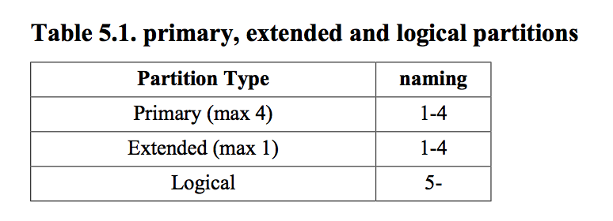
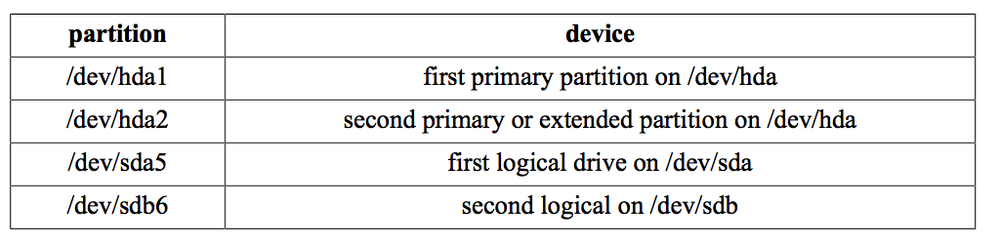
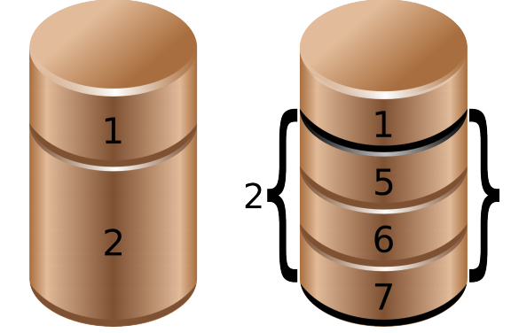

## 5.磁盘分区

这一章衔接前一章继续探讨硬盘管理,这里我们会对设备进行分区

这一章同时又是下一章的铺垫,我们在分区上搭建文件系统

### 5.0.0待完成

### 5.1 关于分区

#### 5.1.1 主分区 扩展分区 逻辑分区

linux 需要你创建一个或多个分区,下一段将会解释如何创建和使用分区

分区的结构和大小一般被柱面和扇区决定,分区分为主分区(最多四个),扩展分区(最多1个)和逻辑分区(在扩展分区中),每个分区有个包含code的type属性.



#### 5.1.2 分区命名

在前面章节我们看到硬盘设备根据配置被命名为/dev/hdx或/dev/sdx with,后面跟的就是一个分区号,从1开始.因此主分区(可能是4个)会被标记为1到4,逻辑分区总是从5开始,因此 /dev/hda2是ATA第一个硬盘设备的第二个分区,然后and /dev/hdb5是第二个ATA硬盘的第1个逻辑分区.对于SCSI, /dev/sdb3是第二个SCSI硬盘的第三个分区.



下面图片显示了两个具有分区的硬盘,注意扩展分区是逻辑分区的容器




### 5.2 发现分区

#### 5.2.1 fdisk -l

下面的例子你可以看到/dev/sdb的两个分区,第一个分区扫描31个柱面,包含一个交换空间，第二个分区更大一些.

```
root@laika:~# fdisk -l /dev/sdb
Disk /dev/sdb: 100.0 GB, 100030242816 bytes
255 heads, 63 sectors/track, 12161 cylinders
Units = cylinders of 16065 * 512 = 8225280 bytes
 Device Boot Start End Blocks Id System
/dev/sdb1 1 31 248976 82 Linux swap / Solaris
/dev/sdb2 32 12161 97434225 83 Linux
root@laika:~# 
```

#### 5.2.2 /proc/partitions

这个文件包含一个主要和次要的分区设备

```
paul@RHELv4u4:~$ cat /proc/partitions
major minor #blocks name
 3 0 524288 hda
 3 64 734003 hdb
 8 0 8388608 sda
 8 1 104391 sda1
 8 2 8281507 sda2
 8 16 1048576 sdb
 8 32 1048576 sdc
 8 48 1048576 sdd
 253 0 7176192 dm-0
 253 1 1048576 dm-1
```
