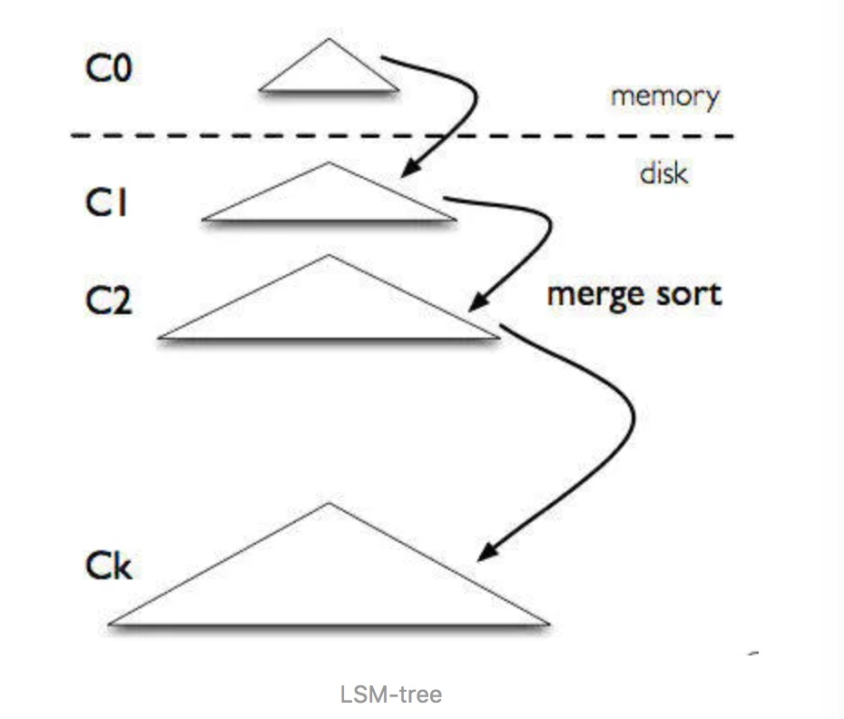

### LSM树

LSM树，全称是The Log-Structured Merge-Tree (LSM-Tree)，主要是适用于写密集、少量查询的场景

这里面有两个重点 Log-Structured 和 Merge-Tree， Merge-Tree说明了它不是一个简单的树

LSM-tree 是专门为 key-value 存储系统设计的，LSM-tree 最大的特点就是写入速度快，主要利用了
磁盘的顺序写，pk掉了需要随机写入的 B-tree

LSM-tree 被用在各种键值数据库中，如 LevelDB，RocksDB，hbase，还有分布式行式存储数据库 Cassandra
也用了 LSM-tree 的存储架构

可以看到 C0在内存中，其余的在硬盘上，每一级数据量大小有差别(levelDB差10倍左右)

操作来了，首先追加到写前日志（Write Ahead Log，也就是真正写入之前记录的日志）中，接下来加到 C0 层。当 C0 层的数据达到一定大小，就把 C0 层 和 C1 层合并，类似归并排序，这个过程就是Compaction（合并）。合并出来的新的 new-C1 会顺序写磁盘，替换掉原来的 old-C1。当 C1 层达到一定大小，会继续和下层合并。合并之后所有旧文件都可以删掉，留下新的

注意数据的写入可能重复，新版本需要覆盖老版本。什么叫新版本，我先写（a=1），再写（a=233），233 就是新版本了。假如 a 老版本已经到 Ck 层了，这时候 C0 层来了个新版本，这个时候不会去管底下的文件有没有老版本，老版本的清理是在合并的时候做的。

写入过程基本只用到了内存结构，Compaction 可以后台异步完成，不阻塞写入。

从图可以看出，因为数据时分级存储的，所以查询性能就会下降

缺点:

写放大:

假如现在有三层，文件大小分别是：9，90，900，r=10。又写了个 1，这时候就会不断合并，1+9=10，10+90=100，100+900=1000。总共写了 10+100+1000

读放大:

为了查询一个 1KB 的数据。最坏需要读 L0 层的文件，再读 L1 到 L6 的每一个文件

### B+树
