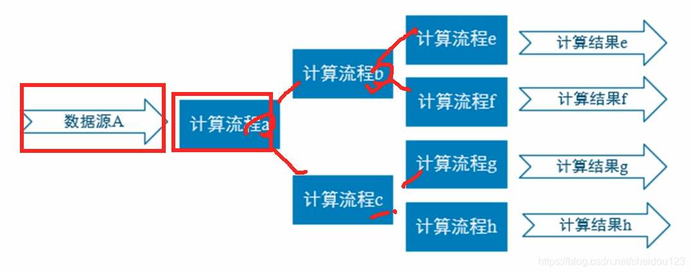
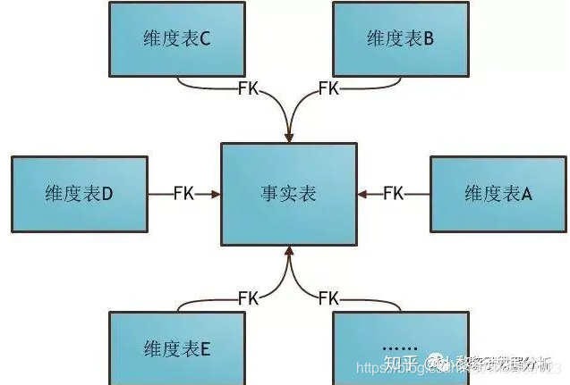
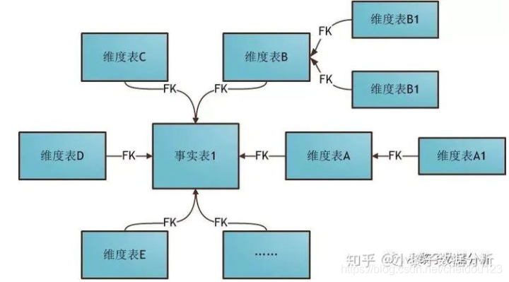

### 事实表和维度表

#### 维度表
代表描述一个东西的，比如商品，用户
* 不大
* 很宽
* 变动小

#### 事实表
代表一个业务事件，比如一个下单:
* 很大
* 列数一般比较少
* 经常变化，每天会增加

### 实时计算和实时数仓

#### 实时计算
追求时效性，直接得结果，计算中间结果没有保存，这些中间结果需要重新计算

#### 实时数仓
对数据处理流程进行规划，分层，提高复用性，B和C都用到A了

### OLAP分类
* MOLAP 主要是druid和kylin，通过空间和预计算换在线查询时间
* ROLAP Presto Impala GP CK 在原始数据上执行sum,group by操作，比较灵活，消耗资源
* HOLAP MOLAP和ROLAP的融合体，对于聚合的，使用MOLAP预计算数据模型，其他的使用ROLAP，比如鼎石的DorisDB

### 星型模型和雪花模型

#### 星形模型

多维数据集的每一个维度都直接与事实表相连接，数据有冗余

#### 雪花模型

数据冗余少，但是效率一看就低

### 基础架构
* SMP 所有资源都共享（shared everything）
* NUMA 拿出一部分资源共享
* shared nothing 几乎不分享(除了网络带宽啥的)
