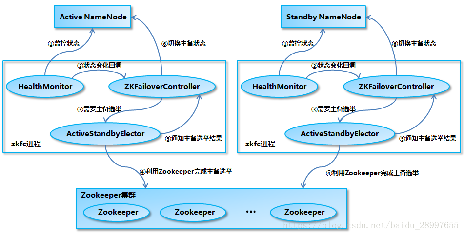

NameNode是HDFS的一个重要组件，所以需要一个高可用的机制来保证NameNode正常使用

2.x版本中，HDFS架构解决了单点故障问题，即引入双NameNode架构，同时借助共享存储系统来进行元数据
的同步，共享存储系统类型一般有几类，如：Shared NAS+NFS、BookKeeper、BackupNode 和 Quorum
Journal Manager(QJM)，上图中用的是QJM作为共享存储组件，通过搭建奇数结点的JournalNode实现
主备NameNode元数据操作信息同步。

另外，master和standby是通过QJM机制来进行数据同步，然后通过zk来自动替换，这个很重要，在GP中，
我们需要手动切换master和standby节点
