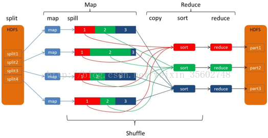

### Shuffle

描述数据从map task到reduce task这段过程，shuffle的过程会很影响吞吐量，因为reduce task需要
其他节点拉取map task的结果

Shuffle 过程本质上都是将 Map 端获得的数据使用分区器进行划分，并将数据发送给对应的Reducer的过程

shuffle分为两个部分
* 在map端的叫做shuffle write
* 在reduce端的叫做shuffle read

### map端的shuffle

* 根据split输入数据，运行map任务;

* 每个map task都有一个内存缓冲区，存储着map的输出结果;

* 当缓冲区快满的时候需要将缓冲区的数据以临时文件的方式存放到磁盘;

* 当整个map task结束后再对磁盘中这个map task产生的所有临时文件做合并，生成最终的正式输出文件，然后等待reduce task来拉数据

### reduce端的shuffle

* Copy过程，拉取数据。

* Merge阶段，合并拉取来的小文件

* Reducer计算

* Output输出计算结果

