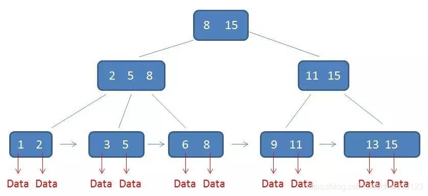

<!-- MDTOC maxdepth:6 firsth1:2 numbering:0 flatten:0 bullets:1 updateOnSave:1 -->

   - [1.union 和union all的区别](#1union-和union-all的区别)   
   - [2.preparedStatement和statement的区别](#2preparedstatement和statement的区别)   
   - [3.数据库三范式](#3数据库三范式)   
   - [4.Mysql行级锁](#4mysql行级锁)   
         - [⑴ 共享锁](#⑴-共享锁)   
         - [⑵ 排它锁](#⑵-排它锁)   
   - [5.事务的基本要素(ACID特性)](#5事务的基本要素acid特性)   
   - [6.事务的并发问题](#6事务的并发问题)   
   - [7.事务的隔离级别](#7事务的隔离级别)   
   - [8.数据库查询语言分类](#8数据库查询语言分类)   
         - [⑴DQL（Data Query Language）](#⑴dql（data-query-language）)   
         - [⑵DML（Data Manipulation Language）](#⑵dml（data-manipulation-language）)   
         - [⑶DDL（Data Definition Language）](#⑶ddl（data-definition-language）)   
         - [⑷DCL（Data Control Language）](#⑷dcl（data-control-language）)   
   - [9.mysql导出表结构](#9mysql导出表结构)   
   - [10.乐观锁和悲观锁](#10乐观锁和悲观锁)   
   - [11.drop、truncate和delete的区别](#11drop、truncate和delete的区别)   
   - [12.水平分区和垂直分区和读写分离](#12水平分区和垂直分区和读写分离)   
   - [13.Mysql执行计划](#13mysql执行计划)   
         - [⑴id](#⑴id)   
         - [⑵select_type](#⑵select_type)   
         - [⑶table](#⑶table)   
         - [⑷type(重要)](#⑷type重要)   
         - [⑸possible_keys](#⑸possible_keys)   
         - [⑹key(重要)](#⑹key重要)   
         - [⑺key_len](#⑺key_len)   
         - [⑻ref](#⑻ref)   
         - [⑼rows(重要)](#⑼rows重要)   
         - [⑽filtered](#⑽filtered)   
         - [⑾Extra(重要)](#⑾extra重要)   
            - [①Using temporary](#①using-temporary)   
            - [②Using where](#②using-where)   
   - [14.Mysql存储引擎](#14mysql存储引擎)   
         - [⑴MyISAM](#⑴myisam)   
         - [⑵InnoDB](#⑵innodb)   
         - [⑶两者的区别](#⑶两者的区别)   
   - [15.Mysql索引原理](#15mysql索引原理)   
   - [16.索引分类](#16索引分类)   
         - [⑴从实现上说分为聚集索引和非聚集索引](#⑴从实现上说分为聚集索引和非聚集索引)   
         - [⑵从功能上说分为下面几种](#⑵从功能上说分为下面几种)   
         - [⑶从结构上分](#⑶从结构上分)   
   - [17.索引用法](#17索引用法)   
         - [⑴什么地方使用索引](#⑴什么地方使用索引)   
         - [⑵索引注意事项](#⑵索引注意事项)   
         - [⑶最左前缀的理解](#⑶最左前缀的理解)   
            - [①举例](#①举例)   
            - [②总结](#②总结)   
   - [18.覆盖索引](#18覆盖索引)   
   - [19.in与not in,exists与not exists的区别](#19in与not-inexists与not-exists的区别)   

<!-- /MDTOC -->

### 1.union 和union all的区别
* union会对结果集进行处理排除掉相同的结果
* union all 不会对结果集进行处理，不会处理掉相同的结果
### 2.preparedStatement和statement的区别
* 任何时候使用preparedStatement而不是statement
* PreparedStatement预编译，防止SQL注入
* PreparedStatement多次使用可提高效率
### 3.数据库三范式
* 第一范式（1NF）无重复的列（原子性），每一列都是不可分割的原子数据项，而不能是集合，数组，记录等非原子数据项。
* 第二范式（2NF）属性完全依赖于主键，如果有哪些数据只和主键的一部份有关的话，它就不符合第二范式。
* 第三范式（3NF）属性不依赖于其它非主属性，每个非关键字列都独立于其他非关键字列。
### 4.Mysql行级锁
MYISAM引擎只支持表级锁，而INNODB引擎能够支持行级锁，下面的内容也是针对INNODB行级锁展开的:
##### ⑴ 共享锁
又称读锁，是读取操作创建的锁。其他用户可以并发读取数据，但任何事务都不能对数据进行修改。
如果事务T对数据A加上共享锁后，则其他事务只能对A再加共享锁，不能加排它锁。
```java
SELECT ... LOCK IN SHARE MODE;
```
会对查询出的每一条数据加共享锁，如果其它线程再加排它锁就会阻塞。
##### ⑵ 排它锁
又称写锁，如果事务T对数据A加上排他锁后，则其他事务不能再对A加任任何类型的锁。获准排他锁的事务既能读数据，又能修改数据。
```java
SELECT ... FOR UPDATE;
```
在查询语句后面增加FOR UPDATE，Mysql会对查询结果中的每行都加排他锁，当没有其他线程对查询结果集中的任何一行使用排他锁时，可以成功申请排他锁，否则会被阻塞。
另外mysql的innodb对数据的update,delete,insert都会给涉及到的数据加上排他锁，select语句默认不会加任何锁类型。所以加上排它锁普通的select还是可以用的。
### 5.事务的基本要素(ACID特性)
* 原子性（Atomicity）：事务开始后所有操作，要么全部做完，要么全部不做，不可能停滞在中间环节。事务执行过程中出错，会回滚到事务开始前的状态，所有的操作就像没有发生一样。也就是说事务是一个不可分割的整体，就像化学中学过的原子，是物质构成的基本单位。
* 一致性（Consistency）：事务开始前和结束后，数据库的完整性约束没有被破坏 。比如A向B转账，不可能A扣了钱，B却没收到。
* 隔离性（Isolation）：同一时间，只允许一个事务请求同一数据，不同的事务之间彼此没有任何干扰。比如A正在从一张银行卡中取钱，在A取钱的过程结束前，B不能向这张卡转账。
* 持久性（Durability）：事务完成后，事务对数据库的所有更新将被保存到数据库，不能回滚。
###  6.事务的并发问题
*  脏读 对于两个事务T1 和T2 ， T1 读取了已经被T2 更新但还没有被提交的字段。之后，若T2 进行回滚，T1读取的内容就是临时且无效的
* 不可重复读 是指在一个事务中两次读同一行数据，可是这两次读到的数据不一样
*  幻读 系统管理员A将数据库中所有学生的成绩从具体分数改为ABCDE等级，但是系统管理员B就在这个时候插入了一条具体分数的记录，当系统管理员A改结束后发现还有一条记录没有改过来，就好像发生了幻觉一样，这就叫幻读。
### 7.事务的隔离级别
* 读未提交（Read Uncommitted）事务A读到事务B未提交的事务，就可能出现脏读
* 读已提交（Read Committed）事务A只能读到B已提交的事务（ORACLE等默认），
* 可重复读取（Repeatable Read）在同一个事务内的查询都是事务开始时刻一致的，事务A读则事务B就不能修改，可能出现幻读，但是MySQL的innodb通过MVCC(多版本并发控制)解决了幻读问题。
* 序列化（Serializable) 事务串行化执行，你读的时候别人都看不到
### 8.数据库查询语言分类
##### ⑴DQL（Data Query Language）
数据查询语言DQL由SELECT子句，FROM子句，WHERE子句组成
##### ⑵DML（Data Manipulation Language）
数据操纵语言DML包含INSERT，UPDATE，DELETE
##### ⑶DDL（Data Definition Language）
数据定义语言DDL用来创建数据库中的各种对象-----表、视图、
索引、同义词、聚簇等如：
CREATE TABLE/VIEW/INDEX/SYN/CLUSTER
DDL操作是隐性提交的！不能rollback
##### ⑷DCL（Data Control Language）
数据控制语言（DCL）是用来设置或者更改数据库用户或角色权限的语句，这些语句包括GRANT、DENY、REVOKE等语句，在默认状态下，只有sysadmin、dbcreator、db_owner或db_securityadmin等角色的成员才有权利执行数据控制语言。
### 9.mysql导出表结构
```sql
 sudo mysqldump -h10.1.210.15 -u用户名 -p密码 数据库名 device_bind_info>device_bind_info.sql
 格式：
 sudo mysqldump -h地址　-u用户名 -p密码　数据库名　表名>导出sql名
```
### 10.乐观锁和悲观锁
*  每次去拿数据的时候都认为别人不会修改，所以不会上锁，但是在更新的时候会判断一下在此期间别人有没有去更新这个数据，可以使用版本号等机制。乐观锁适用于多读的应用类型，这样可以提高吞吐量，像数据库如果提供类似于write_condition机制的其实都是提供的乐观锁。
* 悲观锁每次去拿数据的时候都认为别人会修改，所以每次在拿数据的时候都会上锁，这样别人想拿这个数据就会block直到它拿到锁。传统的关系型数据库里边就用到了很多这种锁机制，比如行锁，表锁等，读锁，写锁等，都是在做操作之前先上锁。
* 两种锁各有优缺点，不可认为一种好于另一种，像乐观锁适用于写比较少的情况下，即冲突真的很少发生的时候，这样可以省去了锁的开销，加大了系统的整个吞吐量。但如果经常产生冲突，上层应用会不断的进行retry，这样反倒是降低了性能，所以这种情况下用悲观锁就比较合适。
### 11.drop、truncate和delete的区别
* 执行速度 drop > truncate > delete
* delete一行一行删除，truncate 删除表全部数据，drop 连表数据和表结构一起删除
* delete 是 DML 语句，没提交事务还可以回滚，truncate 和 drop 是 DDL 语句，操作完马上生效，不能回滚
* 有FOREIGN KEY 约束引用的表，不能使用 TRUNCATE TABLE，而应使用不带 WHERE 子句的 DELETE 语句
* delete删除行会出现id不联系，truncate是id重新开始
### 12.水平分区和垂直分区和读写分离
* 水平分区（Horizontal Partitioning） 这种形式分区是对表的行进行分区，通过这样的方式不同分组里面的物理列分割的数据集得以组合，从而进行个体分割（单分区）或集体分割（1个或多个分区）。所有在表中定义的列在每个数据集中都能找到，所以表的特性依然得以保持。
举个简单例子：一个包含十年发票记录的表可以被分区为十个不同的分区，每个分区包含的是其中一年的记录。（注：这里具体使用的分区方式我们后面再说，可以先说一点，一定要通过某个属性列来分割，譬如这里使用的列就是年份）
* 垂直分区（Vertical Partitioning） 这种分区方式一般来说是通过对表的垂直划分来减少目标表的宽度，使某些特定的列被划分到特定的分区，每个分区都包含了其中的列所对应的行。
举个简单例子：一个包含了大text和BLOB列的表，这些text和BLOB列又不经常被访问，这时候就要把这些不经常使用的text和BLOB了划分到另一个分区，在保证它们数据相关性的同时还能提高访问速度。
* 读写分离，基本的原理是让主数据库处理事务性增、改、删操作（INSERT、UPDATE、DELETE），而从数据库处理SELECT查询操作。数据库复制被用来把事务性操作导致的变更同步到集群中的从数据库。
### 13.Mysql执行计划
MySql提供了EXPLAIN语法用来进行查询分析
```sql
| id | select_type | table  | partitions | type | possible_keys | key    | key_len | ref   | rows | filtered | Extra       |
```
##### ⑴id  
查询的序列号
##### ⑵select_type
* ⑴SIMPLE：简单的select查询，查询中不包含子查询或者union
* ⑵PRIMARY：查询中包含任何复杂的子部分，最外层查询则被标记为primary
* ⑶SUBQUERY：在select 或 where列表中包含了子查询
* ⑷DERIVED：在from列表中包含的子查询被标记为derived（衍生），mysql或递归执行这些子查询，把结果放在零时表里
* ⑸UNION：若第二个select出现在union之后，则被标记为union；若union包含在from子句的子查询中，外层select将被标记为derived
* ⑹UNION RESULT：从union表获取结果的select
##### ⑶table
输出行所引用的表
##### ⑷type(重要)
访问类型，非常滴重要，结果从好到坏依次是:
system > const > eq_ref > ref(优秀线) > fulltext > ref_or_null > index_merge > unique_subquery > index_subquery > range(合格线) > index > ALL
* system：表中仅有一行（=系统表）这是const联结类型的一个特例。
* const：表示通过索引一次就找到，const用于比较primary key或者unique索引。因为只匹配一行数据，所以如果将主键置于where列表中，mysql能将该查询转换为一个常量
* eq_ref:唯一性索引扫描，对于每个索引键，表中只有一条记录与之匹配。常见于唯一索引或者主键扫描
* ref:非唯一性索引扫描，返回匹配某个单独值的所有行，本质上也是一种索引访问，它返回所有匹配某个单独值的行，可能会找多个符合条件的行，属于查找和扫描的混合体
* range:只检索给定范围的行，使用一个索引来选择行。key列显示使用了哪个索引，一般就是where语句中出现了between,in等范围的查询。这种范围扫描索引扫描比全表扫描要好，因为它开始于索引的某一个点，而结束另一个点，不用全表扫描
* index:index 与all区别为index类型只遍历索引树。通常比all快，因为索引文件比数据文件小很多。
* all：遍历全表以找到匹配的行
##### ⑸possible_keys
查询涉及到的字段上存在索引，则该索引将被列出，但不一定被查询实际使用，可能有多个
##### ⑹key(重要)
实际使用的索引，如果为NULL，则没有使用索引，主要看这个而不是possible_keys，只能由一个
##### ⑺key_len
MYSQL使用的索引长度
##### ⑻ref
ref列显示使用哪个列或常数与key一起从表中选择行
##### ⑼rows(重要)
利用索引后查出来的行数
##### ⑽filtered
存储引擎返回的数据在server层过滤，剩下多少满足查询的记录数量的比例(百分比)，值越大越好，filtered列的值依赖统计信息，并不十分准确
##### ⑾Extra(重要)
###### ①Using temporary
使用临时表保存中间结果，也就是说mysql在对查询结果排序时使用了临时表，常见于order by 和 group by
###### ②Using where
使用了where过滤
等等还有很多。。。
### 14.Mysql存储引擎
查看存储引擎:show engines;
有MyISAM，InnoDB，MEMORY，MERGE等，这里只说MyISAM和InnoDB
##### ⑴MyISAM  
* 如果表中绝大多数都只是读查询，可以考虑MyISAM，
* 不支持事务
* 不支持外键
* 支持全文索引
##### ⑵InnoDB
* 适合更新请求密集的表
* 支持事务
* 自动从灾难恢复
* 外检支持
* 支持自动增加列AUTO_INCREMENT属性
##### ⑶两者的区别
* InnoDB支持事务，MyISAM不支持
* InnoDB支持外键，MyISAM不支持
* InnoDB支持行锁，会死锁，并发性能好，MyISAM仅支持表锁，不会死锁，并发性能差
* InnoDB必须有主键，没有指定就为每一行数据生成不可见的ROWID列作为主键，MyISAM可以没有主键
* InnoDB不支持全文索引，MyISAM支持,5.6开始InnoDB也支持全文索引了
* MyISAM内置了一个计数器来存储表的行数。执行 select count(*) 时直接从计数器中读取，速度非常快。而InnoDB不保存这些信息
* InnoDB所有的表都保存在同一个数据文件中（也可能是多个文件，或者是独立的表空间文件)，MyISAM将索引和数据分开进行存储。
* 对AUTO_INCREMENT的处理方式不一样。如果将某个字段设置为INCREMENT，InnoDB中规定必须包含只有该字段的索引。但是在MyISAM中，也可以将该字段和其他字段一起建立联合索引。
* delete from table的处理方式不一样。MyISAM会重新建立表。InnoDB不会重新建立表，而是一行一行的删除。
* 如果执行大量的SELECT，MyISAM是更好的选择。如果你的数据执行大量的INSERT或UPDATE，出于性能方面的考虑，应该使用InnoDB表
### 15.Mysql索引原理
MyISAM和InnoDB均采用b+树的索引结构，但是具体实现还是有区别，这里是innoDB的:
关于b+树的数据结构可以看这里:



为什么用b+树呢:
* b树查找不稳定，b+树因为都在叶子节点所以稳定
* 相同数据量的情况下,b+树比b树更矮胖，因此查询io也要少，真实场景一般高度为3
* b+树叶子节点有链表，所以范围查询更简单

聚集索引和非聚集索引在索引原理的不同
* 聚集索引索引和数据是一体的
* 非聚集索引就是指B+Tree的叶子节点上的data，并不是数据本身，而是数据存放的地址
* 非聚集索引比聚簇索引多了一次读取数据的IO操作，所以查找性能上会差
### 16.索引分类
##### ⑴从实现上说分为聚集索引和非聚集索引
* 正文内容按照一个特定维度排序存储，这个特定的维度就是聚集索引，表中只能由一个，一般是表中的主键索引，如果表中没有显示指定主键，则会选择表中的第一个不允许为NULL的唯一索引，如果还是没有的话，就采用Innodb存储引擎为每行数据内置的6字节ROWID作为聚集索引。聚集索引性能在精确查找和范围查找上面效果要好
* 非聚集索引索引项顺序存储，但索引项对应的内容却是随机存储的
##### ⑵从功能上说分为下面几种
* 普通索引：最基本的索引，没有任何约束
* 唯一索引：与普通索引类似，但具有唯一性约束，唯一索引数据列不能重复，可以提高效率，也可以防重
* 主键索引：特殊的唯一索引，不允许有空值
* 复合索引：将多个列组合在一起创建索引，可以覆盖多个列
* 外键索引：只有InnoDB类型的表才可以使用外键索引，保证数据的一致性、完整性和实现级联操作
* 全文索引：MySQL 自带的全文索引只能用于 InnoDB、MyISAM ，并且5.7之前只能对英文进行全文检索，5.7之后开始支持中文
##### ⑶从结构上分
* Btree(其实就是b+树)
* Hash索引(基本不用)
### 17.索引用法
##### ⑴什么地方使用索引
* 经常搜索的列
* 主键列
* 连接列
* 范围搜索列，因为索引进行了排序
* where子句列
##### ⑵索引注意事项
 * 查询很少的列不创建索引
* 列值较少（性别）的列不创建索引
* image,bit数据类型的列不创建索引
* 修改性能远远大于索引性能的列，索引会提高检索性能但会降低修改性能。
* 只要列中包含有NULL值都将不会被包含在索引中，所以我们在数据库设计时不要让字段的默认值为NULL。
* 对字符串列进行索引，如果可能应该指定一个前缀长度。例如，如果有一个CHAR(255)的列，如果在前10个或20个字符内，多数值是惟一的，那么就不要对整个列进行索引。短索引不仅可以提高查询速度而且可以节省磁盘空间和I/O操作。
* like “%aaa%” 不会使用索引而like “aaa%”可以使用索引,以%开头不会利用到索引，结尾可以。
* 不要在索引列上进行运算,我们可以吧 id - 2 = 1改成id = 1 + 2 的形式
* 不使用NOT IN和<>操作
* 符合最左前缀原则
##### ⑶最左前缀的理解
###### ①举例
基于版本号5.7,我们建立索引(`aa`, `bb`, `cc`)，默认创建出来的都是BTREE结构
首先我们创建数据库:
```sql
CREATE TABLE `bincai` (
	`id` INT(11) NOT NULL AUTO_INCREMENT COMMENT 'id',
	`aa` VARCHAR(15) DEFAULT '',
	`bb` VARCHAR(15) DEFAULT '',
	`cc` VARCHAR(15) DEFAULT '',
	`dd` VARCHAR(15) DEFAULT '',
	PRIMARY KEY (`id`),
	KEY `heidou` (`aa`, `bb`, `cc`)
) ENGINE = InnoDB CHARSET = utf8;
```
然后再往表里插入几条数据
```sql
insert into bincai(aa,bb,cc,dd) values('11','12','13','14');
insert into bincai(aa,bb,cc,dd) values('21','22','23','24');
insert into bincai(aa,bb,cc,dd) values('31','32','33','34');
```

例子1:
```sql
explain select * from bincai where bb = '12';
```
输出:
```sql
| id | select_type | table  | partitions | type | possible_keys | key  | key_len | ref  | rows | filtered | Extra       |
+----+-------------+--------+------------+------+---------------+------+---------+------+------+----------+-------------+
|  1 | SIMPLE      | bincai | NULL       | ALL  | NULL          | NULL | NULL    | NULL |    3 |    33.33 | Using where |
```
例子2(覆盖索引):
```sql
explain select bb from bincai where bb = '12';
```
输出:
```sql
| id | select_type | table  | partitions | type  | possible_keys | key    | key_len | ref  | rows | filtered | Extra                    |
+----+-------------+--------+------------+-------+---------------+--------+---------+------+------+----------+--------------------------+
|  1 | SIMPLE      | bincai | NULL       | index | NULL          | heidou | 144     | NULL |    3 |    33.33 | Using where; Using index |
```
在第二个查询中并不符合最左前缀倒是也利用到了索引，这是为啥呢?
因为查询的字段是索引字段，所以采用了覆盖索引(Extra里面有Using index)，所以无论条件是否满足最左都会使用索引，但是注意type是index,而且rows是3,mysql会一条条查找数据，效率其实不高。另外要注意查询的字段一定要在同一个联合索引里才会产生覆盖索引
例子3:
```sql
explain select aa,bb,dd from bincai where aa = '12';
```
输出:
```sql
| id | select_type | table  | partitions | type | possible_keys | key    | key_len | ref   | rows | filtered | Extra |
+----+-------------+--------+------------+------+---------------+--------+---------+-------+------+----------+-------+
|  1 | SIMPLE      | bincai | NULL       | ref  | heidou        | heidou | 48      | const |    1 |   100.00 | NULL  |
```
当我们完全符合最左前缀原则时，rows是1,type是ref，这才是索引的正确姿势，这时候即使我们查索引覆盖的字段:
```sql
explain select aa,bb from bincai where aa = '12';
```
输出:
```sql
| id | select_type | table  | partitions | type | possible_keys | key    | key_len | ref   | rows | filtered | Extra       |
+----+-------------+--------+------------+------+---------------+--------+---------+-------+------+----------+-------------+
|  1 | SIMPLE      | bincai | NULL       | ref  | heidou        | heidou | 48      | const |    1 |   100.00 | Using index |
```
例子4:
```sql
explain select * from bincai where cc = '12' and aa ='12';
```
输出:
```sql
| id | select_type | table  | partitions | type | possible_keys | key    | key_len | ref   | rows | filtered | Extra                 |
+----+-------------+--------+------------+------+---------------+--------+---------+-------+------+----------+-----------------------+
|  1 | SIMPLE      | bincai | NULL       | ref  | heidou        | heidou | 48      | const |    1 |    33.33 | Using index condition |
```
我们发现也使用到了heidou的索引。这是因为mysql有查询优化器，会将cc = '12' and aa ='12'纠正顺序，生成真正的执行计划，从而利用到索引，但是这样的话aa这列的索引用到了，因为没有bb，所以cc这列的并没有起作用
###### ②总结
* 查询的字段在同一个联合索引里，如果where后面不符合索引规则，会产生覆盖索引
* sql查询优化器会帮我们优化顺序，只需要联合索引第一个在where后面就行
### 18.覆盖索引
如果一个索引包含(或覆盖)所有需要查询的字段的值，称为‘覆盖索引’。即只需扫描索引而无须回表。
* 覆盖索引必须要存储索引的列，所以只能用Btree索引做覆盖索引
* 当发起一个索引覆盖查询时，在explain的extra列可以看到using index的信息
### 19.in与not in,exists与not exists的区别
* exist会针对子查询的表使用索引
* not exist会对主子查询都会使用索引
* in与子查询一起使用的时候,只针对主查询使用索引
* not in则不会使用任何索引
* 如果查询的两个表大小相当，那么用in和exists差别不大；如果两个表中一个较小一个较大，则子查询表大的用exists，子查询表小的用in
* 所以无论哪个表大，用not exists都比not in 要快

exists案例解析:
```sql
SELECT
 A.*
FROM
 A
WHERE
EXISTS (SELECT B.* FROM B WHEN A.id = B.id)
```
首先执行
```sql
SELECT A.* FROM  A
```
然后将其结果集作为条件，在where中进行筛选，exists筛选结果集为true的数据项，而not exists相反，返回结果集为false的数据项
