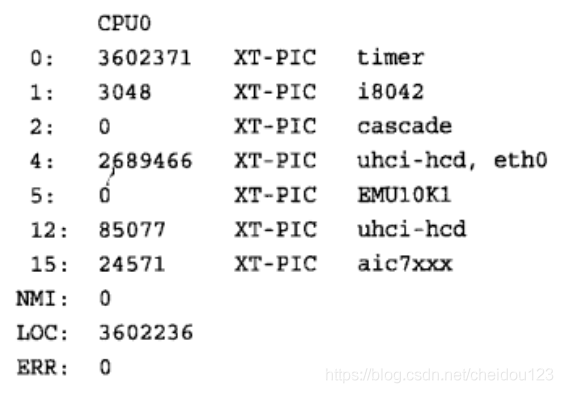
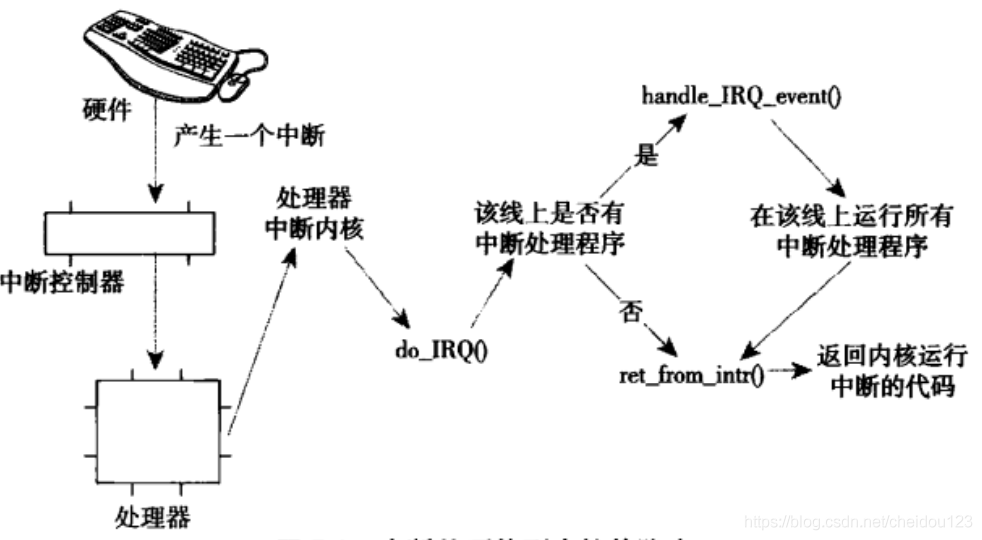

<!-- MDTOC maxdepth:6 firsth1:1 numbering:0 flatten:0 bullets:1 updateOnSave:1 -->

   - [中断上半部分](#中断上半部分)   
      - [中断](#中断)   
      - [中断处理机制的实现](#中断处理机制的实现)   
      - [中断控制](#中断控制)   
         - [禁止和激活中断](#禁止和激活中断)   
         - [禁止指定中断线](#禁止指定中断线)   
   - [中断下半部分](#中断下半部分)   
      - [软中断(softirq,并非软件中断)](#软中断softirq并非软件中断)   
      - [tasklet](#tasklet)   
      - [辅助软中断和tasklet的内核线程](#辅助软中断和tasklet的内核线程)   
      - [工作队列](#工作队列)   
         - [工作队列的实现](#工作队列的实现)   
         - [使用工作队列](#使用工作队列)   
      - [下半部分的机制选择](#下半部分的机制选择)   
      - [禁止下半部](#禁止下半部)   

<!-- /MDTOC -->

## 中断上半部分
### 中断
1.计算机处理器的速度和外围硬件设备(例如键盘)的速度往往不在一个数量级上

2.我们可以让硬件完成任务时向内核发出一个信号，这就是中断机制，中断使得硬件得以发出通知给处理器

3.不同设备的中断都有一个唯一的数字标志，比如IRQ 1是键盘中断

4.中断的数字值有的是固定的，有的是可变的，PCI上面的中断就是动态分配的

5.中断不需要考虑也处理器时钟同步，相比之下，异常需要考虑与处理器时钟同步

6.响应中断时，内核会执行不同的中断处理程序，中断处理程序是驱动的一部分，驱动也是内核的一部分

7.中断处理程序运行在中断上下文中，该上下文中的执行代码不可阻塞，所以中断处理程序应该尽可能短的时间内完成运行，为了让中断能又好又快的运行，我们把中断切分为两部分:
* 中断处理程序是上半部分★，处理能快速完成又不能拖延的工作
* 然后下半部分开始执行允许延迟的工作

8.硬件对应的驱动程序需要通过request_irq注册一个中断处理程序
* 可以设置是否在执行中断处理程序时禁用其他中断，但是一般不设置
* 是否可以共享中断线等等
* 在卸载驱动程序时，要调用free_irq来注销中断处理程序

9.编写中断处理程序
* 中断处理程序要和request_irq里面handler要求的一致
* 中断处理程序返回的值可能有两种情况
   * IRQ_NONE 检测到中断，但是中断对应的不是这个程序
   * IRQ_HANDLED 中断处理程序被正确调用
 * 处理中断时，同一中断线不能再处理其他中断
 * 共享中断线的中断处理程序有些特殊要求，否则不能共享了

10.当执行一个中断处理程序时，内核处于中断上下文，在中断上下文中，不能调用一些会睡眠的函数，中断上下文中的代码应该迅速，间接，因为它可能打断了其他代码甚至另一中断处理程序，我们应该把缓慢的工作放在下半部分执行

11.系统中与中断相关的统计信息位于/proc/interrupts文件中

* 第1列中断线，比如0就是中断号
* 第2列，计数器，我们可以看到不同中断的次数，每个CPU都有计数器
* 第3列，中断控制器
* 第4列，中断设备名称

### 中断处理机制的实现
1.中断处理机制的实现依赖于处理器，中断控制器类型，体系结构，机器本身

2.具体中断路由如下

* 硬件产生中断，通过总线将电信号发送给中断控制器
* 中断控制器检测如果中断线是激活的，就把中断发往处理器
* 处理器如果没有禁止该中断，就立刻停止任何事，关闭中断系统，然后去内存预定义位置执行相关代码
* 内核调用函数do_IRQ，取得中断号，禁止当前中断线其他中断传递。如果有中断处理程序就运行中断处理程序，如果没有，调用ret_from_intr，返回内核增加中断的点

### 中断控制
1.LINUX内核可以让我们禁止当前处理器中断系统，或者所有处理器某条中断线，为什么要控制中断系统呢，归根节点的原因是需要提供同步机制
* 可以确保某个中断处理程序不会抢占当前代码
* 可以禁止内核抢占

2.内核代码没提供禁止所有处理器所有中断线机制，所以多核处理器还需要某种锁来保证同步，但是获取这些锁的同时也会使用禁止当前处理器的中断

#### 禁止和激活中断
我们可以禁止当前处理器的本地中断或者激活当前处理器的本地中断，但是为了安全起见，禁止中断的时候回保存中断系统的状态，激活中断时恢复保存的状态

#### 禁止指定中断线
我们可以禁止掉整个系统某条中断线，但是禁止一条可以共享的(比如PCI设备)是不合适的

## 中断下半部分
1.中断处理程序应该执行的越快越好，它们不能阻塞

2.整个中断流程分为上下两个部分
* 上半部分中断处理程序
* 下半部分执行一些耗时的工作

3.需要上半部分中断处理程序完成的工作
* 对中断的到达进行确认
* 从硬件拷贝数据

4.什么样的工作适合放在中断处理程序上半部分
* 对时间非常敏感
* 和硬件相关
* 不能被打断

5.中断下半部分的执行过程中，允许响应所有的中断

6.在2.6版本中,Linux提供了三种实现
* 软中断
* tasklets 通过软中断实现
* 工作队列

### 软中断(softirq,并非软件中断)

1.软中断使用比较少，tasklets使用比较多，软中断一般给最重要和时间要求最严格的下半部分使用，目前只有网络和SCSI直接使用

2.一个软中断不会抢占另外一个软中断，唯一可以抢占软中断的是中断处理程序，软中断(包括相同类型的)可以在其它处理器上(同一个处理器上不行)并行执行，软中断可以响应中断，但它自己不能休眠

3.通常，中断处理程序会在返回前标记它的软中断，使其稍后执行，一个注册的软中断必须在标记后才能执行

4.软中断的使用
* 分配索引，索引号小的优先级高，优先级可以指定
* 注册软中断程序
* 在中断处理程序标记软中断，使其稍后运行

### tasklet

1.tasklet本质上也是软中断，只不过同一个处理程序不能在多个处理器上同时运行,不同类型的tasklet可以同时执行

2.tasklet接口更简单，锁保护要求也更低，一般情况下应该使用tasklet

3.tasklet的使用
* 声明自己的tasklet
* 编写自己的tasklet程序
* 调度自己的tasklet

### 辅助软中断和tasklet的内核线程

1.每个处理器都有一个辅助软中断和tasklet的内核线程，当内核出现大量软中断时，就会辅助软中断，比如网络流量很大的时候，这个县城叫做ksoftirq/n，其中n对应的是处理器编号

2.软中断可以将自己重新触发让自己再次得到执行，而且当出现大量的软中断的时候，会使用户空间的进程无法获得足够处理器时间，处于饥饿状态，为了解决这个问题，我们可以不马上处理重新触发的软中断，同时当大量软中断出现的时候，啮合线程会在最低优先级上执行软中断

### 工作队列
1.工作队列可以把工作推后，交由一个内核线程去执行，优势在于允许重新调度甚至是睡眠

2.如果推后执行的任务不需要睡眠，选择软中断或者tasklet，否则选择工作对垒

#### 工作队列的实现
1.每个CPU都有一个默认的工作者线程，同时它也可以创建更多工作者线程来执行由内核其他部分排到队列的任务来减轻默认工作者线程的负担
2.工作者线程初始化完之后会进行休眠知道有操作插入到队列里面讲它唤醒，完事继续休眠

#### 使用工作队列
* 创建一些需要推后的工作
* 对工作进行调度，把工作交给默认的工作线程的处理，工作线程有对应处理函数和队列
* 排入队列的工作会在工作线程下一次被唤醒执行
* 我们也可以创建新的工作队列和工作线程

### 下半部分的机制选择
在linux2.6中有三个选择
* 软中断，必须确保共享数据安全，时间严格的比较合适
* tasklet，简单，同类型不能同时执行(不同处理器也不行)，尽量使用这个而不是软终端
* 工作队列，如果要把任务推后到进程上下文，或者需要睡眠，那么就是使用工作队列

### 禁止下半部
1.如果不同类型tasklet共享同一个数据，还是需要正确使用锁机制的，更不用说软中断和工作队列了

2.比如在进程上下文(或中断上下文)和下半部共享数据，那么访问数据之前，需要禁止下半部分处理并获得锁

3.如何禁止下半部分处理:

它们并不能禁止工作队列的执行，对于工作队列，和其他进程上下文所做的保护工作一个样
