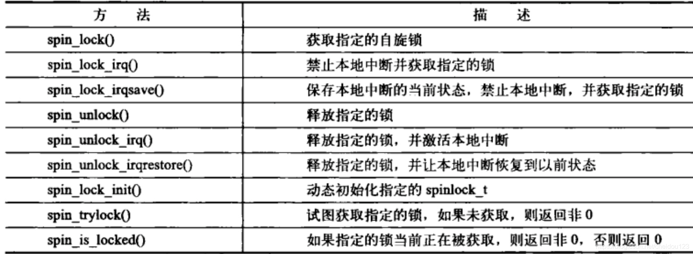
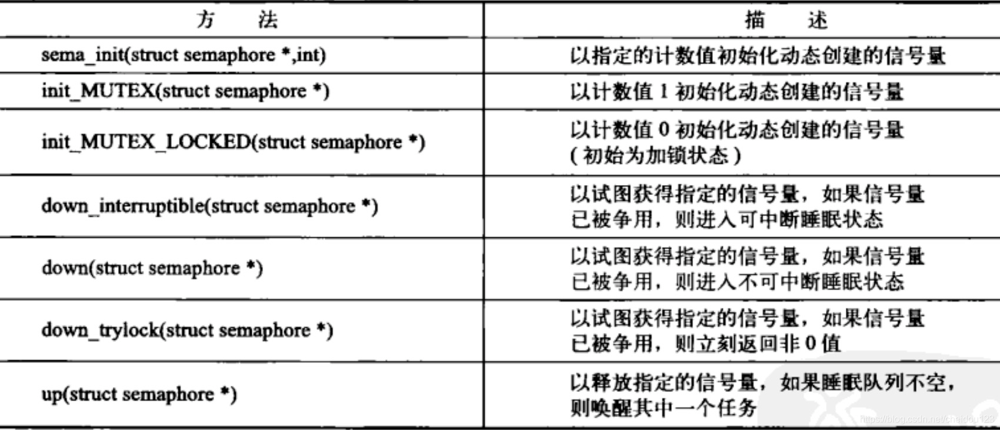
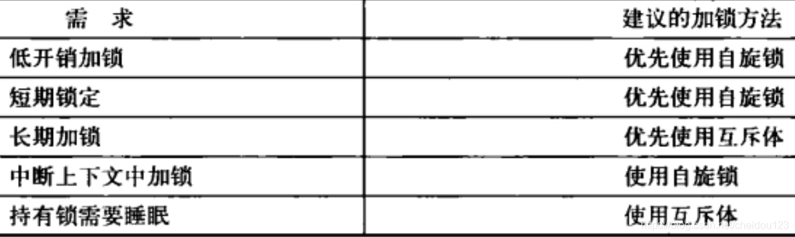

## 内核同步介绍
1.从2.0开始,Linux开始支持多处理器

2.所谓临界区就是访问和操作共享数据的代码段

3.我们应该不让两个执行线程在同一个临界区同时执行

4.i++的机器指令步骤
* 得到当前变量i的值并且拷贝到一个寄存器中
* 将寄存器的值+1
* 将i的新值写会到内存中

5.内核为我们实现了一些原子操作的接口

6.一个锁被高度争用，会严重降低系统性能

7.锁争用严重时，加锁太粗不好，锁争用不严重时，加锁太细也不好，在小型机上，CPU核数较少，争用也较少，加锁太细有时也不好

### 1.造成并发执行的原因
在单处理器上，用户进程可以被抢占并重新调度，如何被抢占的进程在临界区，抢占的进程有去了临界区，就会产生竞争，这种叫伪并发

在多处理器上，进程可以同时执行，叫做真并发

对内核而言，如果内核操作某个资源的时候，来了个中断，中断处理程序还要访问这个资源，这就是个并发问题

### 2.死锁
进程互相等待资源，谁都无法执行，预防死锁最基本的是力求简单，顺序加锁

## 内核同步方法
### 1.原子操作
原子操作是其它同步方法的基石，内核提供了两组原子操作接口
* 针对整形的操作
* 针对单独的位操作

#### ⑴原子整数操作
1.针对整数的原子操作只能对atomic_t类型的数据进行处理，而没有直接使用C语言的int类型，但是我们可以将它转换成int类型

2.原子整数操作最常见的操作就是计数器

3.atomic_t有32位和64位实现，为了提高移植性，我们应该使用32位的实现

#### ⑵原子位操作
原子位操作函数是对普通的内存地址进行访问，它的参数是一个指针和一个位号，只要指针指向了一个数据，我们就可以对数据进行原子性操作

### 2.自旋锁
1.Linux内核中最常见的锁是自旋锁，如果一个线程试图获得一个被占用的锁，就会一直自旋等待锁重新可用，自旋锁等待的过程会浪费处理器时间(★)，不适合长期持有

2.中断处理程序不可以睡眠，所以不能使用信号量制作的锁，可以使用自旋锁

3.在中断处理程序中使用锁时，要先禁止当前处理器中断，防止中断处理器打断持有锁的内核代码，但是它又获取不到锁，所以一直自旋，但是锁的持有者又不可能在中断处理程序完成前释放锁，就会造成死锁，如果再不同处理器那么没有这个问题，所以只需禁止当前处理器中断

4.自旋锁的方法列表:

5.读/写自旋锁，可以同时读，但是不能够同时读写，和同时写，另外不要在读锁里面嵌套写锁，因为写锁会自旋到读锁释放锁，这样会死锁

### 3.信号量
1.信号量适合加锁时间比较长，或者代码在持有锁时会睡眠的情况

2.若果有一个任务试图获得一个已经被占用的信号量的时候，就让出CPU去一个等待队列睡眠，信号量释放时唤醒这个任务

3.由于线程回去睡眠，所以在中断上下文中不能使用，因为中断上下文中线程无法调度

4.占用信号量的时候不能占有自旋锁

5.信号量的同时持有锁数量可以有多个
* 若仅允许一个持有者，那么计数是0和1，叫做二值信号量
* 可有多个持有者，叫计数信号量，使用这种情况不多

6.信号量方法列表:

7.信号量也有读写信号量，读写信号量都是互斥信号量

### 4.互斥体
互斥体是指任何可以睡眠的强制互斥锁，比如一个二元信号量，任何时候只有一个任务可以持有

什么时候使用自旋锁，什么时候使用互斥体:

 

### 5.顺序和屏障
为了防止指令重排序，我们可以加入内存屏障机制

在单线程情况下，指令重排序不会有问题，但是在多处理器情况下就会有问题了，所以Linux内核提供了防止重排序的机制

### 6.其它
1.Linux也有类似于wait,notify的功能，叫做完成变量
2.Linux2.6版本引入了顺序锁，写入时将计数+1，读取前后都读取计数，如果计数相同，说明没有被打断，如果读很多，写很少但是写优先的时候可以考虑使用
