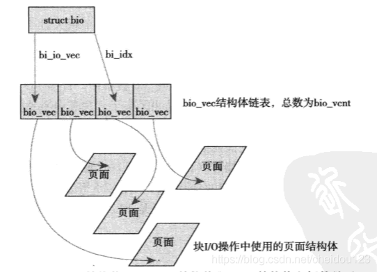
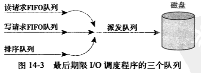

### 概述
1.块设备
* 随机访问
* 硬件设备

2.块设备最常见的是硬盘

3.字符设备是按照字符流的方式顺序访问的，比较键盘

4.块设备比字符设备要复杂很多，因为字符设备只需要控制当前位置，内核不需要为字符设备但需要为块设备提供一个专门的子系统来管理和提高块设备效率，该部分在内核中称作块IO层

5.块设备最小的可寻址单位是扇区，一般是512字节，但是内核执行磁盘操作是块，块只能数倍于扇区，而且必须是2的整数倍，不能超过页面大小，通常是512字节，1KB，4KB

### 缓冲区
1.每一个块被调入内存后，就存储在一个缓冲区里，块和缓冲区一一对应

2.每个缓冲区都有一个描述符，叫做缓冲区头，包含了这个缓冲区的信息

3.缓冲区头的目的是在于描述磁盘块与物理内存缓冲区之间的映射关系

4.缓冲区头的弊端:
* 内核更倾向于操作页面结构，使用这种方式效率低下
* 缓冲区头只能描述单个缓冲区

5.解决缓冲区头的方式就是使用bio结构体

### bio结构体
1.bio的主要目的是代表了正在执行一个IO的操作

2.bio指向多个bio_vec形成的链表，每个bio_vec代表IO操作其中的一个片段，bi_idx是索引

3.每个bio_vec中包含了片段所在的页，和数据所在的页内偏移和长度，通过这些信息可以定位到数据具体位于什么位置

4.bio并不能取代缓冲区头，bio代表的是IO操作，但是bio不能表示缓冲区的信息，缓冲区信息还需要缓冲区头来搞定

### 请求队列
1.请求队列包含一个双向请求链表以及相关控制信息，块设备将它们挂起的块IO请求放到请求队列

2.请求队列不为空，队列对应的块设备就会从队列头获取请求

3.一个请求可能要操作连续的磁盘块，所以每个请求可以由多个BIO请求

### IO调度程序
1.磁盘寻址是整个计算机最慢的操作之一，将磁头定位到特定块的某个位置需要不少时间，所以IO调度主要是为了缩短寻址时间

2.内核在对磁盘提交请求之前，会执行合并与排序的与操作，负责这个的子系统叫做IO调度程序

3.IO调度程序的工作是管理块设备的请求队列，主要是依靠合并和排序，合并就很简单了，如果两个请求访问的磁盘扇区相邻，那么久可以合并，通过一个寻址命令完成任务

4.整个请求队列会按扇区增长的方向有序排列，可以缩短磁盘寻址时间

#### Linus电梯
1.在2.4内核中, Linus是默认的IO调度程序

2.当一个请求加入到队列时，可以能发生四种情况
* 如果队列中存在一个相邻扇区的请求，就将两个合并成一个请求
* 如果队列中有一个待了很久还没执行的请求，就把新的放到队列尾，防止饿死那个待了很久的
* 如果扇区增长方向上有合适的插入位置，就将请求插入到该位置
* 如果没有合适位置，就插入到队列的尾部

#### 最终期限IO调度程序
1.写操作一般是异步的，读操作是同步的，读操作对系统响应影响很大，Linus按扇区增长来插入队列并不太合适，对饥饿的请求并不又好

2.最终期限的IO调度程序加了了两个按时间排序的FIFO队列，一个是读队列，超时500ms，写队列，超时5S

3.还有一个和Linus一模一样的排序队列，在从排序队列取请求时，也会检查FIFO队列，如果有超时的请求就去执行超时的

 

#### 预测IO调度程序
1.最终期限的IO请求有个问题，如果繁重写的时候来了读，因为读的超时时间比较低，所以会迅速去处理读请求，然后再回来执行写操作

2.为了提高效率，在最终期限IO调度的基础上，预测IO的请求提交后再等一会(默认6ms)，看看有没有相邻的可以提交，这样相邻的位置旧可以快速处理

3.如果有IO请求来了，就挺好，如果没有，就会浪费几毫秒，关键是在于能否正确预测要不要等待

####  公平队列CFQ
1.每个进程一个队列，同时请求会和相邻的请求的合并

2.然后时间片轮转调度，每个进程很公平

#### 空操作IO调度程序
1.除了执行相邻请求合并不做任何操作，以近乎FIFO的顺序进行排列

2.空操作主要面向的是闪存卡这种不需要寻道的设备
