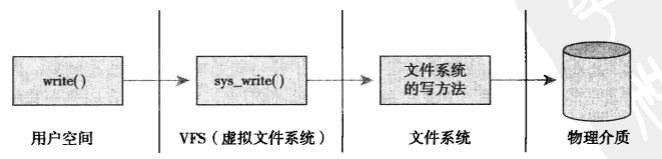
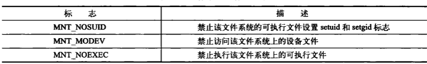

### 概述
1.虚拟文件系统是内核子系统，为用户空间的程序提供了文件和文件系统的接口

2.VFS使得用户可以直接使用系统调用而无需考虑具体文件系统和实际物理介质

3.VFS定义了所有文件系统都支持的接口和数据结构，同时文件系统也将自身的一些概念在形式上和VFS保持一致

4.其实在内核中，除了文件系统本身，其他部分并不需要了解文件系统的内部细节

5.具体流程如下:

6.在Unix中，目录属于普通文件

7.Unix将文件的相关信息和文件本身加以区分，文件的相关信息又叫文件的元数据，被存放在inode中

8.VFS主要包含四个主要的对象类型:
* 超级块对象
* 索引节点对象
* 目录项对象，目录项不同于目录，目录就是普通文件
* 文件对象

### 超级块对象
1.是对一个文件系统的描述

2.这类对象通常对应于存放在磁盘上的文件系统控制块（FCB）,也就是说,每个文件系统都有一个超级块对象

3.VFS超级块是各种文件系统在安装时建立的，并在卸载时被自动删除，其数据结构是super_block

4.所有超级块对象都以双向循环链表的形式链接在一起

### 索引节点对象
1.是对一个文件物理属性的描述

2.文件系统处理文件所需要的所有信息都保存在称为索引节点的inode结构体中

3.同一个文件系统中，每个文件的索引节点号都是唯一的

### 目录项对象
1.对文件逻辑属性的描述

2.每个文件除了一个struct inode结构体外，还要一个目录项struct dentry结构

3.一个索引节点可能对应多个目录项对象

4.在查找路径名/tmp/test时，为了方便查找操作，每个dentry代表路径中一个特定部分，如内核为根目录“/ ”创建第一个目录项对象, 为根目录下的 tmp项创建第二级目录项对象，为 /tmp 目录下的test项创建第三级目录项对象

5.目录项有三种状态
* 被使用，意味着它正被VFS使用并指向有效的数据，不能被丢弃
* 未被使用，VFS没使用，但是扔指向有效的数据，应当被缓存以便需要时再次使用它
* 负状态，没有有效的数据，但是目录项还是被保留了，直到内核确认了确实文件不存在

6.如果VFS便利路径名所有元素并将它们逐个解析成目录项对象，非常低效，所以内核会将目录项对象缓存在目录项缓存中，下次查找直接从目录项缓存中搜索路径名

### 文件对象
1.存放打开文件与进程之间进行交互的有关信息

2.进程直接处理的是文件，而不是超级块，索引节点或者目录项

### 和文件系统相关的数据结构

1.除了上面四种VFS基础对象以外，内核还使用一些标准数据结构来管理文件系统其它相关数据
* file_system_type 用来描述特定文件系统类型，每个文件系统不管有多少个实例安装到系统中，或者压根没安装到系统中，都只有一个file_system_type结构
* vfsmount 来描述一个安装文件系统的实例，当文件系统被实际安装时，将有一个vfsmount结构体在安装点被创建，代表文件系统的实例，vfsmount结构还有一些安装标志信息:

 

### 和进程相关的数据结构
1.有三个数据结构将VFS层和系统进程紧密联系在一起，分别是:
* file_struct 所有与单个进程相关的信息(如打开的文件和文件描述符)包含在其中，由进程描述符中的属性指向
* fs_struct 包含文件系统和进程相关的信息，由进程描述符中属性指向，包含了当前进程的工作目录和根目录
* namespace结构体，由进程描述符属性指向，namespace提供一种资源隔离方案，namespace这个本身比较复杂，每个namespace下的资源对于其他namespace下都是不可见的，系统中可以同时存在两个进程号相同的进程，使用ps命令只能列出自己namespace下的进程。这样每个namespace看上去就像一个单独的Linux系统
