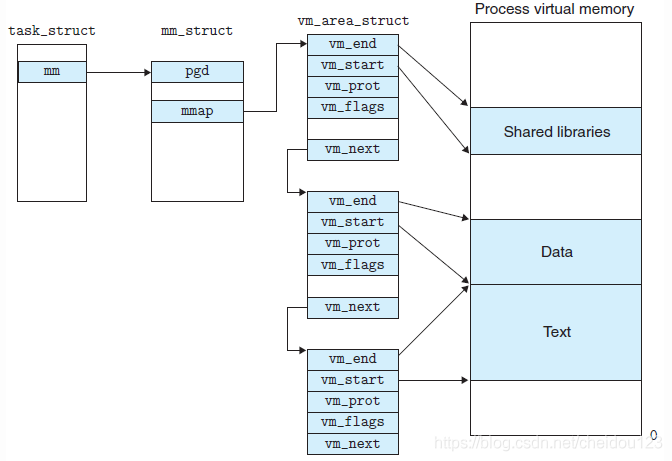

<!-- MDTOC maxdepth:6 firsth1:2 numbering:0 flatten:0 bullets:1 updateOnSave:1 -->

   - [概述](#概述)   
   - [内存描述符](#内存描述符)   
   - [虚拟内存区域](#虚拟内存区域)   
   - [用户空间常用的操作](#用户空间常用的操作)   
   - [页表](#页表)   

<!-- /MDTOC -->

### 概述

1.所谓进程地址空间，就是从进程的视角看到的地址空间

2.在Linux中，每个进程都有自己独立的虚拟地址空间，在32位模式下它是4GB的内存块

3.Linux内核进程和用户进程所占虚拟内存比例是1:3

4.用户空间的进程只能访问整个虚拟地址空间0-3GB的部分，不能访问3GB-4GB的部分

5.当进程地址空间被共享的时候，就是多线程了

### 内存描述符

1.mm_struct表示了进程地址空间的全部信息，叫做内存描述符，其中两个最重要的属性:
* mm_users，如果有两个线程共享该地址空间，就是2
* mm_count，引用计数，如果是0，就说明没有指向内存描述符的应用了

2.内存描述符被进程描述符的mm域指向，每一个进程都有唯一一个mm_struct，一个mm_struct可以被多个进程共享，这种其实就是线程

3.内核线程没有进程地址空间，也没有内存描述符，所以内核线程的进程描述符mm域为空

### 虚拟内存区域
1.vm_area_struct表示的是进程地址空间其中的一个区间，它也称为线性区描述符，也叫VMA

2.进程所拥有的线性区从来不重叠，并且内核尽力把新分配的线性区与紧邻的现有线性区进行合并。如果两个相邻区的访问权限相匹配，就能把他们合并在一起。

3.内存区域有很多属性，其中最重要的是读，写，执行权限

4.每个不同质的虚拟内存区域功能和内部机制都不同，因此一个进程使用多个vm_area_struct结构来分别表示不同类型的虚拟内存区域。各个vm_area_struct结构使用链表或者树形结构链接，方便进程快速访问

5.我们可以在/proc中查看到进程全部的内存区域

6.内核操作内存区域
* find_vma 一个地址属于哪个内存区域
* insert_vm_struct 插入新的vma
* vma_merge 将一个新的VMA和附近VMA合并

### 用户空间常用的操作
* mmap 它把文件内容映射到一段内存上(准确说是虚拟内存上),通过对这段内存的读取和修改,实现对文件的读取和修改，如果在内核空间，内核使用的是do_mmap

* mummap     该调用可以看作是mmap的一个逆过程.它将进程中从start开始length长度的一段区域的映射关闭,如果该区域不是恰好对应一个vma,则有可能会分割几个或几个vma，如果在内核空间，内核使用的是do_mummap

### 页表
1.虚拟地址需要先转换成物理地址，处理器才能解析地址访问请求

2.地址转换工作需要查询页表，每个进程都有各自的页表，线程共享页表

3.Linux中使用的是三级页表，另外还有一个TLB缓存器
