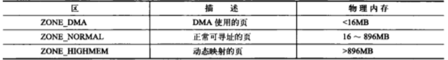
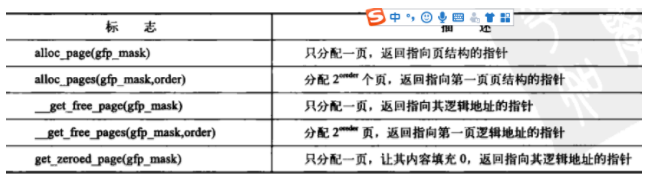

### 页
1.32位体系结构支持4KB的页，如果1GB的物理内存，物理内存被划分为262144个页

2.系统中每一个物理页都有一个struct page结构体

### 区

Linux内核主要使用四种区:
* ZONE_DMA 这个区包含的页能执行DMA操作
* ZONE_DMA32 和ZOME_DMA类似，但是只能被32位设备访问
* ZONE_NORMAL 能正常映射的页
* ZONE_HIGHEM 包含高端内存，其中的页不能永久的映射到内核地址空间

ZONE_HIGHEM叫做高端内存，其余的叫做低端内存

内存分配可以占用其它区，但是不能够同时在两个区分配

### 获得页/释放页malloc()

获得页

内核内分配和释放内存的接口，所有的接口以页为单位分配内存

 

释放页

释放页时只能释放属于你的页，否则可能导致系统崩溃，这点内核和用户空间还是不同的

### 以字节为单位的kmalloc()

如果需要的是整个页，还是使用malloc一族的函数

kmalloc确保页在物理地址上是连续的，在虚拟地址上也是连续的

释放内存的时候要注意，不要释放不是它分配的，也不要重复释放

### 物理地址无需连续的vmalloc

vmalloc分配的内存虚拟地址是连续的，但是物理地址无需连续

一般情况下，只有硬件设备必须得到物理地址连续的内存

但是，很多内核代码使用kmalloc而不是vmalloc是出于性能考虑

### Slab
1.slab机制核心思想是再空闲时建立缓存对象池，包括本地对象缓存池和共享对象缓存池

2.本地对象缓存池是本地CPU使用的

3.共享对象缓存池是多个CPU共享的

4.slab描述符是slab分配器中的核心数据结构，slab描述符给每个CPU都提供一个对象缓存池

5.slab由一个或2的N次方个连续的物理页面组成

6.kmalloc函数的核心就是slab机制，当分配一个30字节的小内存，系统会从slab描述符中分配一个对象

7.每个slab处于下面三种状态之一
* 满
* 部分满
* 空

#### slab原理
1.创建slab描述符，这个描述符里有几个核心属性
* 指向本地缓存池的指针
* 指向slab节点的node指针

2.一个CPU要从这个slab描述符中分配对象
* 如果当前CPU本地缓存池有空闲对象就直接获取
* 本地缓存池没有空闲对象，去共享缓存池获取

3.slab回收有两种方式
* 使用kmem_cache_free释放一个对象
* 定时扫描所有的slab描述符，回收一部分空闲对象

### 在栈上静态分配
1.内核栈小而且固定，32位每个进程有一页或两页，每页4KB

2.在内核中，我们只需要让局部变量不超过几百字节就可以，否则会溢出宕机甚至破坏数据

3.进行动态分配是比较聪明的

### 高端内存的映射
1.在X86的体系结构上，高于896MB的所有物理内存都是高端内存

2.一般X86处理器能够寻址范围是4GB，高端内存的页被映射到3GB-4GB

3.永久映射

永久映射的数量是有限的，当不在需要高端内存时，需要解除映射

4.临时映射

临时映射不会阻塞，可以用在不能睡眠的地方

### 分配函数的选择
1.如果需要连续的物理页，可以使用低级页分配器或者kmalloc（
2.如果想从高端内存进行分配，使用alloc_pages
3.如果不需要物理上连续的页，仅需要虚拟地址上连续的页，就使用vmalloc
4.如果要创建和撤销很大的数据结构，考虑建立slab高速缓存
