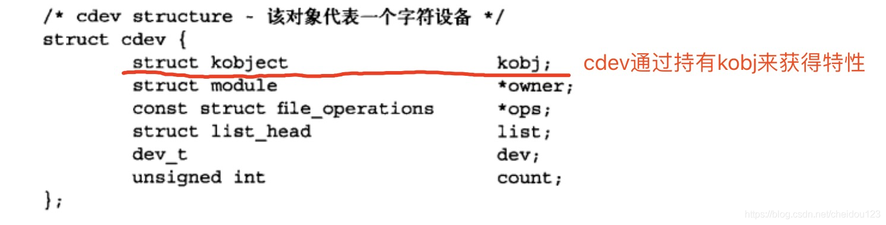
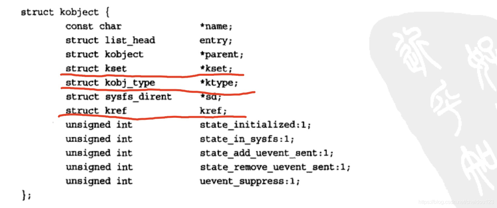

<!-- MDTOC maxdepth:6 firsth1:2 numbering:0 flatten:0 bullets:1 updateOnSave:1 -->

   - [概述](#概述)   
   - [设备类型](#设备类型)   
   - [模块](#模块)   
   - [设备模型](#设备模型)   
      - [kobject](#kobject)   
      - [ktype](#ktype)   
         - [kset](#kset)   
   - [sysfs](#sysfs)   

<!-- /MDTOC -->

### 概述
关于设备驱动和设备管理，主要讨论四种内核成分
* 设备类型，UNIX中统一普通设备的操作所采用的分类
* 模块，Linux内核中按需加载和卸载目标码的机制
* 统一设备模型
* sysfs，表示系统设备树的一个文件系统

### 设备类型
1.在Linux中，设备主要分为:
* 块设备，blkdev，可寻址的，通常被挂载成文件系统
* 字符设备，cdev，不可寻址，通过"字符设备节点"的特殊文件访问，应用程序需可直接访问
* 网络设备，它不是通过设备节点访问，而是通过套接字API来访问，所以它打破了一切皆文件的原则

另外有些设备是虚拟的，我们叫做伪设备，比如空设备/dev/null，零设备/dev/zero

### 模块
模块就是在LINUX运行时可以动态插入和删除代码，这样可以使基本内核可以尽可能的小，比如一个驱动程序

### 设备模型
统一设备模型提供了一个专门的机制来表示设备，并描述其在系统中的拓扑结构，主要优点如下:
* 减少代码开发
* 全部设备结构以树形展示出来
* 可以从叶子向其根节点遍历，保证可以正确关闭电源

#### kobject
kobject是设备模型的核心，它通常嵌入其它结构，来使其它结构拥有统一设备模型的特征，比如我们将它嵌入到cdev的结构体:

然后我们来看kobject结构体:

kobject的主要功能是提供了一个统一的引用计数kref，初始化后，kobject引用计数为1，，就留在内存中，如果有一个对象引用kobject，那么引用计数就加1，当引用计数为0时，对象被撤销并释放内存

#### ktype
ktype就是描述一种普遍的特性，我们可以拥有同一普遍特性的kobject引用同一个ktype

##### kset
kset表示一组kobject的集合，kobject通过kset组织成层次化的结构

它可以将相关的kobject组成一个kset，当成sysfs的一个节点

### sysfs
sysfs文件系统是一个处于内存中的虚拟文件系统，它为我们提供了kobject对象层次结构视图，它替代了/proc下的设备相关文件

* block目下下每个子目录对应系统中一个已经注册的块设备，每个子目录下又包含分区
* module包含系统已加载模块的信息
* devices 将设备类型导出到用户空间

另外，目录层次可以使kset或者kobj:
* 对于devices、bus、class、module它们是kset
* 对于fs、dev、firmware、kernel、block 它们是 kobj

分析目录结构时把kset当成一个普通的kobj会好理解很多
