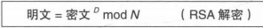

## 密码
### 环游密码世界
在密码学中，有几个重要的概念!


密码，分为两种解密种类:
* 解密 接收者解密
* 破译 不是接收者解密

对称密码和非对称密码
* 对称密码加密和解密使用同一密钥的方式
* 非对称密码加密和解密使用不同的密钥

也有同时使用对称密码和非对称密码的，叫做混合密码系统

密码学主要有六种主要的技术
* 对称密码
* 非对称密码
* 单向散列函数
* 消息认证码
* 数字签名
* 伪随机数生成器

我们先做个总结


我们使用密码学技术有几个做基本的原则
* 不要使用保密的密码算法，因为早晚会暴露，而且开发很困难
* 使用低强度的密码比不进行任何加密更危险
* 任何密码总有一天会被破解
* 密码只是信息安全的一部分

### 历史上的密码
#### 凯撒密码
就是通过字母移位，这个破解很简单，因为总共26个字母，只需要暴力破解一个个试就可以了

#### 简单替换密码
就是字母随机替换，其实破解也很简单，我们只需要根据频率进行分析就可以了

#### Enigma
是一种德国国防军使用的密码机，不过后来也被偷摸的破译了

### 对称密码
#### 比特序列运算和XOR运算
所谓比特序列运算，就是把字母转换成bit，其实这种编码规则就叫ASCII，另外我们要知道这种不是加密，因为计算机可以识别出来


什么是XOR呢，就是异或，异或有个最重要的地方就是A和B异或后，再和B异或一次，就重新得到了A

#### 一次性密码本-无法被破译的密码
什么叫一次性密码本呢？就是将明文转换成bit和一串相同长度随机比特序列进行XOR运算，然后接受方在用这个比特序列解密，具体就是再XOR一下

虽然这种方式无法破译，但是这种方式依然没有被使用
* 最最主要的原因是密钥如何配送给接收方
* 如果明文很长，密钥也很长
* 密钥的保存
* 不能重用
* 需要真正的随机数，而不是伪随机数，但是实际上也可以使用伪随机数，那种方式叫做流密码

#### 可破解的DES--不可使用
目前DES可以在短时间内被破译，从理论上来说，DES密钥长度是64位，但是每7个比特会有一个错误校验比特，所以实际长度是56位比特

明文转化后每64位叫做一个分组，DES是以分组为一个单位进行加密的，如果超过一个分组，具体先不讲

##### DES的原理Feistel密码
在Feistel密码中，每次加密叫做一轮，DES一共16轮，另外在AES的候选算法(注意不是被选中的)也有使用Feistel密码，我们先看一轮的情况:


具体过程如下:
* 待加密的数据分成左右两个部分
* 输入右侧直接发出到输出右侧
* 输入右侧同时发送到轮函数
* 轮函数根据右侧数据和子密钥，生成随机比特序列
* 左侧部分和随机比特序列进行XOR

就像上面那样，左侧并没有加密啊，因为这才一轮，实际上有很多轮，我们举个三轮的例子:


如何解密呢？注意我们使用的是XOR，所以轮函数可以任意复杂，不需要存在反函数，解密可以使用完全相同的结构

DES很容易破解，只需要使用差分分析或者线性分析就可以

#### 3DES-兼容DES的--也不推荐使用
三重DES存在的主要目的是增加DES的强度，分组长度也是64比特


首先我们要知道，三重DES并不是指的经过三次加密，而是指加密-解密-再加密

三重DES的密钥长度是DES的三倍，如果三段完全相同，那么就能无缝兼容DES，因为加密后再解密就是原文，再加密就是DES

#### AES 推荐使用，目前还未被破解
AES标准有很多候选算法，最终被选上的是Rijndael算法，这是一个免费的算法

Rijndael算法在AES标准中分组长度固定为128比特，密钥长度只有128，192，256三种长度

它并没有使用Feistel网络，而是使用SPN结构，具体的实现可以略过，稍微复杂一点点

### 分组密码
上面讲的DES和AES，只能加密固定长度的明文，如果需要加密任意长度的明文，就需要对分组密码进行迭代，这种迭代方法就是分组密码的模式

* 分组密码和流密码
  * 分组密码每次只能处理特定长度的一块数据
  * 对数据流进行连续处理，一般以1比特，8比特或者32比特进行加解密

一次性密码本属于流密码，DES，3重DES，AES等大多数对称加密算法都是分组密码

由于我们需要将一段很长的密文进行加密，所以我们需要不断进行迭代，这个迭代的方法就是分组密码的模式，分组密码的模式主要有以下几种，这里我们一般只介绍两个，也就是ECB和CBC，因为目前而言CBC是最合适的
* ECB 电子密码本模式
* CBC 密码分组链接模式
* CFB 密文反馈模式
* OFB 输出反馈模式
* CTR 计数器模式

上面几种模式的比较如下:


首先我们要知道，如果简单的将明文直接切开，也就是分组，那么会出现很多漏洞，这种也就是ECB模式

* 明文分组和密文分组
   * 明文分组，也就是加密对象的明文，分组长度和分组密码算法长度一致
   * 密文分组，通过分组密码算法将明文分组加密之后所生成的密文


#### ECB模式
ECB是最容易理解的，也就是将明文分组加密后直接结合成密文，解密也差不多


如果最后一个明文分组小于分组长度会加一些填充

攻击ECB模式其实很简单，攻击者可以直接修改密文分组的顺序，当解密时，明文分组的顺序就会改变，甚至无需破译密码都行

#### CBC模式
##### 什么是CBC模式
CBC模式是将前一个密文分组与当前明文分组的内容混合起来进行加密的，这样就可以避免ECB模式的弱点

首先将明文分组域前一个密文分组进行XOR运算(第一个使用一个初始化向量)，然后再进行加密


解密同理


* CBC模式的特点
  * 可以保证即使相同的明文分组也不一定会产生相同的密文
  * 如果要加密密文分组3，需要凑齐明文分组1，2，3才行
  * 如果有一个密文分组损坏，会损害它对应的明文分组和下一个明文分组，也就是两个，再下个不受影响
  * 但是密文分组发生错位，后面的就全GG了

##### CBC模式的攻击方式
###### 比特缺失
在CBC模式中，如果有一个比特缺失，会从当前明文直接影响到最后，如下所示


###### 初始化向量比特反转


Mallory可以对初始化向量进行攻击，通过修改初始化向量的某个比特来修改明文分组某个比特，这个可以指哪打哪

但是我们通过修改密文分组的某个比特无法做到指哪打哪，因为这样会修改明文分组多个比特的值，以及下一个明文分组

###### 填充提示攻击
我们都知道，分组密码是有填充部分的，攻击者可以每次修改一些填充部分，这样接收者无法正确解密，就会返回一个错误消息，攻击者根据这个错误消息就可以获得一部分与明文相关的信息，这种方式适合所有需要进行分组填充的模式

###### 对初始化向量进行攻击
如果初始化向量是可以预测的随机数，就可以进行攻击，在TLS1.0版本协议中，就是可以预测的随机数，后来进行了修补

##### CBC的应用实例
在SSL/TLS中，就是使用CBC模式来确保通讯的机密性的

### 公钥密码
#### 密钥配送问题
可以说公钥密码是密码学历史上最伟大的发明，它解决了对称加密方法的密钥配送问题，最常用的公钥密码是RSA

什么是密钥配送问题呢？就是如何将密钥传给对面，公钥密码就是用来解决密钥配送问题的方式之一，其他方式如下
* 通过事先共享密钥来解决
* 通过密钥分配中心来解决
* 通过Diffie-Hellman密钥交换来解决，这个后面再探讨
* 通过公钥密码来解决

#### 什么是公钥密码
密钥分为加密密钥和解密密钥，加密密钥公开，解密密钥自己保留
#### 时钟运算


##### 加法
时钟加法也就是时钟向右转，其实也就是
```
X mod 12
```
##### 减法
我们只需要让时钟向左转动就可以了，但是时针只能向右转动，比如我们现在时钟位置位于7，减7其实就是加5

##### 乘法
乘法其实更简单，比如7*4 就是做4次加法，每次加7

##### 除法
除法，其实也可以看做乘法的逆运算，这里有个概念，就是某个数是否存在倒数，可以通过这个数和12的最大公约数是否为1这个条件来判断

##### 乘方
乘方，也就是多次乘法。为了避免大整数相乘，可以通过下面的方式


#### RSA
RSA主要有两种用途:
* 公钥密码
* 数字签名

##### 加密
RSA的加密过程如下:


在RSA中，明文，密钥和密文都是数字，密文的代表明文数字的E次方求mod N的结果，而E和N就是公钥，注意他俩不是密钥对。非常简洁

##### 解密



数D和数N组合起来就是RSA的解密密钥，也就是D和N的组合是私钥

 

#### 对RSA的攻击
