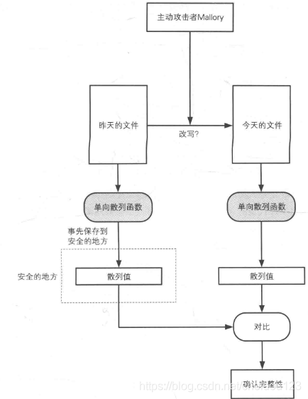

### 单向散列函数

#### 什么是单向散列函数

我们有个场景，如果有个网站发布了一个资源，然后它让多个网站帮他发布，如何保证其他网站没有篡改文件
内容呢？？

这个时候我们就需要一种叫做散列的方式，散列可以保证文件的完整性和一致性，网站在自己网站可以发布
文件的散列值，下载者对下载的文件进行散列，然后对比就可以了

单向散列函数又叫做消息摘要函数，哈希函数等，散列完之后的叫做消息摘要

#### 散列函数的重要特点

* 无论消息体有多大，散列出来的长度都是一样的，比如SHA-256散列完都是256bit
* 能够快速计算出散列值
* 消息不同，散列值也不同,如何一样，就是产生了碰撞
* 单向

#### 单向散列函数的实际应用

* 检测软件是否被篡改
* 基于口令的加密
* 消息认证码
* 数字签名
* 伪随机数生成器
* 一次性口令

#### 具体例子

##### MD4/MD5

MD4是1990年设计的，已经不安全

MD5被中国学者王小云的论文证明可以通过不到1小时就可以找到两个不同的输入
