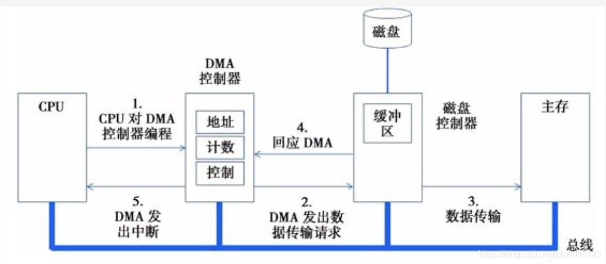
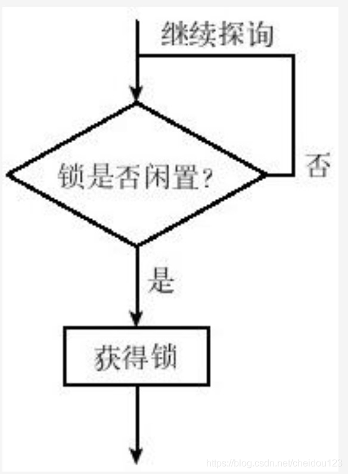
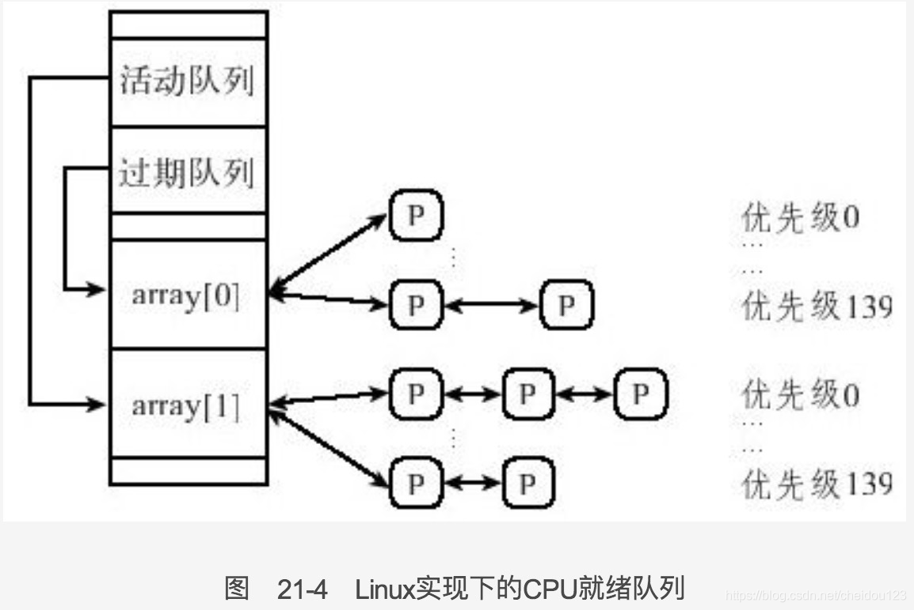

### IO原理篇
1.从操作系统设计人员来看，输入输出设备分为两种，字符设备和块设备
* 字符设备以字符为单位，不能寻址，例如键盘
* 块设备以数据块为单位，可以寻址，例如磁盘

2.有的设备也可以同时作为字符设备和块设备
3.输入输出设备主要包括两个部分
* 物理硬件部分，
* 控制器，控制器的作用包括以下几点
  * 控制设备的物理运行
  * 将序列字节流转换为字节块流
  * 进行纠错操作

4.按照CPU与设备控制器的沟通方式来分，可以分成以下三种:
* 专有通道的IO，IO与内存完全没关系，需要在高级语言中使用IN/OUT这种低级指令
* 内存映射的IO，将IO设备的控制寄存器和缓冲寄存器映射到内存里，对内存地址的访问就是对设备的访问，所以看起来就像内存访问，在这种情况下，我们主要是要禁止内存缓存来保证IO设备拿到最新的数据
* 混合IO，缓冲区对应内存映射，IO端口对应专用通道IO

5.按照CPU在IO过程中的角色可以分为
* 繁忙等待访问，CPU介入整个过程，一直处于繁忙状态
* 直接内存访问(DMA)，如果按照数据块进行IO需要内存与IO设备交换大量数据，当交换数据时，可以让CPU去忙别的事情

6.直接内存访问在数据交换过程中使用的是DMA控制器，这个过程如下，其中步骤1是CPU告诉DMA控制器IO的起始地址和数据长度

7.并不是任何时候都适合使用DMA，当设备IO速度很高，或者CPU很闲时，还是可以考虑直接使用CPU的
8.IO软件使用户不需要理解不同设备的不同底层命令，将不同IO设备的差异屏蔽，IO软件的主要目标如下
* 设备独立
* 统一命名
* 错误处理
* 数据传输
* 缓冲
* 共享与独享

9.从软件角度来看，设备也有不同的IO模式
* CPU介入很深，繁忙等待，容易造成优先级倒挂等问题
* 中断驱动IO原理，不进行繁忙等待，而是去干别的事，IO数据传输完成发送IO中断给CPU，CPU恢复程序
* 直接内存访问，中断驱动IO的问题是一个IO任务可能分成多次数据传输，因而导致多次中断，直接内存访问就是将这多次中断合并成一次

10.IO软件分层
*  中断服务程序，位于最底层，直接与硬件相关，不同硬件也不同
* 设备驱动程序，负责中断响应，启动IO操作后阻塞，等待完成中断，当收到中断请求后，中断服务程序将设备驱动程序叫醒，由制造商提供，需要了解硬件细节，归属操作系统内核
* 设备独立的操作系统软件，这层软件存在的目的在于有些和设备无关的IO可以统一起来，另外它可以对所有的IO设备提供缓冲和错误报告
* 用户层IO软件

### 多核原理篇
1.超线程技术可在同一时间让应用程序使用芯片不同部分
2.超线程技术能同时执行俩线程，但是性能不如两个CPU，它是半并行
3.多核的内存结构
* UMA 均匀内存访问，所有核使用相同方式和延迟访问内存，核太多竞争太激烈
* NUMA 非均匀内存访问，离近的更快，远的慢
* COMA，每个核配置缓存，完全走缓存

4.计算机启动的时候，BIOS不支持多线程，因此CPU必须有先后顺序之分，对于对称多处理器架构，有一个是启动处理器，其余是应用处理器
5.多处理器之间通讯可以使用信号等方式，但是为了对方及时响应，可以采用中断机制，用于协调中断的是高级可编程中断控制器(APIC)，每个CPU核都有APIC单元

### 多核环境下的进程同步与调度
1.硬件提供的原子操作中找那加载存入指令，测试与设置在多核环境下均可使用
2.总线锁就是将总线锁住，只有持有该锁的CPU才能使用总线
3.旋锁
* 几乎所有多核操作系统都提供的用于多处理器
* 主要用于操作系统多处理器互斥，用户程序不可以使用
* 旋锁的互斥指的是多个CPU之间互斥，而不是线程互斥
* 一个CPU获得旋锁，那么该CPU上所有线程都可以访问受保护资源

4.旋锁的缺点:
* 旋锁最大的问题在于总线竞争，旋锁提现在内存中，CPU检查旋锁装填时，会一个劲的访问内存

5.我们可以从旋锁上排一个队列表示哪个CPU需要它，然后释放时检查这个队列
6.多核环境下的进程调度
* 对于多个核来说，每个CPU都有自己的就绪队列，队列里面又可以按照不同优先级分成子队列，如图21-4所示
* 对于不同优先级的进程来说，调度算法为优先级高的有限，同一优先级采用时间片轮转，也就是时间片用完，放到队列的末尾
* 一个进程优先级也是可以动态变化的啊

 

7.对多核CPU还有需要考虑的一点是要保证多个核负载平衡，我们将一组CPU组成一个调度域，在同一个调度域里面的CPU进行平衡，负载平衡分为主动和被动两种:
* 主动是指CPU将某些进程推出去，可以跨调度域
* 被动是指CPU将某些进程拉进来，可以跨调度域

8.一个一直在同一个CPU核上的叫做钉子进程
9.多核环境下能耗管理
* 当CPU没有任务可执行时，可以进入C状态，一个耗能很低的状态
* 当CPU工作量很小时，可以进入低速的P状态
* 对于超线程架构来说，一个逻辑CPU可以变为C而不影响其它逻辑CPU，但是P不行，因为一个物理CPU通用一个时钟
* 对于多核结构来说，C也是独立的，多核之间拥有独立的P状态控制寄存器，但是每个核之间P状态一般是相互依赖的

10.多核不一定能提高系统性能，因为这涉及到多个核之间相同协调

### 操作系统设计之哲学原理
1.层次架构，下面一层只对上面一层负责，上层只控制直接下层
2.没有多措，只有好坏之分
3.能不管的尽量不管，比如fork的时候只创建一个空的子进程
4.让困于人，只做分内的事，比如多死锁不支持动态避免
5.留有余地，即有保留空间的概念
6.子虚乌有，就是用户看来实实在在的东西然而并没有，比如虚拟内存
7.时空转换，比如我们使用分级页面，放到磁盘上一部分，时间换空间
8.权力分离，优先级调度方式操作系统提供，每个进程优先级用户选择
9.尽量简单，适可而止
