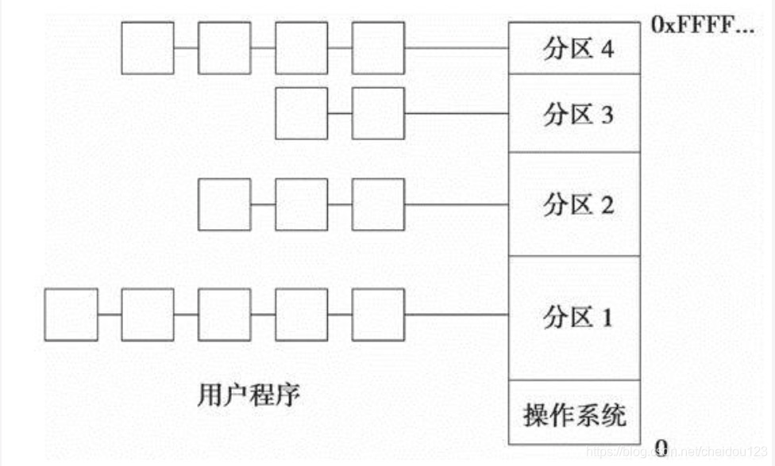
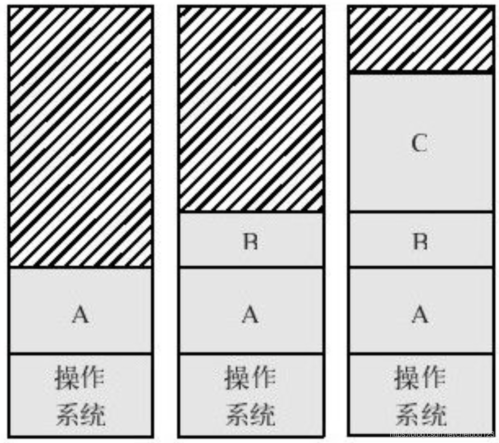
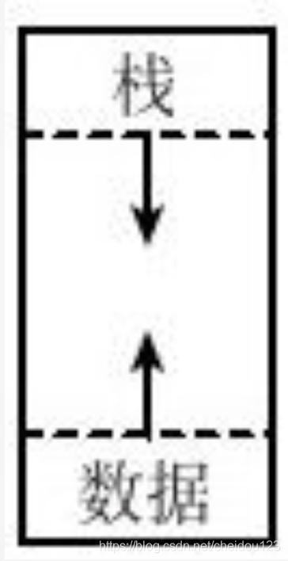
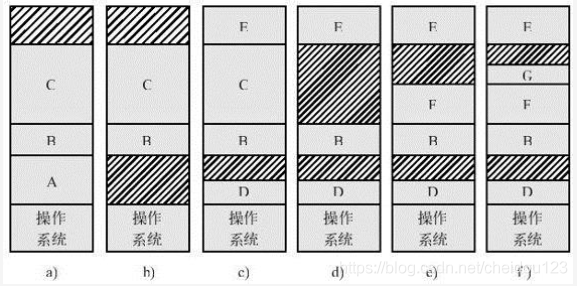
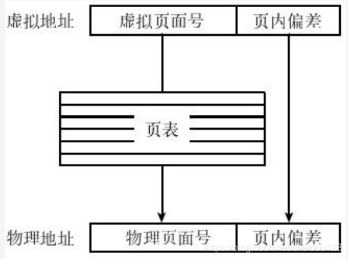
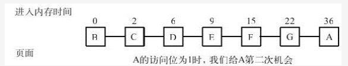
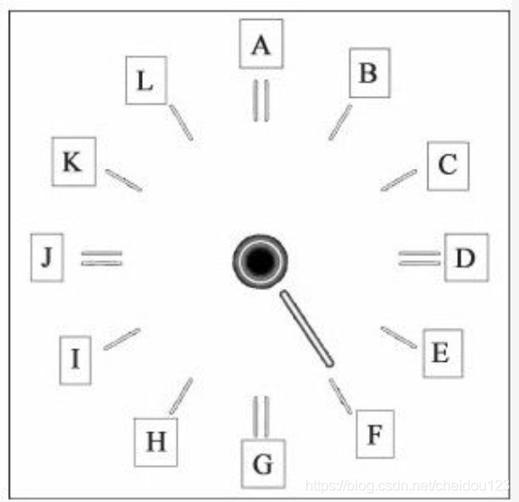
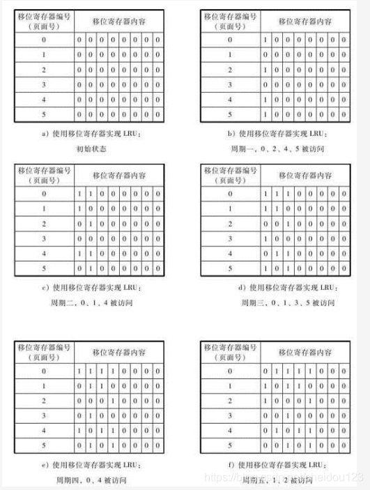
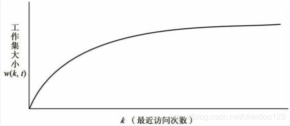
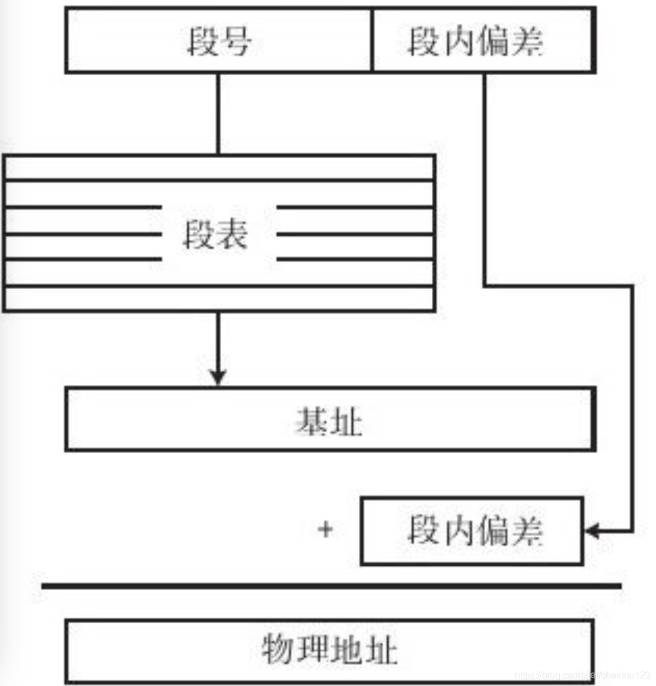

### 基本内存管理
#### 内存管理的环境
程序要运行，必须先加载到内存，内存管理负责对内存架构进行管理，使用户无需担心自己的程序是在缓存，主存，还是磁盘上，实现的手段就是靠虚拟内存，虚拟内存就是一个幻像，给用户提供一个比物理主存大许多的地址空间
#### 内存管理的目标
* 一个进程不能随便访问另一个进程的地址空间
* 程序指令里面的地址是虚拟空间的虚拟地址，而不是实际物理地址
#### 虚拟内存的概念
一个程序向要运行，需要加载到物理内存中，但是物理内存又非常有限，使用虚拟内存可以在不增加成本的情况下扩大内存容量

虚拟内存的核心是把物理主存扩大到磁盘上，把磁盘空间看做主存空间的一部分，在程序执行时，程序发出的地址到底是在主存还是磁盘完全由操作系统内存管理模块负责判断

#### 操作系统在内存中的位置
操作系统就是管理计算机的程序，本身也需要使用资源，其中一个就是内存空间，多数现代操作系统ROM里面包括操作系统一部分和IO，RAM包括操作系统其它部分

#### 单道程序的内存管理
在单道程序的环境下，内存里只有一个用户程序和一个操作系统，操作系统所占用的内存空间是恒定的，因而可以将用户程序总是加载到同一个内存地址上，即用户程序永远从同一个地方开始执行，这种模式下，用户程序地址都可以事先算出，即程序运行前就计算出所有的物理地址(编写程序时并不需要知道，而是由编译器等来做静态翻译)，这种方式叫做静态地址翻译

当然，这种情况是不现实的

#### 多道程序的内存管理
在多道程序的情况下，无法将程序总是加载到固定的内存地址上，无法使用静态地址翻译，我们就必须在程序运行时来进行地址翻译，叫做动态地址翻译

##### ⑴固定分区的多道程序内存管理
将内存分成固定的几个区域，每个区域大小是固定不变的，当新程序来了，就排队的等待，直到加载到固定分区

##### ⑵地址翻译的方法
物理内存地址 = 虚拟地址 + 程序所在区域的起始地址

程序的大小叫做极限，程序发出的虚拟地址大于极限，就把进程kill了

##### ⑶动态地址翻译的优点
使用动态地址翻译最重要的好处是使虚拟内存的概念得以实现，一个程序发出的访问地址有可能在内存，也有可能在磁盘

##### ⑷非固定分区的内存管理
固定分区大小不是很灵活，如果一个程序比分区大咋办，下面来介绍下非固定分区，非固定分区除了划给操作系统一部分，剩下的进程A来了，给进程A一块，B来了，给进程B一块

有的时候A运行着运行着需要更多的空间咋整呢？我们可以一开始就给程序分配一块足够大的，这时有个问题，一个程序空间的增长包含两个来源:数据/栈，我们可以让它们反向增长来最大化空间使用

##### ⑸交换
操作系统如何知道该分配多少空间给一个程序呢，如果像上面所说上来分配一个很大的，会不会造成内存浪费？

还有个办法，就是当空间不足时，把它倒入磁盘，然后再加载到一块更大的内存，叫做交换

当需要执行某个进程时，整个进程从交换分区中移动到主存中。单个进程的大小不能超过内存可用空间的大小

#### 闲置空间管理
在进行内存管理的时候，我们需要知道哪些已经被占用，哪些是空闲的:

第一种方式是每个分配单元一个标志位来标志是否被占用

还有一种方式通过链表加位图的方式

### 页式内存管理
#### 基址极限管理模式的问题
* 空间浪费的问题，会导致外部碎片，这种碎片处于进程外边，如果进行碎片整理，效率又十分低下:

* 程序受限的问题，单一程序不能超过物理内存空间(减去操作系统所占部分)，尽管多个程序总空间可以超过

#### 分页内存管理
分页内存管理将虚拟地址空间和物理内存空间划分为大小相同的页面，如4KB，然后将页面作为内存空间分配的最小单位，这样就可以解决上面两个问题，进程外没有了空间浪费，用到的页加载到内存，不用的在磁盘，解决了程序受限的问题

在分页系统下，程序发出的虚拟地址由两部分组成：页面号和页内偏移量

##### ⑴地址翻译
对于一个虚拟页面，系统需要知道该页面是否在内存中，如果在找到，不在就产生一个系统中断，将该页从磁盘转到内存，然后给它分配物理页面号，分页系统的核心就是地址翻译，这个翻译过程由内存管理单元MMU搞定，翻译只会翻译页面号，因为虚拟页大小和物理页大小一样，无需翻译偏移量

内存管理单元的关键在于查页表，每个程序都有一个页表，存放映射关系

##### ⑵页表
页表的记录条数与虚拟页面的数量时相同的，页表中一个记录包括很多的内容，如下所示:

页表是一个硬件数据结构，如果要访问的页面不在内存，就产生一个缺页中断，去磁盘上找到对应的内容放入内存，然后更新页表

#### 分页系统的优缺点

分页系统解决了外部碎片的问题，但是页表很大占用了很多内存，所以有了多级页表的概念，比如分为顶级页表，一级页表，二级页表。。。程序运行时，顶级页表常驻内存，顶级页表指向的是一级页表的信息，一级页表二级页表看情况来决定是否放入内存

比如一个两层页表，前10位是顶级页表索引，中间10位是次级页表索引，后12位是页内偏移量

多级页表也有缺点，就是降低了效率

#### 反转页表
在不增加页表级数的情况下，可以通过反转页表来降低页表所占空间，反转页表存放物理地址到虚拟页面的映射，由于物理内存很小

假设我们有个64位虚拟地址，那么进程逻辑地址大小为2^64B
假设页面大小为4KB， 4KB为2^12B
两者相除，页面数量是2^52
假设我们的实际物理内存只有256MB，除以4KB，为65534 即2^12
可见，通过反转页面可以使页表数量大大减少

而且，反转页表每个系统可以只有一个，CPU发出来的地址是虚拟地址，我们可以将所有的虚拟页号散列到物理页号

#### 翻译速度
为了提高翻译速度，引入了TLB的概念，TLB就是一个缓存，通过局部性原理将上次访问的地址的旁边地址给缓存起来，这样就不用查页表了，查TLB表的时候硬件可以并行同时查询所有条目，所以非常快，TLB由CPU制造商提供

#### 缺页中断处理
如果虚拟地址对应的页面不在物理内存，那么就会产生一个缺页中断，去对应磁盘去找对应的内容

#### 锁住页面
如果你物理内存不够了，就会出现页面替换，如果一个页面很重要，我们可以将其锁住，以防止被替换到磁盘

#### 页面尺寸
如果页面尺寸太大，因为程序的最后一个页面一般都不满，所以最后一个页面会产生较大的内部碎片

如果页面尺寸太小，又会使页表很大或者页表层次增多，所以我们需要一个平衡

#### 内存抖动
如果我们的替换策略不合理，把快要访问的页面给替换到磁盘上去了，然后接着又缺页中断了，如果一直缺页中断，就会产生内存抖动，所以我们要设计一个合理的页面替换策略，另外，如果一个进程频繁访问页面数超过物理内存页面数，也会产生内存抖动

比莱迪异常:
有的时候，我们增加物理页面数，缺页中断反而更多了，就是发生了这种很少见的异常，我们可以继续给进程增加物理页面数，直至消失

### 页面更换算法
#### 页面更换的目标
我们选择的页面最好是再也不会被访问的页面，页面更换算法分为两大类
* 公平算法 不考虑每个页面在一个程序中的不同作用
   * 随机算法，其实就是猜，这里不作详细讨论
   * FIFO算法，先入先出，最先进入内存的可能多次被访问，其实也不好这种
   * 第二次机会算法
   * 时钟算法
* 非公平算法 每个页面有一些个体信息
  * 最优算法，一个不可能实现的理想状态下的算法，选择一个随后最长时间不会被访问的页面进行替换
  * NRU算法
  * LRU算法
* 混合算法
  * 工作集时钟算法

#### 第二次机会算法
第二次机会算法是对FIFO算法的增强，在FIFO算法替换一个页面时，如果这个页面最近没有被访问，则直接替换，如果检查访问位被访问了，那么将它访问位清0，并将它挂到链表末端，从链表头开始找，知道找到访问位是0的为止

#### 时钟算法
它和第二次机会算法本质是类似的，但是使用的内存空间要少，

我们把页面排成时钟形状，指针依次旋转，如果访问到的页面访问位是1，就改为0，继续旋转，直到找到位0的替换出来

第二次机会算法和时钟算法都有很小的概率导致无限循环，即改成0之后又马上被访问了

#### NRU算法
NRU选择的是一个在最近一段时间没有被访问过的页面进行替换，每个页面都有一个访问位和修改位，凡是对页面读写操作，访问位设置为1，对页面进行写操作，修改位设置为1，所以，页面一共有四种类型了:

系统会定期将访问位清0，但是不会对修改位清0，由此可见，在考虑一个页面状态时有一个时间的概念，有了这4个页面类别后，NRU算法就按这四个顺序来替换，有第一种的就从第一种替换一个，以此类推

NRU算法无法判断同一类型的页面的访问时间到底谁更近一些

#### LRU算法
LRU算法是最近最少使用算法，我们举个LRU算法的例子:

每个页面有一个移位寄存器，在每个固定时段内，所有页面移位寄存器右移一位，如果在这个时间段内被访问了，移位寄存器置1，否则为0

#### 工作集时钟算法
LRU算法虽然很好，但是成本较高，商用操作系统并没有采用LRU算法，因为它必须对页面保持某种记录，还需要周期性更新记录

工作集时钟算法被大多数商业操作系统采纳

我们要知道，在一段时间内，程序访问的页面将局限在一组页面集合上，这个集合叫做工作集，随着访问次数越来越多，工作集趋于稳定，也就像一个饭店，经常卖出去的菜也就那一些:

如果程序在内存里面页面数小于工作集，也就是一个劲的发生缺页中断，导致内存抖动

我们要做的是页面更换时，找到一个不属于工作集的页面进行更换，具体算法如下:
* 每个页面维护一个最后访问时间，将内存里的页面顺序按照时钟方式组织起来
* 确定时间间隔为T
* 从指针指向的位置依次扫描所有页面
* 如果页面访问位是1，就把访问时间改成当前时间，访问位清0
* 如果访问位是0，说明从上次扫描到现在没有被访问过
    * 与当前时间距离大于T，就替换
    * 如果不大于T，记录它的最后访问时间，如果全都是这种页面，就把最后访问时间最早的替换掉(所有这类最后访问时间就记录一个就行)

如果所由访问位都是1，说明我们需要增加物理页面了

#### 全局策略和局部策略

全局策略:每次替换时替换的可以是另一个进程的页面。利用资源好，但是容易造成程序不稳定，一个进程占用物理页面数可变

局部策略:替换当前进程的页面，程序稳定，但是不能良好利用系统整体资源，一个进程所占物理页面数保持不变

### 段式内存管理
#### 分页系统的问题
分页系统最大的缺点就是一个进程只能占有一个虚拟地址空间，但是只分配一个地址空间会有很大的问题，例如，我们的编译器在工作空间会有多个数据结构，比如词法分析树，常量表，代码段等等，当一个数据结构空间增长时，可能会和邻近的数据结构发生冲撞，如下图所示，所以，我们最好让一个程序又多个地址空间

#### 分段管理系统
我们可以将程序分成多个地址空间，比如编译器，符号表，代码段，常数表等等分别占用一个地址空间，这时候每个虚拟地址有两个部分组成，段号和段内偏差，我们通过段号去查找段表，然后再结合段内偏差找到最终的物理地址，一般一个段表也就3到5个段

 

#### 段页式内存管理
分段管理的缺点是外部碎片，以及一个段必须全部加载到内存，为了解决这个问题，我们可以对段再进行分页

就相当于我们在段表之后再跟上页表，在段表里先找到页表，同时结合TLB来提高性能，当前商用计算机都支持段页式内存管理模式
