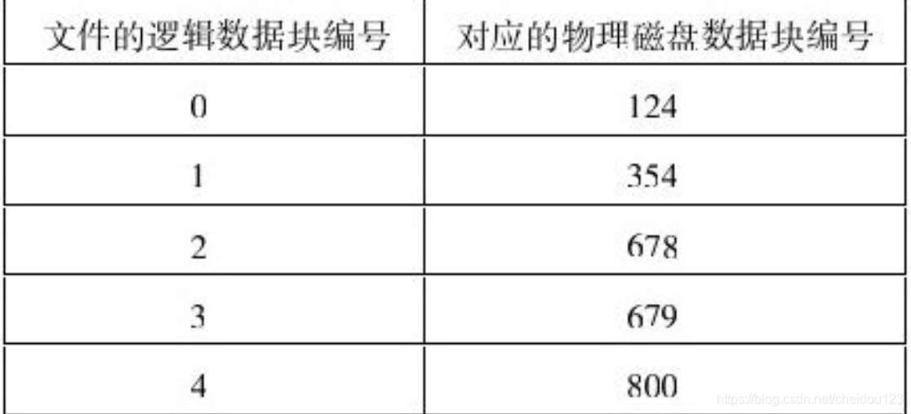

### 磁盘操作
1.磁盘有多块盘片，每个盘片正反两面，每个面都有一个磁头，但是在任何时候只能有一个磁头处于活跃状态
2.每个盘面分成磁道，每个磁道又分成扇区，扇区分为三个部分，标题，数据部分，ECC纠错信息
3.扇区的数据部分一般是512B，必须是2的指数次方
4.磁盘驱动器的访问速度指以下几个部分:
* 寻道时间，把磁头移动到所要求磁道位置所需要的平均时间
* 旋转延迟，磁头找到磁道后，盘面旋转到磁头下方的平均时间
* 上面两者相加就是平均访问时间

5.操作系统一般以磁盘块(几个扇区组成)进行管理
6.磁盘调度算法
* 先来先服务，效率低下
* 短任务优先，谁的读写数据量小谁优先，但是磁盘瓶颈在于访问时间
* 短寻道优先，看似不错，但是容易左右摆动，寻道时间迅速增加
* 电梯算法，单向运行，直到没有请求，就和电梯一样，防止左右摆动

7.固态硬盘没有移动的机械组件，使用与内存相同的介质

### 文件系统
1.文件系统就是磁盘的抽象
2.文件系统将其接触的磁盘的物理特性转换为用户看到的路径名和文件名，用户对磁盘的访问只需要给出文件名和路径名即可，无需知道磁柱，磁道，扇面，数据块等
3.文件系统的目标是地址独立和地址保护
4.地址独立就是一个文件在产生的时候无需担心其存放的磁盘地址
5.地址保护意思是不是任何人都可以访问文件
6.除了给出文件名，还可以给出文件内容来供操作系统查询使用，比如数据库
7.现代操作系统均使用字节流的方式来组织文件内容
8.文件类型分为目录，一般文件，块文件
9.一般文件分为文本文件和二进制文件，文本文件存放的是没有经过处理的数据，即以ASCII码表示的数据，任何编辑器都能打开，二进制文件时经过编码的文件，普通编辑器打不开，必须专门文件才能打开
10.块文件时对于输入输出设备的，我们把输入输出设备当块文件
11.我们如果使用系统调用的方式来操作文件，效率较低，我们可以将磁盘访问编程内存访问，将需要访问的文件映射到一个进程的虚拟地址，访问该虚拟地址就相当于访问文件，当进程中止时，就把内存内容flush到磁盘

#### 地址独立的实现机制--文件夹
1.文件在磁盘上的什么位置，需要一个数据结构来记录每个文件在磁盘上的地址，这个数据结构就是文件夹
2.文件夹需要提供一个找到下属文件所有磁盘块的方法
3.文件夹本身也是文件
4.如何通过文件名找到其所在磁盘地址
* 假设我们要找的地址是/caibin/handsome
* 首先根目录有caibin的磁盘地址，我们先找到caibin这个文件夹
* caibin这个文件夹里面又有handsome的地址

5.使用相对路径有时候可以节省磁盘访问次数，但是访问的文件必须是直系后代，否则可能还多浪费时间了呢，因为首先要往上找，可能还不如绝对路径寻找快呢

### 文件系统实现
1.必须分区的根本理由在于对磁盘空间的使用，磁盘地址需要保存在内存里，一个16位内存，最多保留2^16个地址，如果每个扇区512B，那么也就32MB，如果每个扇区太大，又浪费了磁盘空间
2.磁盘有一个个扇区，编号从0开始递增，最前面的是MBR，主引导记录，该记录用来启动计算机
3.紧接着MBR的是磁盘分区表，磁盘分区表里给出的是磁盘的所有分区及其开始和终结地址，其中一个是主分区，操作系统就装在里面，主分区最前面的是引导记录BR
4.计算机启动流程
* 处于主板ROM的BIOS程序首先运行
* BIOS读取MBR并运行
* MBR找到系统主分区，找到BR运行
* BR负责启动操作系统

5.对文件系统的实现，根本在于可以把文件放在合适的地方，并在需要时容易读出这些数据
6.数据在磁盘上可以连续存放，也可以非连续存放
7.连续空间存放
* 一个文件占据一片连续的空间
* 一次磁盘寻址就可以读出整个文件，效率较高，数据库一般都是连续存放
* 连续存放的问题是磁盘碎片较多，比如删除一个文件，如果新的文件大小不小于让出的空间，就没法塞进去，必须文件扩大比较不方便，因为周围可能都被占用了

8.非连续空间存放
* 我们可以使用链表的方式，每个数据块留出一个指针空间，存放下一个数据块地址
* 这种方式可以利用碎片，但是访问速度慢，而且指针还占了空间
* 还有个隐蔽的问题，我们磁盘块是2的N次方，指针已占用，数据就不是2的N次方了，那么访问速度叶晖变慢

9.为了解决非连续空间存放链表的问题，我们可以把指针全都抽出来放到一张表里(★注意这里，FAT的记录项与物理磁盘块数一样，所以比较占用空间)，我们查数据的位置就去查表，这张表叫做文件分配表
* 文件分配表每个记录是下一个所在数据块的物理磁盘块编号
* 起始地址存放在文件夹里面

10.索引文件组织
* FAT表虽然很大，但是存放有用的记录不一定很多，如果系统文件数量较少，或文件尺寸很小，则FAT里面的很多记录都是空的，所以将整个FAT放在内存里有些不必要了
* 如果我们可以将单个文件所有数据块磁盘地址收集起来，放到一个索引数据块里，文件打开时将该数据块加载到内存，然后从里面获得物理磁盘地址，这样就只加载我们需要的到内存，节省了太多的空间
* 该索引数据块成为inode，下图就是一个inode

* 访问文件时，先打开inode，从里面找到对应的磁盘地址
* inode还存放有一些别的信息，比如文件创建时间等
* 索引文件也属于非连续空间存放方式，自然也有非连续空间存放的优点

11.多级索引
* 在文件太大时，我们可以使用多级索引
* 多级索引一个文件有多个inode，其中有一个顶级node，顶级inode存放次级inode的磁盘地址
* 这种问题在于访问磁盘降低了效率，因此我们可以使用非对称多级索引，顶级索引节点分成两个部分，一部分用来直接存储数据块地址，另一部分存放其它inode的地址，如果文件尺寸小，就将全部地址存放在顶级inode中

12.文件inode里面有个链接计数，如果为0就删除该文件
13.挂载是将一个文件系统并入到另一个文件系统，比如U盘上面存在一个文件系统，我们插入U盘就是挂载操作，使U盘上文件系统成为计算机文件系统一部分
14.文件系统会给每个用户一个磁盘配额，可以使容量，也可以是文件数，也可以是两者结合，即一个用户最多创建的容量或文件数，配额又分为软配额和硬配额
* 软配额是可以临时超过，但是下次登录前需要解决，否则超过的会被删除
* 硬配额表示任何时候都不能超过

### 文件系统性能
1.对文件系统的地址保护分为两种:
* 从文件角度出发
* 从用户角度出发

2.从文件角度出发:访问控制表
* 这是一种主动控制机制，将保护措施构建在被保护者身上
* 内核空间每个文件(或文件集合)有一张访问控制表，里面记载着它的具体用户(或集体用户用户)的访问权限，如图18-1所示
* 访问控制表的优点是容易理解和实施，缺点是效率较低，每次访问一个 文件，我们需要搜索访问控制表，而且每个文件每个用户需要进行权限赋予，访问控制表也容易被攻克

3.从用户角度出发:能力表
* 每个用户可以拥有多个文件的访问能力，这些能力合到一起就成了能力表，比如A用户能能力表是 文件A:读，文件B:写，具体如图18-2所示
* 能力表也保存在内核空间
* 能力表文件名也可以是文件集合，用户也可以使用户集合
* 能力表一看就效率高，但是删除对象的时候需要对所有用户进行遍历，同时它也有安全问题

4.保护域
* 如果访问控制表或能力表很大，那么执行访问控制的成本就会大大增加，而且如果某些文件或对象访问权限一样，还得一个个记录
* 为了解决这些问题推出了保护域，每个进程都运行在一定的区域里面，从而具有访问该域里面文件和对象的权限，如图18-4所示，一个进程必须处于一个域，而且可以切换域

5.文件系统性能只要提现在两个方面，可靠性和速度
6.文件系统可靠性体现在持久性和一致性两个方面
7.持久性的手段主要是备份和复制
8.文件系统一致性问题在于我们进行建立文件等操作时，可能不是一个原子性操作而导致的问题，解决方式就是日志，事务，和随影，日志和事务的问题是进行数据拷贝过程中，源数据不能被使用，而随影通过对同一个文件保持不同数据版本来解决这个问题，随影主要用于数据库系统，随影的问题是占用磁盘额外空间
9.磁盘系统读写一个扇区都是原子性操作，这是由硬件保证
10.解决文件系统一致性会导致时间或空间占用，我们可以有选择性的保证一些对系统非常重要的文件，用户数据由用户自己想办法保证一致性
11.文件系统一致性检查可以通过维护两个表，一个限制空间表，一个占用空间表，如果一个位置两个状态一致，就说明出现了问题啊

 

12.文件系统效率提升
* 磁盘访问瓶颈不在于旋转延迟，而在于寻道延迟，寻道延迟的瓶颈在于磁臂移动速度，但是磁臂移动太快反而会降低寻道精准度，更浪费时间
* 缓存，我们可以重点将inode等元数据缓存，
* 减少磁盘访问时磁臂移动，主要是依赖磁盘调度算法
* 提前将需要的数据块读入内存，根据局部性原理进行预取，适用于顺序性访问

13.海量数据文件系统
* 当文件系统数据量增长到一定程度，传统文件系统无法有效运转
* 海量数据文件系统有很多挑战，最重要的是数据量大，分部环境广
* 为了提高性能，我们可以形成三种服务器，目录服务器，元数据服务器，数据服务器，这样就可以提高搜索效率
