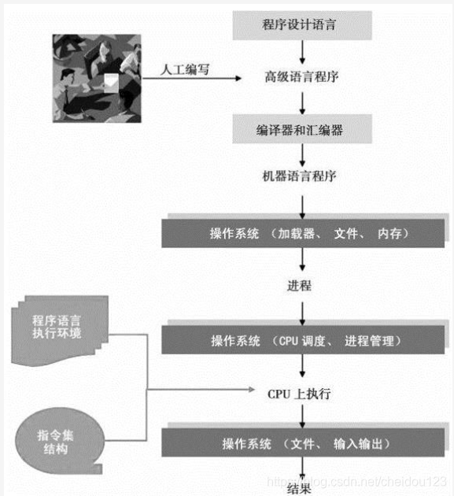
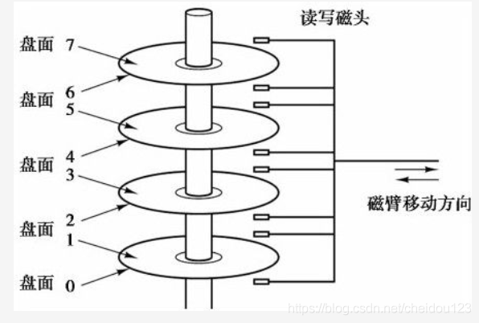
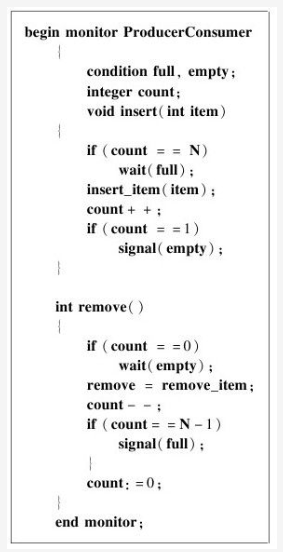
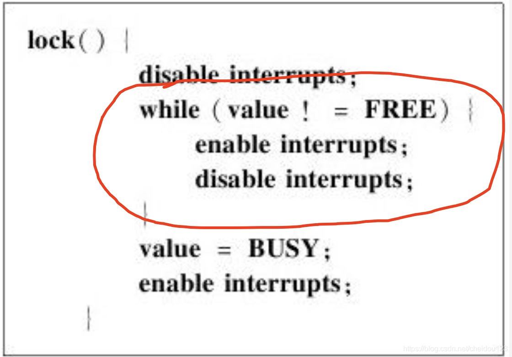
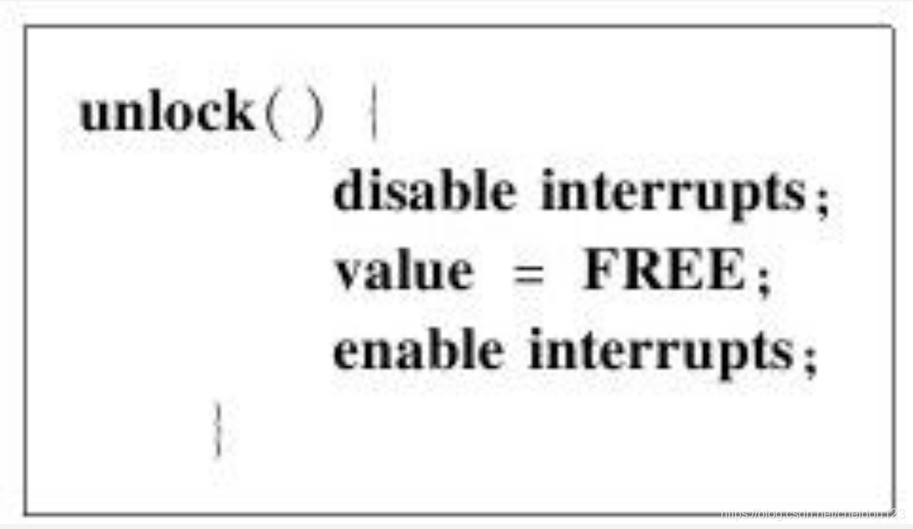
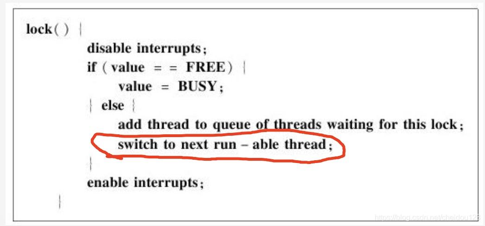

## 基础原理
### 操作系统导论
#### 1.程序是如何运行的

对于程序员而言，一般使用JAVA或C这种高级程序设计语言，但是计算机不认识它们，我们需要通过编译器和汇编器将它们转换为计算机能够识别的机器语言程序

事实上，程序也可以直接通过机器语言或者汇编语言来编写，如果是汇编语言，只需要经过汇编器即可

#### 2.操作系统的核心功能
* CPU管理
* 内存管理
* 外存管理
* IO管理

### 操作系统基本概念
#### 1.计算机硬件基本知识

磁盘盘片两面都可以存储数据

中断时操作系统获得计算机控制权的根本保证

#### 2.用户态和内核态
用户态和内核态本质上是CPU的一个状态，它的标志就是CPU状态字的一个状态位，一个程序运行时，它的CPU是什么态，这个程序就运行在什么态

用户态访问受限是如何实现的呢？
需要对程序的每一条指令进行检查，这种检查就叫做地址翻译，通过对地址翻译的控制，就可以限制程序对资源的访问，当程序处于内核态时，内核程序可以绕过地址翻译直接执行特权指令，从而突破了限制

目前操作系统代码越来越多，为了防止出错，提出了微内核的概念，只将操作系统最重要的核心部分放在内核态执行，这样就提高了效率和安全性

#### 3.进程
操作系统对进程的管理通过进程表来实现
#### 4.系统调用
系统调用就是一些API，应用程序通过调用它们来获得操作系统的服务，系统调用一般不在操作系统原理课上多说，而是在系统编程上具体阐述

系统调用分为三个阶段:
* 参数准备，将参数压入栈中(或寄存器)，调用具体库函数，具体库函数将它底层的系统调用代码放到寄存器，然后通过陷入trap中断将控制权交给操作系统
* 系统调用识别 将系统调用代码从寄存器取出，与操作系统维护的系统调用表比较，获得系统调用程序体内存地址
* 系统调用执行
#### 5.壳
使用API来做系统调用需要编程，操作系统为了可以不编程使用，提供了shell程序与用户交互，这个壳可以是文本形式(Linux)或者图形形式(windows)

## 进程管理
###  进程
1.进程管理，内存管理，文件管理是操作系统的三大核心功能
2.一个程序加载到内存后就变成进程
3.进程就是为了在CPU上实现多道编程而出现的概念
4.进程分为三种状态，执行，阻塞和就绪
5.进程空间也叫地址空间，如何让多个进程空间共享一个物理内存很重要
6.操作系统要管理进程就要维护关于进程的一些信息，维护进程记录的结构就是进程表或者进程控制块PCB
7.创建进程的步骤如下:
* 分配进程控制块
* 初始化机器寄存器
* 初始化页表
* 将程序代码从磁盘读进内存
* 将处理器状态设置为用户态
* 跳转到程序的起始地址(和上一步必须同时执行，因为跳转时一个内核指令)

### 进程调度
#### 1.什么是进程调度
1.进程调度的目的是选择下一个要运行的进程
2.一般情况程序使用CPU模式有三种，CPU密集型，IO密集型，平衡型
3.进程调度的过程:
* 因时序或外部中断或进程挂起而导致操作系统获得CPU控制权
* 操作系统在所有就绪的进程中按照某种算法遴选进程
* 如果选中的不是当前进程，操作系统就将当前系统状态予以保护
* 将选中进程环境布置好
* 跳转到选中的进程

#### 2.进程调度算法
1.先来先服务调度算法，谁先来服务谁，但是可能会大大提高短的工作的耗时
2.时间片轮转调度算法，周期性切换，如果切换太频繁，上下文切换就比较多，如果切换太少，和不切换没啥区别，也会增加耗时
3.短任务优先调度算法，是短的任务就先执行，这样也有问题，会饿死长任务，而且我们也不知道运行多久
4.优先级调度算法，每次切换时，选择优先级最高的，而且这个优先级时动态调整的，比如一个进程执行一次之后就降低优先级，这个有个问题是如果优先级都最高也不好保证响应时间
5.实时调度算法是一种我们必须保证响应时间的算法，一种方式就是如果新工作来了，如果比当前工作截至时间更靠前，就抢占当前工作
6.进程调度算法还有很多，比如彩票算法，混合调度算法等等

#### 3.优先级倒置
什么是优先级倒置？

在多任务实时操作系统中，不可避免的是多个任务要访问相同的资源。为了避免出现多个任务同时访问共享资源造成系统混乱，需要一种同步机制来保证不会出现多个任务同时访问共享资源（即必须保证一个任务对共享资源操作完成后，才能然其他的任务来访问该资源）。同步原语中的互斥体（mutex）就是为了解决该问题而引入的（也就是既要允许多个任务访问共享资源，又要保证不会出现多个任务对共享资源的同时访问）

互斥体:
互斥体实现了“互相排斥”（mutual exclusion）同步的简单形式（所以名为互斥体(mutex)）。互斥体禁止多个线程同时进入受保护的代码“临界区”（critical section）。因此，在任意时刻，只有一个线程被允许进入这样的代码保护区。任何线程在进入临界区之前，必须获取（acquire）与此区域相关联的互斥体的所有权。如果已有另一线程拥有了临界区的互斥体，其他线程就不能再进入其中。这些线程必须等待，直到当前的属主线程释放（release）该互斥体。什么时候需要使用互斥体呢？互斥体用于保护共享的易变代码，也就是，全局或静态数据。这样的数据必须通过互斥体进行保护，以防止它们在多个线程同时访问时损坏。

然鹅，加上这种互斥体有个优先级倒置的问题，就是假设现在又A，B，C三个进程，优先级从高到低以此是A B C，而且C和A同享资源，当C在持有资源时，就算它不占用CPU时，A也是不能运行的，因为A拿不到资源，这之后B就可以占用时间片嗷嗷的跑了

解决方式时使用优先级继承的方式，其大致原理是让低优先级线程在获得同步资源的时候(如果有高优先级的线程也需要使用该同步资源时)，临时提升其优先级。以前其能更快的执行并释放同步资源。释放同步资源后再恢复其原来的优先级

### 进程通讯
#### 1.管道
管道所占用的空间既可以是内存，也可以是磁盘

管道是一个线性字节数组，类似文件，但是管道不是文件，因为通过文件系统看不到管道的存在，记住Linux一切皆文件这句名言这里就有点问题了

管道的一个最重要的特点是两个进程要存在一个关系，比如父子关系

#### 2.记名管道
两个不相关的进程之间进行管道通讯，需要使用记名管道，我们可以从文件系统看到记名管道

管道一般只有UNIX或者类似的系统才支持
#### 3.套接字
对于套接字，我们要严重重视一点:服务器套接字既不发送数据，也不接收数据，当客户端一个客户端套接字发送连接请求时，服务器套接字就创建一个客户端套接字，与客户端通讯的任务就交给了这个客户端套接字
#### 4.信号
如果通过管道和套接字方式有若干问题:
* 必须要建立连接，效率低，如果消息量很小不值得
* 对方可以考虑不鸟你你也没办法

信号就可以解决这俩问题，信号就是一个内核对象，发送方将它填好并指明目标进程，发出特定软件中断，操作系统接收到中断，到内核对象里找接收方进行通知，如果接收方不鸟它，就把接收方终止了
#### 5.信号量
信号量不仅是通讯机制，更是同步机制
#### 6.共享内存
共享内存必须在同一个机器上，管道不需要在同一机器，注意，使用全局变量实现进程通讯不叫共享内存
#### 7.消息队列
可以多进程读写
#### 8.总结
虽然方式很多，归根结底就是System V IPC标准

## 线程管理
### 线程
1.线程是进程的分身，它们本质上是一样的，拥有同样的程序文本，只是执行时的上下文不一致
2.线程管理就是要维持线程的各种信息，这些信息包含了线程的各种关键资料，存放这些信息的数据结构叫做线程控制表或线程控制块
3.线程可以共享的资源
   * 地址空间
   * 全局变量
   * 文件
   * 子进程
   * 定时器
   * 信号
   * 占用CPU时间

4.线程不能共享的资源
   * 程序计数器
   * 寄存器
   * 栈
   * 状态字

5.在存储上，线程依附于进程
6.线程的调度和进程有所不同，进程的调度只能由操作系统内核来实现，线程可以由三种方式
  * 由进程负责，用户态实现
  * 由操作系统负责，内核态实现
  * 两者结合的方式

7.线程调度的内核态实现
优点:
* 简单，线程调度的复杂性由操作系统承担
* 线程阻塞了，操作系统就调度两一个
缺点:
* 效率低，每次切换都要陷入内核
* 内核态实现占用内核稀缺的内存资源，内核空间满了，操作系统直接挂了
* 需要操作系统支持

8.线程用户态实现
优点:
* 灵活性高
* 不占用内核资源
缺点:
* 编程困难
* 如果一个线程受阻，操作系统会把CPU转给另外进程，这个问题有两个解决方案，第一个是不让线程受阻，这显然不可能，第二种是受阻后操作系统询问当前进程可否有能继续执行的线程，这个也不好，因为这属于操作系统去调用上层功能了

9.混合实现
就是用户态负责非阻塞切换，内核态负责阻塞切换

10.从用户态进入内核态的方式
* 如果程序在运行过程中发生中断或异常，系统将自动切换到内核态来运行中断或异常处理机制
* 系统调用

### 线程同步
1.可能造成多个线程竞争的代码段或者资源叫做临界区
2.信号量
信号量是所有原语里面最强大的，它不仅是一个同步原语，还能作为锁使用，我们这里将信号量作为锁来使用:

信号量简单来说就是一个计数器，取值为当前积累的信号数量，它支持加法up和减法down两个虽然分为多步，但是是原子性的操作，如果把信号量的取值规定为0和1，我们就可以得到一个二元信号量锁

二元信号量down操作:
* 等待信号量变成1，不是1就去睡觉
* 将信号量设置为0
* 继续向下执行

二元信号量up操作:
* 将信号量设置为1
* 叫醒该信号量上面等待的第一个线程(这样就实现了notify的功能)
* 线程继续往下执行

使用多个信号量也有可能会发生死锁

3.管程(monitor)

把需要同步的代码用一个管程的构造框框起来，由编译器来保证任何时候这有一个线程可以运行在里面，注意是运行在里面！

我们看看如何通过管程来实现生产者和消费者的同步:

生产者insert和消费者remove都位于同一个管程里面

MESA和HOARE管程

当一个线程发出signal后，哪个线程会持有管程的锁呢？

* HOARE管程使被叫醒者有更高的优先级
* MESA管程使叫醒者和被叫醒者优先级相同，这种方式更加被操作系统所认可

4.消息传递

其实吧，管程需要对编译器进行依赖，大多数程序设计语言并没有实现管程机制，而且管程只能在单台计算机上发挥作用，如果在多台计算机上，就需要通过消息传递的方式了

消息传递有两个基本的操作，send和receive

消息传递的主要问题是消息丢失和身份识别，还有效率问题

5.栅栏

我们都知道JAVA有个锁叫countdownlatch，栅栏也是同样的道理，这里就是一组线程到同一个地方汇合后再一起向前推进

### 死锁对应之哲学原理
#### 1.银行家算法
银行家给客户贷款有两种策略:
* 有钱就放
* 考虑风险

假设银行有10000元，客户A需要4000元来完成目标才能还款，客户B需要6000，客户C需要10000

假设客户A，B，C第一次借款分别为2000 4000 2000 ，这时候只要按指定顺序，两种方案都OK，先都借出去，然后剩下2000借给A，A完成后还了再借给B，最后给C

假设客户A, B, C第一次借款分别为2000 4000 3000，这时，第一种方案就不行了，因为剩1000没法让A完成目标了，这时候第一种方案就有问题了

#### 2.死锁/活锁/饥饿
* 死锁：是指两个或两个以上的进程（或线程）在执行过程中，因争夺资源而造成的一种互相等待的现象
* 活锁：两个线程互相谦让，结果谁也走不了
* 饥饿：有个线程时活雷锋，一直让别人，结果自己饿死了

### 锁的实现
硬件为我们提供了一些原子操作的指令，我们可以根据这些指令来实现我们的锁

#### 1.通过中断启用和禁止来实现锁
中断启用和中断禁止两个指令硬件已经保证是原子性操作

我们知道，线程放弃上下文切换只有两种情况:
* 被中断
* 自己主动放弃

为什么要用中断启用和禁止来实现锁，直接把代码放在禁止中断和启用中断之间不行吗？
这样的话是非常危险的，锁需要操作系统来提供，如果我们交给用户，用户忘了启用中断，就GG了

加锁的代码:

while是一个循环等待，我们需要在里面频繁和关闭中断，来使别的线程可以占用CPU来将value弄成FREE

解锁的代码:

value = FREE 并非是一个原子性操作，所以还得禁止中断

#### 2.以测试与设置指令来实现锁
测试和设置指令就是操作系统以原子性的操作:
* 将1写入指定内存单元
* 返回指定内存单元原来的值

加锁代码:

如果原来的值不是1，就拿到了锁，原来的值是1，现在还是1

解锁代码:

赋值0的操作可以直接在总线上产生，所以不需要中断禁止来保护

#### 3.以非繁忙等待，中断启用和禁止来实现锁
前面两种方式线程都会使用繁忙等待，浪费资源还容易出问题，所以我们想拿不到锁的时候就去睡觉，等待被叫醒

先来实现一个不完美的加锁，然后我们看看有啥问题;

 

代码显示，我们在启用中断前，切换到了另一个线程，这样启用中断就没用了，这种方式是不可取的

如果我们把启用中断位置改改是否可取呢？

* 把启用中断放到add thread之前，假如在add thread之前锁被另一个线程释放了，但是线程仍旧放到队列去了，这样不可以，可能会造成死锁
* 把启用中断放到add thread之后，这种也不行▲

根本问题在于我们应该将放入等待队列和切换到别到线程组成为一个原子性的操作！

#### 4.以最少繁忙等待，测试与设置来实现锁
使用测试与设置指令无法彻底避免繁忙等待，但是可以尽可能减少等待时间，这时候，我们需要一个全局的变量，

#### 5.总结
中断禁止和设置不能在多CPU下工作，而测试与设置指令可以，在多CPU情况下，如果禁止某个CPU中断，那别的CPU可以继续跑，如果全都一起禁止，硬件不支持，如果一条条禁止，又不能保证原子性

而测试与设置指令是针对内存的，多CPU有全局内存，可以正常工作
