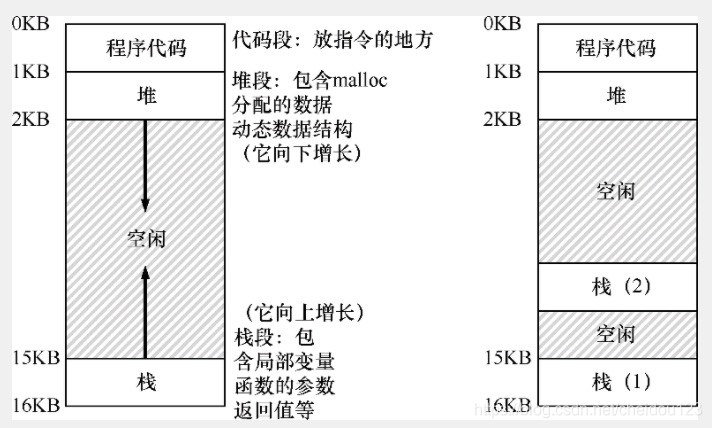
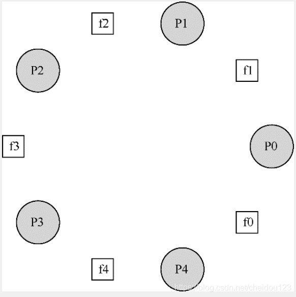
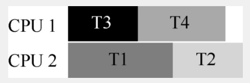

- [并发:介绍](#-----)
- [锁](#-)
  * [1.控制中断(不可使用)](#1----------)
  * [2.原子交换(不可使用)](#2----------)
  * [3.比较并交换](#3-----)
  * [4.链接加载和条件式存储](#4----------)
  * [5.获取并增加](#5-----)
  * [6.如果防止自旋过多](#6--------)
  * [7.Linux实现](#7linux--)
  * [8.基于锁的并发数据结构举例](#8------------)
    + [⑴并发的计数器结构](#---------)
    + [⑵并发队列](#-----)
- [条件变量](#----)
- [信号量](#---)
  * [1.通过信号量实现锁](#1--------)
  * [2.通过信号量实现条件变量](#2-----------)
  * [3.哲学家就餐问题](#3-------)
- [常见并发问题](#------)
  * [1.非死锁问题](#1-----)
  * [2.死锁问题](#2----)
- [基于事件的并发](#-------)
  * [1.select/poll](#1select-poll)
  * [2.异步IO](#2--io)

### 并发:介绍
* 一个进程的所有线程共享地址空间，所以可以访问相同的数据
* 线程之间上下文切换地址空间保持不变
* 多线程有多个栈，所以地址空间看起来也是不同的，如右图所示

* 进程切换，状态保存在进程控制块(PCB)
* 线程切换，状态保存在线程控制块(TCB)

### 锁
* 在源代码枷锁，放在临界区周围，可以保证临界区像单条原子指令一样执行
* POSIX库将锁称为互斥量(mutex)

首先我们先说锁的三大目标:
* 互斥
* 公平
* 性能

#### 1.控制中断(不可使用)
最早的互斥解决方案就是控制中断，一旦加锁，就关闭中断，可以保证临界区代码不被中断而原子性的执行

但是它有很多缺点:
* 关闭中断需要我们对调用线程执行特权操作
* 这种方案对多处理器无效
* 关闭终端导致中断丢失，比如磁盘完成读取请求而CPU不知道

#### 2.原子交换(不可使用)
系统设计者考虑让硬件支持锁，最简单的硬件支持叫做原子交换

原子交换就是直接检查目标对象是不是1，是1就表示锁被占用(这里是打个比方)，如果不是就设置成1，如果是的话就一直自旋直到锁可用

原子交换需要依赖硬件的原子交换(xchg)指令，否则并发设置为1可能会出问题

原子交换可以保证互斥，不能保证公平，多处理器上性能还可以

#### 3.比较并交换
就是compare and swap，它和原子交换很像，它根据目标是是否等于预期值来判断是否可以上锁，它在无等待同步时会很有用

#### 4.链接加载和条件式存储
* 从内存取出一个值到寄存器，然后+1之后更新，更新的时候发现内存中的值和取出来的时候不一样了，就不会更新

#### 5.获取并增加
它能够保证所有线程都能抢到锁，首先，它获取目前的排队数，并加1，然后当排队到它时就执行

#### 6.如果防止自旋过多
* 要自旋的时候，放弃CPU，让它变成就绪态，这种方式就怕一直竞争不到给饿死
* 我们可以通过队列来存放休眠的线程，通过取队列元素就可以防止饿死了
#### 7.Linux实现
Linux一般会自旋一定的次数，然后再休眠，叫做两阶段锁
#### 8.基于锁的并发数据结构举例
##### ⑴并发的计数器结构
每个核心上有一个局部计数器，然后整个CPU有个全局计数器，它们都有各自的锁，局部计数器达到阈值就更新到全局计数器，如果阈值小，准确率就高

##### ⑵并发队列
俩锁，一个负责队列头，一个负责队列尾

### 条件变量
有的时候，线程需要一个条件，才能继续运行，比如父线程需要等待子线程执行完毕，在POSIX标准中给我们提供了wait方法和signal方法来达到我们的目标

### 信号量
在POSIX标准中，有下面几个函数来操作信号量
* sem_wait 信号量的值小于0的时候等待，否则就将信号量的值减1
* sem_post 增加信号量的值
* sem_init 初始化一个值

我们可以通过信号量实现锁和条件变量，也可以通过锁和条件变量组合形成读写锁
#### 1.通过信号量实现锁
将信号量的值初始化为1即可:
* A线程将信号量减1并继续运行，这时信号量值为0
* B线程来了之后，0-1=-1，就会等待
* A线程执行完之后+1，信号量变成0，唤醒B线程
* B线程执行完之后再+1，信号量变成1

#### 2.通过信号量实现条件变量
将信号量的值初始化为0即可，假设一个线程创建另外一个线程，并等待它结束:
* A线程先创建B线程，然后-1等待
* B线程执行完后POST，唤醒A线程
#### 3.哲学家就餐问题

深色的是5个哲学家，浅色是5个刀叉，一个哲学家需要拿起两边的刀叉，才能吃饭，有时他们也会放下所有刀叉进行思考，在这里关键是如何避免死锁，比如大家都先拿到左手刀叉，然后等右边的等不到了，然后都不能吃饭了，我们可以让四个哲学家先拿左手，后拿右手，最后一个先拿右手，后拿左手

### 常见并发问题
并发问题分为死锁问题和非死锁问题
#### 1.非死锁问题
非死锁缺陷一般是由违反原子性和没有达到预期顺序导致的，我们可以通过加锁和条件变量来解决
#### 2.死锁问题
如果避免死锁:
* 控制加锁顺序，我们可以通过锁的地址来控制
* 通过CAS来避免使用锁
* 保证两个可能导致死锁的线程不同时运行，但是这样会付出性能代价，如下，T1和T2都使用A,B俩锁，可以让它们在一个核上顺序执行

 

### 基于事件的并发
基于事件的并发，也就是指等待事件发生后再做具体的事情

#### 1.select/poll
select和poll非常相似，select检查需要关注的I/O描述符集合，然后返回就绪的

* 阻塞，在返回响应之前完成所有工作
* 非阻塞，接到请求先响应，工作慢慢来

#### 2.异步IO
异步IO(AIO)可以让程序在完成IO之前先返回给请求方
