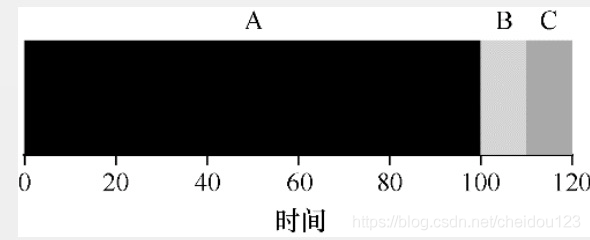
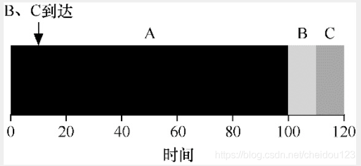
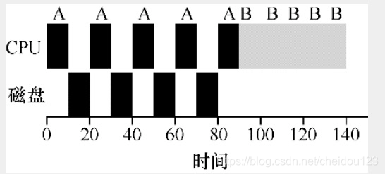

- [操作系统介绍](#------)
- [进程](#--)
- [受限直接执行](#------)
  * [1.受限制的操作](#1------)
  * [2.在进程之间切换](#2-------)
  * [3.保存和恢复上下文](#3--------)
- [进程调度:介绍](#-------)
  * [1.FIFO 先进先出](#1fifo-----)
  * [2.SJF最短任务优先](#2sjf------)
  * [3.STCF 最短完成时间优先](#3stcf---------)
  * [4.RR 轮转](#4rr---)
  * [5.结合IO](#5--io)
  * [6.无法预知](#6----)
- [调度:多级反馈队列(MLFQ)](#----------mlfq-)
- [调度:比例份额](#-------)
  * [1.彩票机制](#1----)
  * [2.步长机制](#2----)
- [多处理器调度(高级)](#----------)
  * [1.单队列调度](#1-----)
  * [2.多队列调度](#2-----)
    + [3.Linux多处理器调度](#3linux------)

### 操作系统介绍
* 不像操作系统为CPU和内存提供抽象，操作系统不会为程序创建专用的虚拟磁盘，操作系统管理磁盘的软件叫做文件系统
* 文件系统必须做很多工作
   * 确定数据位于磁盘那个位置
   * 在文件系统维护的结构中对其进行记录，这样做需要向底层存储设备发出IO请求，以读取现有结构或更新(写入)它们，操作系统提供了一种通过系统调用来访问设备的方法，叫做标准库
* 抽象使我们不需要考虑底层，比如用C不用考虑汇编，汇编不用考虑逻辑门，逻辑门构建处理器不需要考虑晶体管

### 进程
* 程序计数器告诉我们程序当前正在执行哪条指令
* 一个操作系统对进程需要包括如下接口
   * 创建
   * 销毁
   * 等待，比如等待进程停止
   * 其它控制，比如暂停
   * 获取状态
* 进程创建过程
   * 将代码和初始化变量加载到内存中，现代操作系统使用惰性加载
   * 为程序栈分配内存
   * 为程序堆分内存
   * 一些其他初始化任务，比如进程3个描述符
* 进程状态
   * 运行
   * 就绪
   * 阻塞，比如当进程发起IO时，其他进程可以使用处理器，IO完成，进程再到就绪状态
* 进程最重要的API
  * fork 创建一个进程，子进程会在fork出开始执行，fork之前的不执行
  * wait 等待其他进程完毕
  * exec 让子进程执行其他程序，而不是父进程的代码，这里有个非常重要的点，我们可以在fork之后，exec之前，做一些其他操作，比如执行之前，改变标准输出重定向到其它文件

### 受限直接执行
* 操作系统必须以高性能的方式虚拟化CPU，同时保持对系统的控制
* 直接执行，指的是直接在CPU上运行程序，但现在有两个问题
   * 操作系统如何保证程序不做我们不希望他做的事
   * 进程间如何切换

#### 1.受限制的操作
硬件通过提供不同的执行模式来协助操作系统，在用户模式下，应用程序无法完全访问硬件资源，在内核模式下，操作系统可以访问机器的全部资源

如果用于希望执行某些特权操作，现在操作系统都提供了系统调用的能力，目前大多数操作系统提供了几百个系统调用

在执行系统调用的时候，程序会执行特殊的trap(陷阱)指令，改指令跳入内核并将特权级别提高到内核模式，完成后，再调用陷阱返回指令，然后就回到用户模式了

系统调用看起来和普通调用一样，其实内核的是著名的陷阱指令，陷阱指令是一种软件中断指令，通过这种指令，可以进行一个软件中断，导致CPU保存当前进程状态，然后切换到内核模式，调用操作系统执行

#### 2.在进程之间切换
* 等待系统调用，当系统进程合理运行时，会通过系统调用，将CPU控制权转交给操作系统，如果系统执行了非法操作，比如除以0，也会将控制权交给操作系统

* 操作系统进行控制，比如通过时钟中断,CPU控制权又回到了操作系统，然后可以做它想做的，在系统启动时，操作系统也启动了时钟，当然，这个时钟也可以关闭

#### 3.保存和恢复上下文
当操作系统获得控制权，如果决定进行进程切换，就会执行一些上下文切换的底层代码，把当前进程的一些信息保存，下次切换回来时再读出来

### 进程调度:介绍
测量指标
* 平均周转时间，每个进程到达到完成的时间相加除以进程数
* 相应时间，A，B，C三个进程从到达到开始执行时间

#### 1.FIFO 先进先出
假设条件:
* 所有工作同时到达
* 工作一旦开始，就保持运行但完成
* 只用CPU
* 运行时间已知

如图，平均周转时间为(100+110+120)/3 = 110，由于A的原因，拉长了B和C的周转时间，B，C响应时间也高
#### 2.SJF最短任务优先
先运行最短的任务，再运行次短的任务，如此下去，但是，当工作不是同时到达的时候，如下:

我们可以看到，由于B和C到达较晚，所以平均周转时间又上去了，而且B,C响应时间也高
#### 3.STCF 最短完成时间优先
当B,C到达时，可以抢占A，谁能先完成，谁就运行，如下所示:

假设A,B,C同时到达，那么第三个执行的响应时间也高
#### 4.RR 轮转
CPU不断切换时间片，在一个时间片执行一个进程，可以显著减低响应时间，但是每个进程如果运行时间相同，周转时间又会比较差了

#### 5.结合IO
进程当执行IO时，可以让出CPU，这时候就可以更好的利用处理器

 

#### 6.无法预知
上面的情况根本上是我们知道每个工作的长度，但是现实中是不太可能的，所以上面本质上都是扯蛋

### 调度:多级反馈队列(MLFQ)
多级反馈队列的目的是在我们对进程一无所知的情况下，优化周转时间和降低响应时间

首先我们要知道，MLFQ中有许多优先级不同的队列，每个队列中会有多个工作，这里有两条基本的规则:
* 如果工作A所在队列的优先级 > 工作B所在队列的优先级，A执行，B不会执行
* 如果工作A所在队列的优先级 = 工作B所在队列的优先级，A和B交替执行

如果从我们的基本规则来看，低优先级队列的工作就永远不会执行了，实际在运行中，工作的队列会一直变化

* 当工作一进来，先在最高优先级
* 当队列工作的CPU运算时间(IO时间不在里面)达到了某个阈值之后，就会移动到低优先级，一般情况下优先级越高，阈值越低，一直到最低优先级队列
* 为了防止低优先级的工作永远不会执行，系统会将定期将所有工作加入到最高优先级，然后重新往低优先级队列移动

### 调度:比例份额
首先我们明确一点，下面这两种方式，基本没有正式使用，因为它们仍旧没有解决很多问题，比如IO
#### 1.彩票机制
我们给A，B两个进程分配75张彩票和25张彩票，然后调度程序通过抽签的方式决定执行哪一个程序
#### 2.步长机制
彩票机制的问题是，当工作时间较短时，两个进程运行时间比可能和它们持有彩票比差别较大，所以又引入了步长机制

当A，B分别持有100和50张彩票，那么它们的步长分别为50和100，总之是比例反过来，当行程值相同时(初始为0，每次执行完后加一个步长)，调度通过彩票机制来决定执行哪个进程，否则谁的行程值越低，就执行谁，这样就能精确控制比例了

### 多处理器调度(高级)
缓存局部性:
* 时间局部性 一个数据访问完可能会再次被访问
* 空间局部性 一个地址x的数据被访问，那么x周围的数据也可能被访问

缓存一致性:
多处理器每个核都有独立的缓存，因而会有一致性问题，为了解决这个问题，一种方式使用总线窥探技术，一旦发现本核CPU缓存的数据在其它核更改，就删除或更新数据

缓存亲和度:
一个进程一直在同一个CPU上跑，可以更好的利用缓存

#### 1.单队列调度
所有的CPU同享一个队列，N个CPU就同时从队列拿N个工作来执行，之后就取下一个

优点:
* 比较简单，而且负载均衡较好

缺点:
* 需要加锁，效率低
* 缓存亲和度解决困难

#### 2.多队列调度
每个核一个队列，工作进来后就分配到固定的核上

优点:
* 不需要加锁，缓存亲和度好

缺点
* 容易导致负载不均衡，比如一个CPU上工作很快就完了，而另一个CPU上工作还有很多

为了解决负载不均衡，可以采用一种窃取技术，工作较少的队列偷瞄其它队列，如果其它队列很忙，就拿过来一个或多个工作

##### 3.Linux多处理器调度
* O(1) 调度程序，多队列，基于优先级，类似于多级反馈队列
* 完全公平调度程序CFS，多队列，类似于步长调度
* BF调度程序BFS，单队列，类似于更复杂比例调度

目前对调度程序使用还没有一个定论
