- [地址空间](#----)
- [内存操作API](#----api)
  * [1.内存类型](#1----)
  * [2.常用操作](#2----)
- [地址转换](#----)
  * [1.硬件在地址转换的作用](#1----------)
  * [2.操作系统在地址转换的作用](#2------------)
  * [3.这种动态重定位的问题](#3----------)
- [分段](#--)
  * [1.如何分段](#1----)
  * [2.支持共享](#2----)
  * [3.操作系统的支持](#3-------)
  * [4.存在的问题](#4-----)
- [空闲内存管理](#------)
  * [1.假设](#1--)
  * [2.一些通用的底层机制](#2---------)
    + [⑴分割与合并:](#-------)
    + [⑵追踪已分配空间的大小](#-----------)
    + [⑶嵌入空闲列表](#-------)
    + [⑷让堆增长](#-----)
  * [3.基本策略](#3----)
- [分页:介绍](#-----)
  * [1.一个简单的例子](#1-------)
  * [2.页表存在哪里](#2------)
  * [3.页表中究竟有什么](#3--------)
  * [4.分页的问题](#4-----)
- [分页:快速地址转换(TLB)](#----------tlb-)
  * [1.TLB的基本算法](#1tlb-----)
  * [2.示例:访问数组](#2-------)
  * [3.谁来处理TLB未命中](#3----tlb---)
  * [4.TLB的内容](#4tlb---)
  * [5.上下文切换时对TLB的处理](#5-------tlb---)
  * [6.TLB替换策略](#6tlb----)
  * [7.实际系统的TLB表项](#7-----tlb--)
  * [8.小结](#8--)
- [分页:较小的表](#-------)
  * [1.简单的解决方案:更大的页](#1------------)
  * [2.混合方法：分页和分段](#2----------)
- [多级页表★](#-----)
- [超越物理内存:机制](#---------)
  * [1.交换空间](#1----)
  * [2.存在位](#2---)
  * [3.缺页](#3--)
- [超越物理内存:策略](#---------)
  * [1.最优替换策略](#1------)
  * [2.简单策略:FIFO和随机](#2-----fifo---)
  * [3.利用历史数据的LRU](#3-------lru)
  * [4.其它虚拟内存策略](#4--------)
  * [5.超额请求](#5----)

### 地址空间
地址空间，是物理内存的抽象，是运行的程序看到的系统中的内存

一个进程的地址空闲包括运行的程序的所有内存状况，比如程序代码，栈，对等等，我们可以画一个很简单的图:

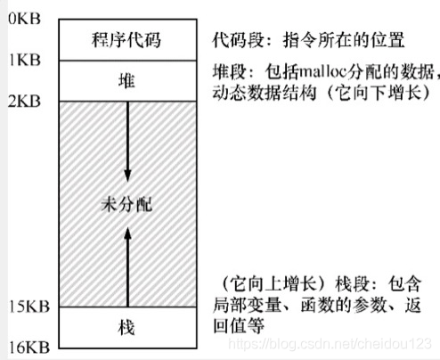

在程序运行时，堆和栈可能会增长，这种放置方式并不固定

虚拟内存的目标
* 透明 程序的行为就好像它们自己拥有私有物理内存
* 效率 可以依赖TLB这种硬件功能
* 保护 进程和操作系统不会受到其它进程的影响，也就是隔离

我们要知道，我们应用程序看到的都是虚拟地址，只有操作系统和硬件才能拿看到屋里地址

### 内存操作API
#### 1.内存类型
* 栈内存 自动释放
* 堆内存 手动释放

#### 2.常用操作
* malloc 传入需要申请的堆空间大小
* free 释放内存，另外我们要知道，当进程结束时，内存会被回收，所以一个时间很短的进程，没有free很多时候也没有问题

malloc和free不是系统调用，它们是库调用，但是它们构建在系统调之上，比如brk/sbrk

我们要注意，要正确的分配和释放内存

### 地址转换
地址转换，即将每次对内存的访问中的虚拟地址转换成数据存储的物理地址

地址转换的本质目的还是为了创造每个程序拥有自己私有内存的假象，然鹅本质上是共享的

地址转换这节我们先假定三点来降低难度，方便理解:
* 地址空间必须连续地放在物理内存中
* 地址空间大小小于物理内存的大小
* 每个地址空间大小完全一样

#### 1.硬件在地址转换的作用
基于硬件的重定位又叫动态重定位，每个CPU都有一个基址(base)寄存器和界限(bound)寄存器，这两个寄存器统称为MMU(内存管理单元)
* 基址寄存器提供一个偏移量的功能，虚拟地址+寄存器地址 = 物理地址
* 界限寄存器保证了进程能够访问的范围，不在范围内就报错

为什么不用软件重定位(静态重定位)，根本原因是软件重定位并不安全

#### 2.操作系统在地址转换的作用
* 需要通过数据结构来记录哪些空闲的物理内存并没有被分配，在进程创建时，需要为进程的地址空间找到可用的内存空间
* 在进程终止时，回收内存
* 切换进程时要修改基址寄存器和界限寄存器的值
* 需要提供异常处理，比如越界访问

#### 3.这种动态重定位的问题
操作系统给进程寻找物理内存，但是分配物理内存并没有完全使用，导致了内存碎片

### 分段
#### 1.如何分段

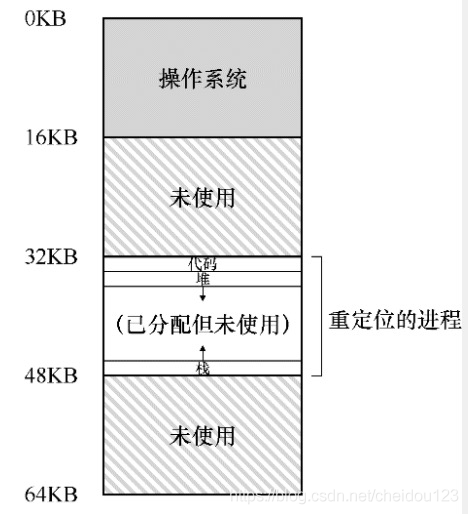

如果我们将上图地址空间放入物理内存，那么堆和栈之间的区域没有使用但依然占据物理内存，所以在这一节，我们简单将地址空间分成代码，栈，堆三个逻辑不同的部分，这样，将它们在物理内存中分离开，另外注意它们的增长方向，下图分配是地址空间和在物理内存中的分布:

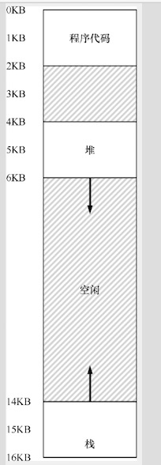

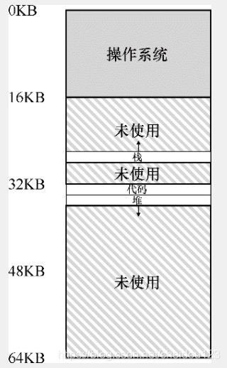

这样需要每个CPU需要3对基址寄存器和界限寄存器，那如何区分是哪种段呢，有一种方式就在虚拟地址的前两位指明它是属于什么段

当我们访问超过非法地址，就会引发段错误，上图它们的值分别为:

* 例子1(代码段)
   * 程序代码在内存空间从0开始，引用虚拟地址100-0 =100 ，在界限2KB内
   * 32 * 1024 + 100 = 32848，发起对32848的引用

* 例子2(堆)
  * 虚拟地址4200，需要先减去在内存空间的位置(4096)，得到104，在界限2KB内
  * 104 + 34 * 1024 = 34920，发起对34920的引用

* 例子3(栈)
* 我们注意看图，栈在这里是反向增长的
* 我们访问虚拟地址15KB，15 -16 = -1
* -1 + 28 = 27，正确物理地址是27KB

#### 2.支持共享
为了节约内存，我们可以使用代码共享，我们可以说明每个段的读写属性，来进行内存保护:

#### 3.操作系统的支持
* 上下文切换时段寄存器内容保存和恢复
* 管理物理内存的空闲空间，为新的地址空间寻找物理空间

但是，使用目前的分段机制，在物理内存中可能会出现很多空闲的地方，因为空间不够但是又无法给地址空间使用，可以在进程停止时，给它排列通过操作系统来重新整理紧凑，但是这样很消耗资源

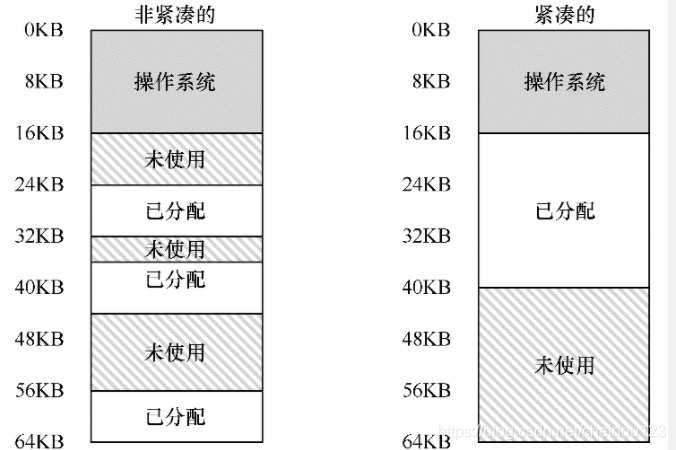

也可以通过算法，每次使用刚刚够的物理内存，这样可以不断占用小内存，留出大块的，但是算法比较复杂，也无法完全消除，真正完全的解决方式是分配大小相同的内存块

#### 4.存在的问题
* 使用目前的分段机制，在物理内存中可能会出现很多空闲的地方，也无法再分配
* 一个很稀疏的堆也要完整加载到内存中

### 空闲内存管理
#### 1.假设
在这一章，我们不会去讨论虚拟内存之类的，而是从宏观上去看待内存

按前面的章节，空闲空间会分成不同大小的块，成为碎片，没有一块连续的空间导致新的内存分配不进去，本章的目的就是解决这个问题

外部碎片和内部碎片(本章主要关注外部碎片)
* 外部碎片，空闲空间由于分段使用导致的碎片
* 内部碎片，分配程序给出的内存块超过请求大小

在这一章中，我们假设
* 内存一旦分配给客户，就不可以重定位到其它位置，也就是说不能通过紧凑内存来较少碎片
* 内存是一块连续的字节区域

#### 2.一些通用的底层机制
##### ⑴分割与合并:
  * 内存里面有若干个空闲段，我们申请一个1KB的内存，匹配到可以满足要求的空闲段就会将此空闲段分割
  *  当我们free一个内存，如果被free掉的内存周围也有空闲段，则会合并成一个

##### ⑵追踪已分配空间的大小
在内存给调用者分配内存时，不仅会分配调用者申请内存的大小，还会分配一个头块，里面包含所分配空间的大小和检查用的幻数等

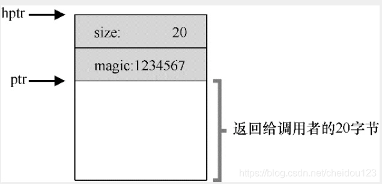

##### ⑶嵌入空闲列表

当我们申请一个4KB的堆的之后，这个堆的结构是下面这样的

来了3个100字节的内存请求，然后打算释放掉一个

最后通过合并把空闲的合并到一起，这样又整齐了:

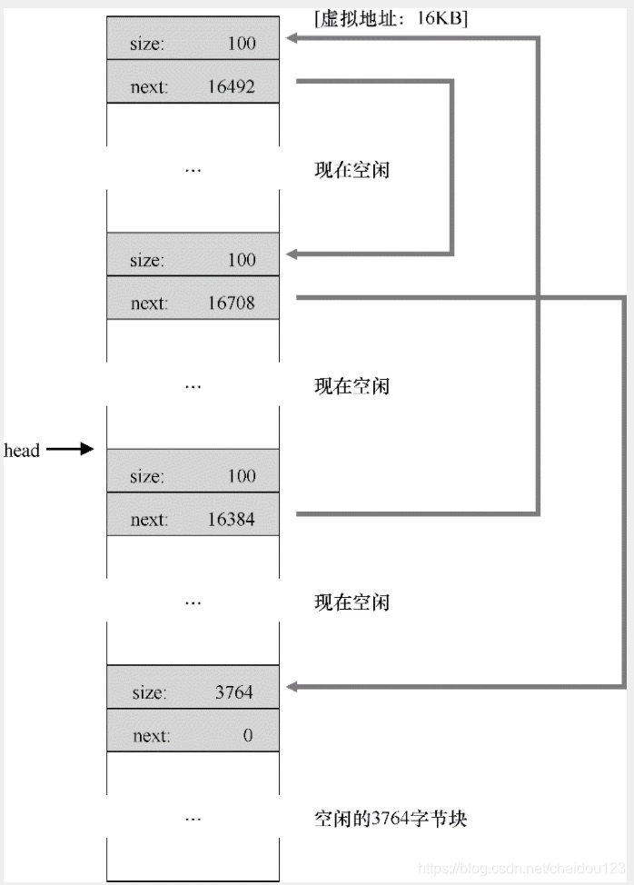

##### ⑷让堆增长
大多数传统分配程序从很小的堆开始，当空间耗尽时，再想操作系统申请更大的空间，操作系统通过sbrk系统调用会将物理内存也映射到进程地址空间，然后堆就更大了

#### 3.基本策略
理想的分配策略是速度和碎片最小化，下面这四种先做了解，不要想太深入

* 最优匹配，返回比请求的大的空闲块中最小的一块，需要遍历一次空闲列表
* 最差匹配，直接找最大的空闲块
* 首次匹配，找到第一个足够大的块
* 下次匹配，从上一次匹配结束位置开始最有匹配

另外，还有一些其它的技术和算法

* 分离空闲列表
如果应用程序经常申请固定的块大小，那么就用一个独立的空闲列表来单独分配，这样就不会产生碎片问题了，这样做的难题是这个独立的空闲列表该是多大

* 伙伴系统

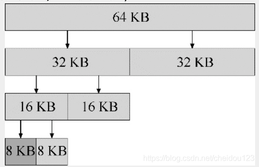

空闲空间通过二分法找到刚刚满足用户请求的块分配给用户，这种会产生内部碎片，当被分配的块被释放时，就会检查它的伙伴是否空闲，如果空闲就继续向上递归合并，因为伙伴块之间地址只有一位不同，所以效率很高

### 分页:介绍
分页和分段相比，它不会导致外部碎片，因为它将内存划分为固定大小的地址单元，而且它支持稀疏虚拟地址空间，下面我们就来看一下分页

#### 1.一个简单的例子
将一个进程地址空间分割成固定长度的分片，就叫做分页

为了记录地址空间和物理内存的映射关系，操作系统为每个进程保存一个数据结构，叫做页表

例子，当我们有一个64字节的地址空间，我们的虚拟地址就需要6位(2的6次幂)，假设页的大小是16字节，那么前两位(虚拟页号VPN)告诉我们选择哪个页，后四位告诉我们感兴趣该页哪个字节

例如，我们加载虚拟地址21，那么就是010101，告诉我们，我们感兴趣的地址在地址空间虚拟页01的0101(第5个)字节处

然后我们把VPN转换成物理帧号，就可以找到最终的物理地址了

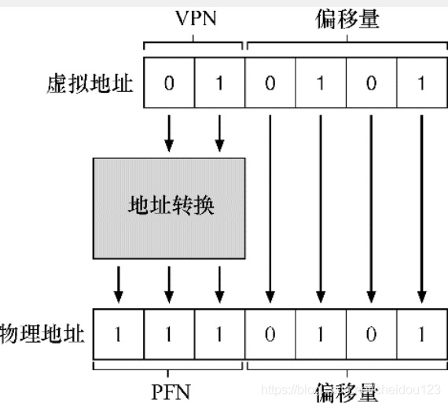

#### 2.页表存在哪里
假设一个32位的地址空间，同时有很多进程在运行，那么仅仅是为了地址转换就需要相当大的内存，其实页表也可以存在在虚拟内存中，甚至可以交换到磁盘上，如果页表存放在物理内存中，寻找页表也会大大降低进程的效率

#### 3.页表中究竟有什么
页表的作用是将虚拟地址映射到物理地址，可以采用多种数据结果，最简单的是线性页表:
* 索引是虚拟页号(VPN)
* 元素是页表项(PTE)，通过页表项找到物理帧号(PFN)

具体页表项中有什么呢，具体看下图

这里根据图示说几个重要的：
有效位，地址转换是否有效，未使用的都是无效，稀疏地址空间就靠它呢
保护位，表明页时是否可以读取，写入或执行
脏位，页面被带入内存是否被修改过
物理帧号 PFN
#### 4.分页的问题
* 寻找页表位置对进程效率影响很大   
* 要防止内存被页表塞满而不是有用的应用程序数据

### 分页:快速地址转换(TLB)
如果将分页数据放到物理内存中，那么每次都需要额外的一次内存访问，因此，通过硬件的帮忙，我们可以将这个转换关系做一个缓存 ，即TLB

#### 1.TLB的基本算法
在虚拟地址提取页号之后，首先检查TLB中是否有转换映射，如果不存在的话，就找对应的页表来寻找，然后更新TLB
#### 2.示例:访问数组

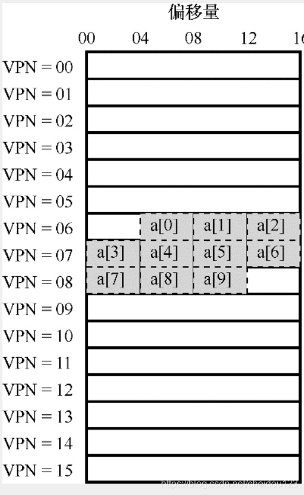

上图所示，由10个整形组成的数组，在地址空间布局如图所示，我们可以看到0，1，2在同一页，说明我们访问了0之后，访问1和2直接走TLB缓存就可以了

另外，由于时间局部性，当我们第二遍遍历数组的时候，会全部走缓存

#### 3.谁来处理TLB未命中
现代操作系统由软硬件来管理TLB未命中，发生TLB未命中时，硬件系统会抛出一个异常，然后操作系统会将特权级提高到内核模式，然后去直接查找页表，最后更新TLB

#### 4.TLB的内容
TLB主要有
*  虚拟页号(VPN)
*  物理帧号(PFN)
*  一些位信息，比如是否被使用等等

#### 5.上下文切换时对TLB的处理
TLB是和进程相关的，但是不同的进程有可能指向同一个物理帧号，比如一个物理地址(例如代码段)被多个进程同享

为了不一直在上下文切换时删除上个进程的TLB信息，可以为每一条TLB数据加一个进程标识符，标志它属于哪一个进程

#### 6.TLB替换策略
当TLB插入新的缓存而空间不够时，替换策略如下:

* LRU
* 随机替换

#### 7.实际系统的TLB表项

我们可以看到，用户地址空间VPN占据19位而非20位，因为还需要给内核一部分，G位设置为1表示这个表项是所有进程共享的，这时候ASID会自动忽略

#### 8.小结
* RAM不总是RAM，有没有命中TLB差距非常大
* 如果一个程序短时间访问超过TLB页数，就会产生未命中，降低效率，当然也有办法解决这个问题
### 分页:较小的表
假设一个32位的地址空间，4KB的页，页表项大小4字节，一个地址空间大概有100W个虚拟页面，那么页表大小就是4MB，100个活动进程大概就400MB内存，所以我们要想办法将页表大小减少

#### 1.简单的解决方案:更大的页
我们可以提高页的大小吗，我们使用16KB的页，那么使用同样的页表项大小，页表大小只需要1MB

但是页过大会导致更对的内存碎片
#### 2.混合方法：分页和分段
分页和分段相结合。减少页表开销，建设有一个16KB的小地址空间和1KB的页，改地址空间和物理内存映射关系如下:

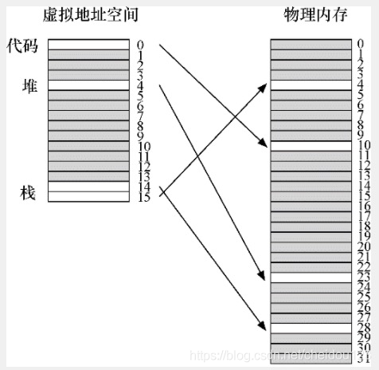

在上图中，只有VPN 0 4 14 15使用了，大部分页表都没有使用，我们混合方法就是将每个逻辑段提供一个页表，来提高页表使用率，在这里就有三个页表，代码，对，栈部分各有一个

在这里，分段里面的基址和限制指的是保存该段页表的物理地址，和页表有多少有效页

使用这种方式，不同逻辑段之间的空间就不会占用页表内存了

但是，使用这种混合方式还是有问题的:
* 首先地址空间要像上面那种类似的使用模式，比如堆，栈，代码段三个逻辑段
* 有一个大而稀疏的堆，照样会占用大量页表内存
* 会导致物理空间产生外部碎片

### 多级页表★
多级页表为了去掉也表中的无效区域，将线性页表改成了类似于树的东西，这种结构是现代操作系统的主流

多级页表就是将页表分成页大小的单元，无效的就不分配具体内存，它依靠的是页目录

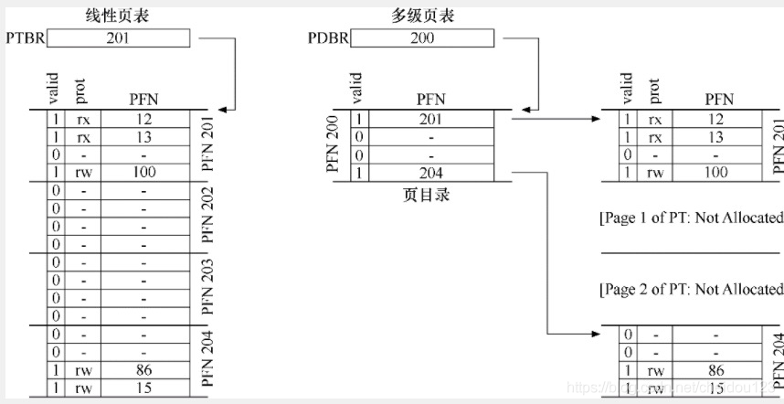

左面是一个线性页表和它对应的页表空间，虽然地址空间大部分区域无效，但是仍需要分配页表空间(即页表中间两页)

右边是一个多级页表的分配，页目录将页表第一个和最后一个标记为有效，它们会在内存中，其余的不会

我们可以看到，多级页表分配的页表空间与正在使用的地址空间成正比，而且支持稀疏地址空间

### 超越物理内存:机制
为了支持更大的地址空间，操作系统需要把一部分地址空间找个更大的地方存起来，这个地方一般是硬盘

#### 1.交换空间
在硬盘上开启一些用于物理页移入和移出的空间，叫做交换空间

交换空间决定了某一时刻能够使用的最大内存页数

另外我们要知道，操作系统也会换出一些页到硬盘，它会设置两个水位线，如果内存不足到低水位，有一个页守护进程就会把内存一直交换到硬盘，知道空闲的内存达到高水位

#### 2.存在位
内存引用发生了什么?
* 硬件首先从虚拟地址获得VPN
* 检查TLB是否命中，命中就返回最终的物理地址
* TLB未命中，则在内存中查找页表，通过页表项找到它在物理内存中的位置，更新TLB，重试指令

交换空间需要页表项中有一个存在位，表示该页存在于物理内存还是硬盘，不在物理内存就是缺页

#### 3.缺页
当操作系统接受到缺页时，它会在页表项中查找存储的硬盘地址，并将页从硬盘读取到内存中
### 超越物理内存:策略
当内存剩余量达到低水位时，会迫使操作系统换出一些页，这一章我们就要考虑入通过何种策略来换出对应的页

#### 1.最优替换策略
* 最优替换策略不切实际，因为它需要操作系统有预见性，但是它可以用来和别的操作系统做比较

下面我们展示一下最优替换策略，假设一个程序按以下顺序访问虚拟页:
0，1，2，0，1，3，0，3，1，2，1

#### 2.简单策略:FIFO和随机
* FIFO:就是简单的先入先出，优点就是俩字:简单
* 随机:就是随机去掉缓存一个，优点还是上面俩字
#### 3.利用历史数据的LRU
简单策略会导致剔除掉一个重要的页，所以后序命中率肯定不高

这时候我们就可以利用局部性原理，LRU就是替换调最近最少使用页面

我们还是以上面的例子来看:
0，1，2，0，1，3，0，3，1，2，1

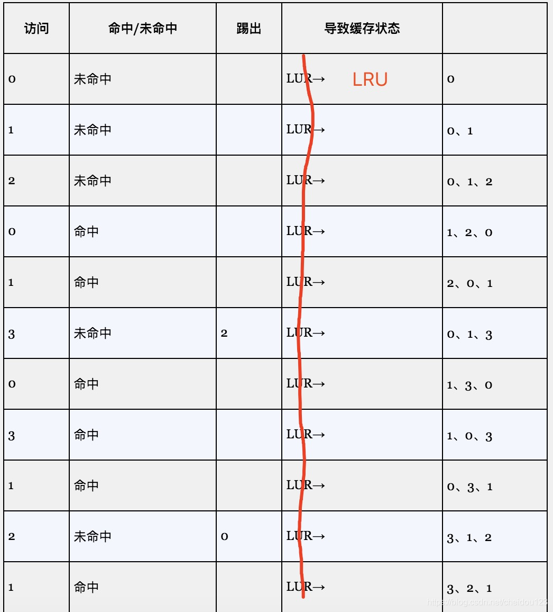 

LRU大多数情况下优于简单策略，我们如何实现LRU呢?

实现完美的LRU非常困难，为了记录哪些页时最少和最近被使用，系统会对内存引用做一些记录工作，但是找到最对最合适的会消耗很多性能，所以我们可以近似实现LRU即可

#### 4.其它虚拟内存策略
* 预取:如果代码页P载入内存，那么P+1可能很快被访问，也应该被载入内存
* 按需分页,操作系统在页被访问时将页载入内存
* 聚集写入，能将多次换出到硬盘合并成一个，提高效率

#### 5.超额请求
如果一个进程请求内存超过物理内存限制，就会发生频繁的换页换出，现代操作系统就会直接杀掉一个内存密集型进程来减少内存
