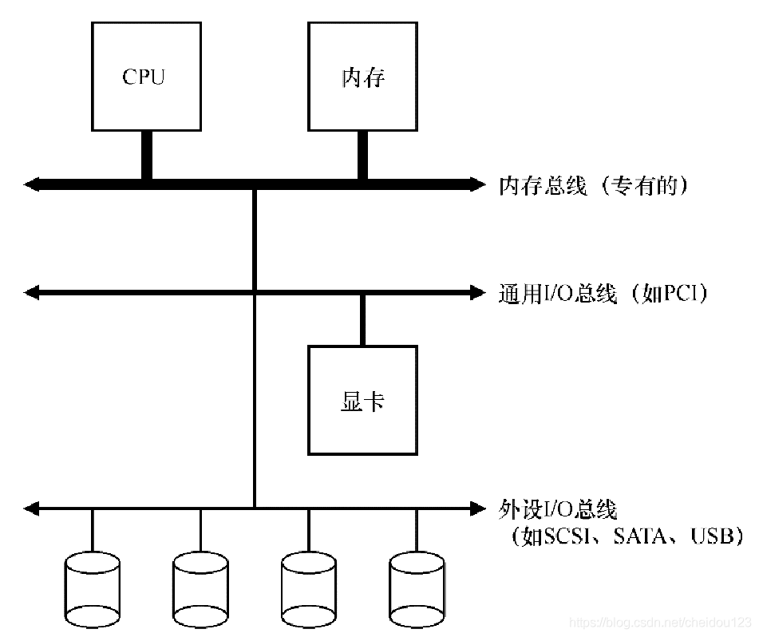
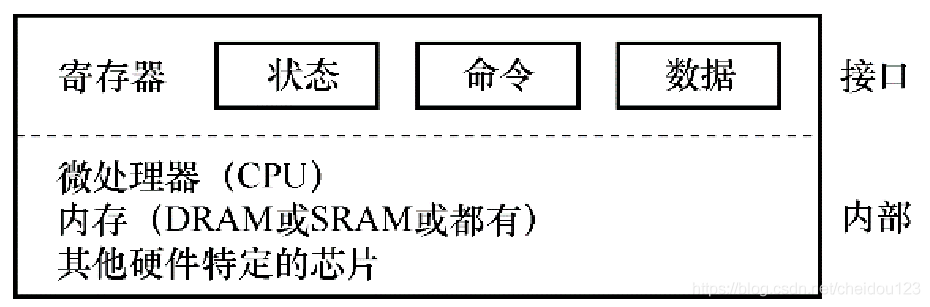
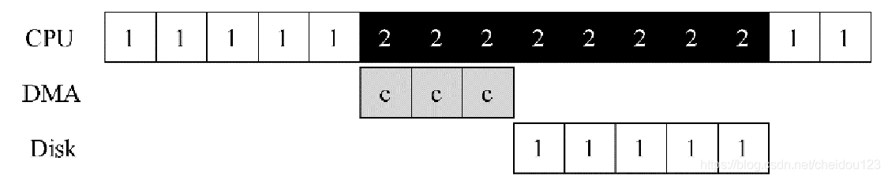
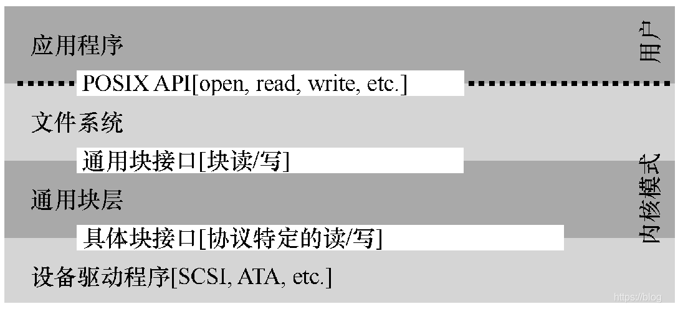
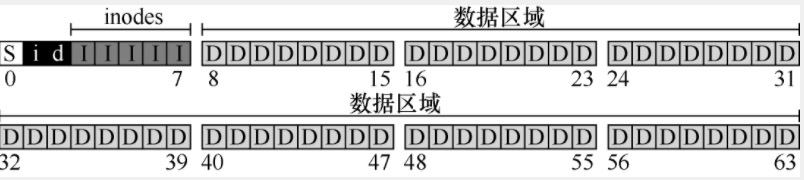
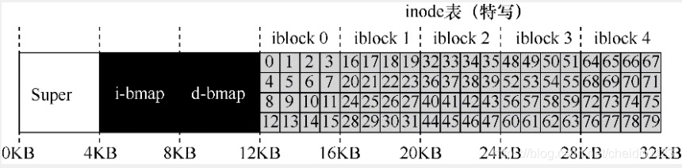
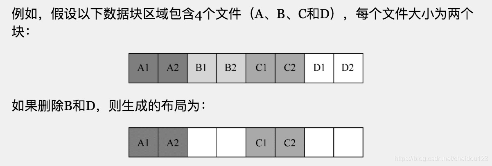
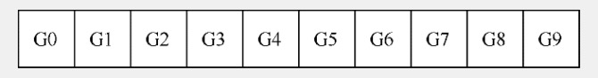
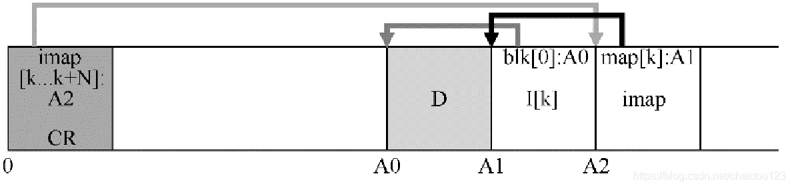

- [IO设备](#io--)
  * [1.系统架构](#1----)
  * [2.标准设备](#2----)
  * [3.使用轮询的方式进行交互](#3-----------)
  * [4.使用中断的方式进行交互](#4-----------)
  * [5.利用DMA进行更高效的数据传送](#5--dma----------)
  * [6.操作系统如何和设备进行通讯](#6-------------)
  * [7.设备驱动程序](#7------)
- [磁盘驱动器](#-----)
- [1.磁盘的基本构成](#1-------)
- [2.完整的IO过程](#2---io--)
- [3.磁盘调度](#3----)
  * [⑴最短寻道时间优先](#---------)
  * [⑵电梯](#---)
  * [⑶最短定位时间(最优方式)](#-------------)
  * [⑷其它](#---)
- [RAID](#raid)
  * [1.RAID0](#1raid0)
  * [2.RAID1](#2raid1)
  * [3.RAID4](#3raid4)
  * [4.RAID5](#4raid5)
- [文件和目录](#-----)
  * [1.文件系统接口](#1------)
  * [2.硬链接/软链接](#2-------)
  * [3.创建并挂载文件系统](#3---------)
- [文件系统实现](#------)
  * [1.文件系统整体组织](#1--------)
  * [2.inode](#2inode)
  * [3.目录组织](#3----)
  * [4.读取和写入](#4-----)
  * [5.缓存](#5--)
- [局部性和快速文件系统](#----------)
  * [1.快速文件系统FFS](#1------ffs)
  * [2.组织结构:柱面图](#2--------)
  * [3.策略:如何分配文件和目录](#3------------)
  * [4.大文件例外](#4-----)
  * [5.其它创新](#5----)
- [崩溃一致性:FSCK和日志](#------fsck---)
  * [1.fsck 文件系统检查程序](#1fsck---------)
  * [2.预写日志](#2----)
  * [3.其他方法](#3----)
- [日志结构文件系统LFS](#--------lfs)
  * [1.如何查找inode](#1----inode)
  * [2.垃圾收集](#2----)
- [数据完整性和保护](#--------)
  * [1.处理扇区错误](#1------)
  * [2.通过校验和检测讹误](#2---------)
  * [3.错误的写入](#3-----)
  * [4.丢失的写入](#4-----)
  * [5.擦净](#5--)
  * [6.校验和的开销](#6------)
- [分布式系统](#-----)
  * [1.RPC](#1rpc)
    + [⑴存根生成器](#------)
  * [⑵运行时层](#-----)
  * [⑶RPC的其他问题](#-rpc-----)
- [Sun的网络文件系统(NFS)](#sun--------nfs-)
  * [客户端缓存](#-----)
  * [服务端缓存](#-----)
- [Andrew文件系统(AFS)](#andrew-----afs-)
  * [AFSv1](#afsv1)
  * [AFSv2](#afsv2)
  * [缓存一致性](#-----)
  * [崩溃恢复](#----)
  * [AFS其它改进](#afs----)

### IO设备
#### 1.系统架构

上图是一个典型系统架构：
* 外围总线，比如鼠标，磁盘等，负责最慢的
* 通用IO总线
* 内存总线，负责最快的，造价最高

#### 2.标准设备

一个简化的设备接口层包括三个寄存器
* 状态寄存器
* 命令寄存器
* 数据寄存器

#### 3.使用轮询的方式进行交互
* 操作系统反复读取状态寄存器(轮询)，直到设备可以接受命令
* 操作系统将数据发送到数据寄存器
* 操作系统将命令写入命令寄存器
* 操作系统再次反复读取状态寄存器(轮询)，然后判断是否执行完成
#### 4.使用中断的方式进行交互
轮询过程会大量浪费CPU时间，所以我们使用中断，CPU的轮询将不再进行，而是向设备发出一个请求后就让对应的进程睡眠，CPU然后切换到其它进程，设备完成操作之后，就会抛出一个硬件中断，再唤醒对应的进程

如果IO请求速度很快，就不要使用中断，因为马上就可以返回，使用中断开销反而更大

#### 5.利用DMA进行更高效的数据传送
如果我们要发送很大的数据到设备的数据寄存器，也会使CPU任务繁重，解决方案就是使用DMA，操作系统告诉DMA引擎数据在内存位置之后就去处理其它请求了，DMA完成会抛出一个中断告诉操作系统，如下图C就是DMA在处理

#### 6.操作系统如何和设备进行通讯
* 方式1是使用操作系统独有的特权IO指令，比如in和out，操作系统需要指定存入数据的寄存器和一个代表设备的特定端口
* 方式2是使用内存映射IO，硬件将设备寄存器作为内存地址提供，操作系统读写对应的内存地址，然后硬件把他们转移到设备上，方式1和方式2目前都在用

#### 7.设备驱动程序
我们需要让我们的操作系统更加通用，可以工作在各种设备上，与设备无关，我们可以使用设备驱动程序来封装交互细节

比如文件系统完全不知道磁盘类型，它只需要简单的向通用块层发送读写请求，块设备层将请求路由到对应设备驱动，再由设备驱动来完成真正的底层操作，驱动会真正的和设备寄存器进行交互

目前，驱动程序在整个内核代码比例越来越大
### 磁盘驱动器
### 1.磁盘的基本构成

上图所示
* 磁盘由大量的扇区组成，上面的每一个数字代表一个扇区(512字节)
* 每一个同心圆是一个磁道，一个表面会有非常非常多的磁道，数百个磁道只有头发宽
* 外侧同心圆扇区一般会多一些，而不是像上面画的那样
* 左下角那个杆子有个磁头可以读取数据，也可以变化磁道，同时，磁盘会旋转
* 扇区一般会倾斜，也就是上图11扇区和12扇区偏斜了2个扇区，这样的好处时，磁头变换后能够更快的读12
* 顺序读比随机读要快的多
* 磁盘也有缓存，它很小，只有几M或十几M，磁头可以缓存读取数据旁边扇区的数据，也就是句柄
* 如果放入内存就向操作系统回报写入完成，就叫做后写缓存，这样可能会出现问题，如果直到数据数据落盘才回报，叫直写

### 2.完整的IO过程
* 完整的磁盘读取包括三个过程，IO过程就是下面三个时间之和
   * 寻道时间，最大寻道时间可能是平均寻道时间的2到3倍
   * 等待转动，可以通过每分钟转动次数RPM来算，比如15000，就是250转每秒，4ms一圈，平均转动时间就是2ms
   * 传输数据，这个占用时间很小

### 3.磁盘调度
磁盘调度的根本目标是最短任务有限(SJF shortest job first)
#### ⑴最短寻道时间优先
就是先去离得最近的磁道取数据，这样有个问题，可能会有磁道的数据饿死
#### ⑵电梯
就是先按一个方向扫描，扫描到一个需要读写的扇区后，判断此方向还有无需要读写的，没有就反向扫描，这样来来回回的扫描，这样避免了饿死的情况
#### ⑶最短定位时间(最优方式)
电梯算法和最短寻道时间都忽视了磁盘的旋转

最短定位时间就是根据具体情况来，根据旋转和磁道的时间来推断到底使用最短寻道时间，还是电梯算法，假设寻道时间很长，那么电梯算法就不合适了

#### ⑷其它
* 系统一般会等待一会，然后将多个请求一起给磁盘，磁盘通过最优方式来读写数据
* 如果请求取块33，8，34这3个扇区，那么调度程序会将33,34请求合并成一个

### RAID
RAID又叫做廉价冗余磁盘阵列，由多块磁盘，内存和处理器组成，对外看像一块大硬盘

我们需要在3个维度来评价一个RAID架构
* 容量
* 可靠性
* 性能，包括随机/顺序读和随机/顺序写

#### 1.RAID0

也就是没有冗余，在性能和容量上最佳，它在性能和容量上是其他RAID的上限，但它可靠性很差
#### 2.RAID1

一个磁盘同时由一个副本

在容量方面，它存储容量只能有实际容量的一半
在可靠性方面，两个相同磁盘有一个可以工作就行
在性能方面，RAID1的整体性能一般

#### 3.RAID4

RAID4用几个磁盘来做校验盘，使用方式是奇偶校验，如前4块磁盘有一个数据坏了，那么可以根据奇偶校验来恢复，但仅支持一个，因为奇偶校验在一块盘上，会经常读取奇偶校验盘，为了提高效率，又引入了RAID5
#### 4.RAID5

如上图所示，由4个磁盘，每个磁盘中有一个块作为校验盘，如上图中绿色的，这样可以做分布式校验，防止校验都往一块盘堆积，另外我们要知道，每个磁盘校验数据和实际数据要分开

在容量方面，RAID5的容量利用率较高
在可靠性方面，RAID5的可靠性相对可以，如果一块盘坏了，我们可以用剩下的盘的校验位将数据恢复
在性能方面，整体性能高于RAID1，但是随机写不如RAID1

### 文件和目录
随着时间的推移，存储虚拟化出现了两个关键的抽象:
* 文件
* 目录
它们都有各自的inode号码

我们可以使用strace或者mac的dtruss来追踪系统调用，比如ls，我们就可以看到它底层实际调用的函数

#### 1.文件系统接口
* open 打开一个文件，如果不存在，也可以创建
* read 读文件
* write 写文件，会先写到缓冲区，可以使用fsync来直接将缓冲区的内容直接写到磁盘
* stat 获取文件信息
* unlink 删除文件，rm底层就调用的它
* mkdir 创建目录
* readdir 读目录
* rmdir 删除目录

#### 2.硬链接/软链接
* 硬链接是对文件的引用，只有所有的引用计数为0后，文件系统才真正被删除，硬链接不能对目录使用，不能跨磁盘分区，因为inode号在文件系统是唯一的
* 软链接，软链接不是引用，我们通过ls可以看到第一位是l,代表软连接，如果软链接所指向的file文件被删除，那么软连接就成了悬空引用

#### 3.创建并挂载文件系统
创建文件系统可以使用mkfs命令，我们指定一个设备和一种文件系统类型，就在该设备(比如磁盘分区)创建了一个空的文件系统

通过mount命令，我们可以将文件系统挂载到我们的目录树中

### 文件系统实现
在这一章我们实现一个简单文件系统，我们实现文件系统主要有两个重点:
* 文件系统的数据结构到底是什么样的
* 如何将系统调用映射到对应的结构上

#### 1.文件系统整体组织

如上图所示,我们有一个非常小的磁盘，磁盘上有64个块，每个块4KB

* 字母D(data region)代表的数据为用户数据,这里我们给它56个块
* 字母大写I(inode)记录文件的元数据，从第4到7我们给它分配5个块，叫做inode表，假设每个文件inode有256字节，也就是我们可以有80个文件
* 小写字母i和d分别来记录大i块和D块是否已经分配，比如我们可以使用位图(或者B树)的方式，当我们创建一个文件时，我们需要通过位图找到一个空闲的inode来分配给该文件，然后把位图这个位置标记为已使用，同时分配数据块也是和inode一样的方式，数据块我们尽量找连续的
* S(superblock)叫做超级块，记录一共有多少个inode和数据块，上面分别是80和56，文件系统类型等等，当挂载文件系统时，操作系统会首先读取超级块

#### 2.inode

如上所示，5个inode块一共可以有80个inode，每个inode中保存有文件类型，大小，分配块数，时间信息，磁盘位置等，这些统称为元数据

如何通过inode来引用数据块的位置呢，可以有很多种方式:
* 方式1，我们可以在inode中存有一组指针，每个指针指向一个磁盘块，但是这样如果文件很大，指针就不够了
* 方式2，我们存储多段范围，即磁盘位置和范围大小，一个文件可以有多个范围
* 方式3，我们通过多级索引，比如我们可以通过几个直接指针和几个间接指针，间接指针我们可以指向一个磁盘数据块，磁盘块有4KB，可以再存储很多指针指向一个文件，这样就可以引用一个大文件，如果文件还大，我们还可以通过多级，即数据块再指向数据块，这样就可以支持很大的文件了，为什么还要有直接指针，因为大多数文件并不大，使用直接指针更好，只有大文件才适合间接指针

#### 3.目录组织
文件系统将目录试做特殊类型的文件，目录也有inode存放于inode表，inode指向目录的数据块
#### 4.读取和写入
读取文件步骤:
* 假设我们要读取 /caibin/handsome这个文件
* 文件系统必须从根目录开始找，根目录的inode是众所周知的2，文件系统先读入inode为2的块
* 文件系统读取inode为2的数据块，找到caibin这个条目，获取到caibin的inode号码，然后通过caibin数据块，找到handsome的inode号码
* 把handsome的inode号码加载到内存，进行权限检查，在当前进程文件表中分配一个文件描述符返回给用户

写入文件步骤:
* 写入文件首先要和读取文件一样打开文件
* 写入文件工作量更大，它需要读写位图，初始化inode等

#### 5.缓存
为了优化读取和写入文件，大多数文件系统使用系统内存DRAM来缓存重要的块，可以大大降低IO次数

现代操作系统会将虚拟内存对应的内存和文件系统的内存进行动态划分，因为文件系统有时不需要很大的缓存

大多数现代系统会将写入缓存5到30S的时间，可以使用fsync来强制写入磁盘，比如数据库就不喜欢这种缓存

### 局部性和快速文件系统
#### 1.快速文件系统FFS
我们实现的简单文件系统数据遍布各处，有非常昂贵的定位成本，而且长期使用，会导致碎片化，如下图所示

如果我们此时再分配一个占据4个块的文件E，那么E也肯定会粉扫在磁盘上

有一种东西叫磁盘碎片整理工具，我们通过它可以重新组织，连续放置文件和空闲块，并更新inode等

而且块不应该太小，否则会增大定位开销

快速文件系统FFS也就是优化文件系统结构和分配策略，从而提高磁盘的性能

快速文件系统是文件系统历史的一个分水岭，像我们展示如何处理磁盘，从这以后，诞生了数百个新的文件系统

#### 2.组织结构:柱面图
FFS将磁盘分组，每个组叫做柱面组，下面是一个具有10个柱面组的磁盘:

每个柱面组的内部结构如下，就像一个简单的文件系统:

#### 3.策略:如何分配文件和目录
FFS分配策略的根本原则是 相关的放一起

对目录的放置策略是找到分配数量少的柱面组和大量自由inode

对文件的放置策略是
* 将数据块和其inode放到一个组
* 同一个目录下的文件尽可能在一个组

#### 4.大文件例外
一个大文件很大，如果放到一个组(也可能还会占用其它组)，会妨碍其它相关文件加入本组，

所以，大文件的放置策略有例外:
* 将一定数量的块分配到第一个组，比如我们可以将inode的直接引用和inode放一起
* 然后将其余大块分散其余组中

#### 5.其它创新
有些文件很小，如果占用一个4KB的块，就会产生很多内存碎片，所以FFS设计人员引入了512字节的子块，一个1KB的文件占用俩子块，而不是浪费一个4KB的块，4KB的块的剩余部分可以继续当做子块分配

FFS为了防止磁盘读完块0，还没来得及读块1，块1就已经转过磁头，所以将左图的布局改成右图，而且通过缓存，磁盘将转过的磁道内容缓存，从1读完2再读到7时就可以直接走缓存了

### 崩溃一致性:FSCK和日志
文件系统面临一个问题，如果我们在写文件系统时突然系统崩了，这时候怎么办?

比如我们有一个简单的文件系统，里面包含超级块 ，位图，inode，数据块等等，我们可能写了数据块， inode还没有写，这时候就会导致文件系统不一致的问题

文件系统目前主要有两种方式来处理这个问题:
* fsck 文件系统系统检查程序，一般较老的文件系统使用
* 预写日志

#### 1.fsck 文件系统检查程序
它决定让文件系统不一致的情况发生 ，然后再修复它们，比如fsck工具，这个工具用来查找这些不一致并修复它们，但是它无法检查到所有的问题，比如inode更新数据块还没更新，导致引用的以前的数据

fsck的工作流程:
* 检查超级块
* 检查inode和它的间接块，拿到当前文件系统分配的块，和位图比较，如果不一致，则信任inode
* 检查inode状态，如果状态可疑，就清除
* 查看inode实际链接数和inode属性上的连接数，如果不对，则修复inode
* 检查同一数据块是否有多个inode，如果有，就清除一个，或者将数据块再复制一个
* 坏的inode清除
* 检查目录完整性

fsck的问题在于很复杂，而且很慢，如果磁盘较大会相当慢

#### 2.预写日志
更新磁盘时，先记下一个日志，随后再更新，如果更新时发生错误，就查看日志重试，

我们看一个例子，我们想把v2的inode，位图，数据块Db写入到磁盘，再它们写入磁盘前，他们会先写入下面的日志，日志还有一个开始TxB和TxE的事务标志

当这个日志已经完全存在于磁盘，我们就可以覆写文件系统中的旧数据了，·如果发生错误，文件系统就会通过日志进行恢复，

磁盘为了维护上面几个块的写入顺序，开发了写入屏障，也就是屏障之前的一定先于屏障之后的写入磁盘，但是很多硬盘为了速度抛弃了这一点

另外，为了防止写日志的过程出现错误，Ext4使用了校验和的方式来提高速度

为了防止日志占用空间太大，可以将已经写入磁盘的日志空间重新使用，另外日志空间可以不记录Db块，只记录I和B两个元数据

只记录I和B的话，我们最好先写入Db数据到磁盘，这样inode不会指向脏数据

#### 3.其他方法
* 每个数据块都反向引用inode
* 写时复制
等等

### 日志结构文件系统LFS
日志结构文件系统的产生背景:
* 目前内存模块不断增长，通过缓存对读磁盘性能提升很大，磁盘瓶颈主要存在于写上
* 顺序IO的性能远远高于随机IO
* 文件系统不支持RAID

LFS采用了一种写入缓冲的技术，当缓存到达一个合适的数量时，就一口气写入磁盘，每次写入磁盘的一大坨我们称作段

#### 1.如何查找inode
快速文件系统把inode放在磁盘固定的位置

在LFS中，更新不会覆盖磁盘上旧的数据，而是完全重新写入，而且它的inode是完全分配在整个磁盘上的，并且，我们需要找到数据最新的那一个inode和对应的数据位置

LFS中，发明了inode映射的方案，我们通过inode号码去映射层(imap)去找对应的inode地址，而且它也是和对应的数据块一样散布在磁盘上的

那问题来了，我们如何去找映射层的位置呢？在LFS上面磁盘有一个固定的区域(CR)，这个区域存有映射层的位置，CR区域一般是定时更新

具体顺序如上，我们先通过CR找imap，然后缓存imap，来了个inode号时我们就通过imap找对应的inode地址

如果我们访问的包含目录，因为目录也有inode，就先通过上面方式拿到目录数据，再查映射层找到我们期望的数据

#### 2.垃圾收集
LFS不会覆盖旧的数据，因而在整个磁盘中散布着很多垃圾数据，不同于版本控制文件系统，LFS只希望保留最新的数据，它会定期清理，比如读一个段，把还未过期的数据写到一个新段，旧段清理掉

如何找到垃圾数据呢?
LFS的每个段都有个段头，里面有版本号等信息，通过与imap中版本号比较来确定是否需要被回收

### 数据完整性和保护
现代磁盘大部分时间都在正常工作，但是有时无法成功访问一个或几个块，两种类型的单块故障很常见:
* 扇区错误，这个磁盘可以感知并尝试修复
* 块讹误，这个无法检测到

#### 1.处理扇区错误
磁盘可以检测出扇区错误，然后通过读取副本，或者通过奇偶校验修复，但是有的时候修复也会失败，因为用来做奇偶校验的块也坏了

#### 2.通过校验和检测讹误
数据讹误会导致磁盘返回错误数据，如何组织用户获得错误数据，关键问题在于如何检测讹误，这里我们引入了校验和的机制，我们这里看一个简单的基于异或的校验方式

 

XOR的问题在于，如果同一个位置两个位变了，就校验不出来错误了，还有复杂点的比如CRC循环冗余校验

如何在存储系统中存储校验和呢？我们知道磁盘只能以512字节及其倍数写入，那么我们可以用520字节扇区格式化驱动器，多出8个字节用来存储校验和

如何使用校验和呢？读完数据计算其校验和，然后和存储校验和比较，如果不一致，说明发生了错误

#### 3.错误的写入
如果数据写入到错误的位置怎么办，比如我们想写到块A，但是写到块B了，我们可以通过在校验和里面增加位置信息，如果和实际位置不一致，就说明发生了讹误

#### 4.丢失的写入
磁盘写入如果丢失，但是通知上层已经写入完成，实际并没有写入，而且同一位置旧数据也具有匹配的校验和，有种经典的方式是写入后直接读取，来确保数据到达磁盘表面

#### 5.擦净
因为大多数数据并不会经常访问，所以磁盘会定期读取系统每个块，来检验校验和是否有效

#### 6.校验和的开销
校验和主要分为空间开销和时间开销，对时间开销更加明显

### 分布式系统
分布式系统的核心是通讯然鹅，通讯本质上是不可靠的

* UDP是不可靠通讯的一个很好的例子，虽然UDP也有校验和的方式
* TCP可以说是比较可靠的通讯层

#### 1.RPC
RPC是编程语言对于分布式系统的抽象，它可以让程序在远程机器上执行代码像调用本地函数一样直接，RPC主要有两部分组成，存根生成器和运行时层
##### ⑴存根生成器
存根生成器在内部都会完成远程调用的所有过程
* 创建消息缓冲区
* 将入参等打包进消息缓冲区
* 将消息发送到目标
* 等待回复
* 解析返回包
* 从存根生成器返回给客户端代码

#### ⑵运行时层
运行时层是如何找到远程服务，以及具体协议，是TCP还是UDP

#### ⑶RPC的其他问题
* 要注意字节序的问题，可能是大端序，也可能是小端序
* 单纯使用TCP也不能完全保证可靠性，最好在应用程序层面做检查，比如在TCP之前就损坏了

### Sun的网络文件系统(NFS)
分布式文件系统主要是允许在客户端之间轻松的共享数据，并且可以集中的管理数据

分布式文件系统允许客户端通过简单的系统调用(比如read,write)来访问文件服务器，对客户端来讲目测和基于磁盘的文件系统一个样

NFS网络文件系统是SUN公司推出的一种经典的文件系统，不同的公司可以开发自己的NFS服务器在NFS领域竞争，这里介绍的是NFSv2这种经典的网络文件系统

NFSv2的一大特点是无状态，服务器不会保存客户端的实际状态，客户端的每次请求要包括服务端需要的完整信息才行

理解NFS的关键是理解文件句柄，文件句柄是需要访问文件的唯一标识符，文件句柄包含卷标识符(具体的文件系统类型)，inode号，以及世代号(复用inode号时递增)，当客户端拿到服务端具体的文件句柄时，客户端就可以通过类似系统调用的方式来读取和写入文件，通过告诉服务端具体的文件句柄让服务端知道要读写哪里

NFS大多数请求都是幂等的，所以客户端可以通过简单的重试解决很多问题，然鹅，有些操作比如mkdir很难成为幂等的

#### 客户端缓存
我们可以通过客户端缓存来提高性能，比如对于写入而言，客户端可以先缓存一会，然后将缓存的数据统一写入文件服务器

缓存带来的问题是缓存一致性，缓存一致性分为两点:
* 更新可见性，客户端B修改文件，但是缓存到了本地，那么客户端A读到的并不是最新的，解决方式就是通过关闭时刷新，当程序写入文件并关闭时，客户端会将所有更新刷新到服务器
* 陈旧的缓存，客户端B修改文件也发送到了服务器，但是客户端A的缓存没有更新，读到的还是旧的，解决方式时客户端定时通过文件句柄拿到文件属性，从而拿到文件修改时间决定是否要刷新本地缓存，这是一种折中的方式

#### 服务端缓存
服务端从磁盘读取数据后，会保留在内存中，以提高性能

关键时写，服务器在真正写入磁盘前，不会给write方法返回成功，防止因服务器挂了导致数据丢失，有时候也可以通过配用独立供电内存的方式解决这个问题

### Andrew文件系统(AFS)
AFS最大的特点在于全文缓存，客户端会将要访问的文件整个缓存到本地磁盘，后序的操作就可以直接读写本地文件系统，当调用close时，如何文件发生了修改，就会写回服务器

AFS主要亮点是减少和服务器交互，但是目前使用量比NFS少很多

#### AFSv1
当再次访问服务器时，AFSv1会直接请求服务器判断文件是否被修改，如果未更改，客户端就继续使用本地缓存

AFSv1存在的问题:
* 客户端需要请求服务器判断文件是否被修改
* 路径查找成本较高

#### AFSv2
* 引入了回调的概念，一旦服务器端文件被修改，就回调通知客户端
* 引入了文件标识符，类似于NFS文件句柄

#### 缓存一致性
AFS同一客户端机器不同进程对文件的写入是立即可见的，在不同客户端机器上，通过回调也可以保证缓存一致性

如果两台客户端机器同时修改，它就会后者获胜，NFS则不同，NFS会将两者合并，但是比如JPEG图像两者合并一般就不能使用了

#### 崩溃恢复
* 如果客户端崩溃，在它恢复后，它会首先询问服务器自己的缓存是否还有效
* 如果服务端崩溃，它的客户端必须知道服务器崩溃了(通过心跳等种种方式)，然后客户端在使用缓存之前先检查有效性

#### AFS其它改进
AFS对安全性，访问控制，系统管理方面比较领先
