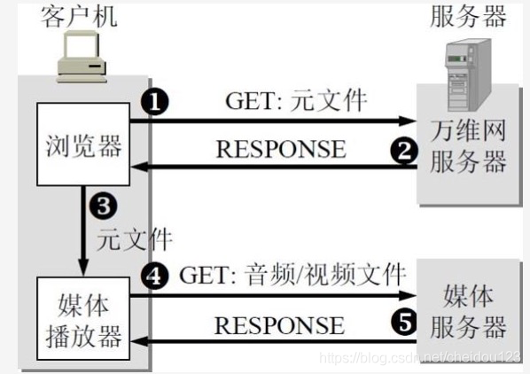
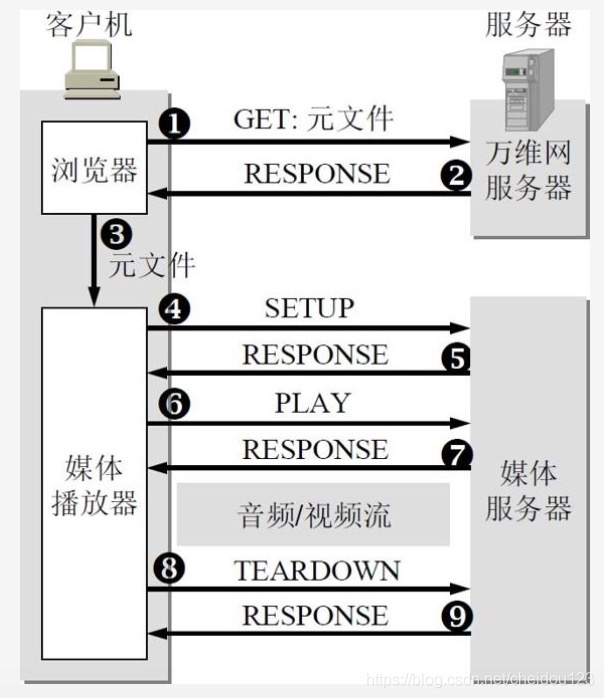
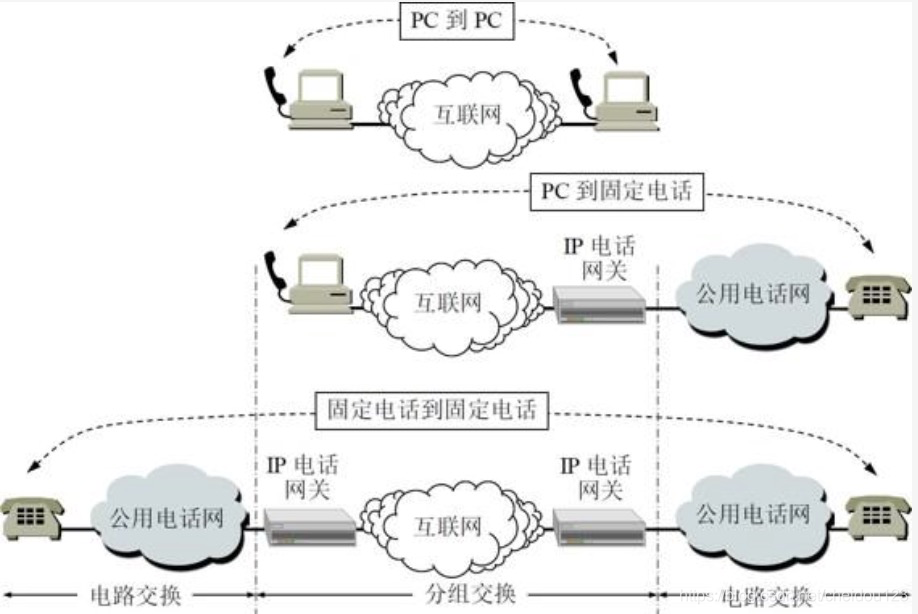
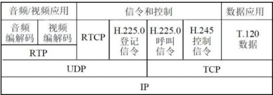
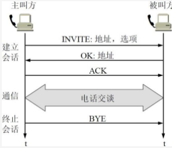
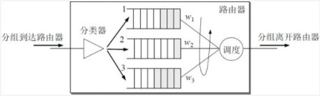
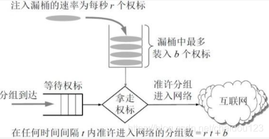
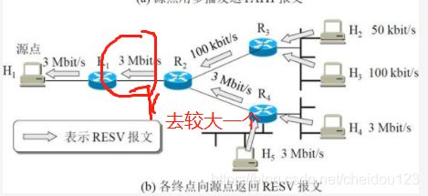
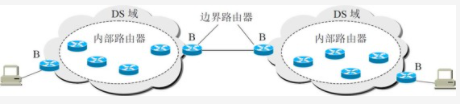

<!-- MDTOC maxdepth:6 firsth1:2 numbering:0 flatten:0 bullets:1 updateOnSave:1 -->

   - [概述](#概述)   
      - [多媒体信息的特点](#多媒体信息的特点)   
      - [音视频服务的类型](#音视频服务的类型)   
   - [流式存储音频/视频](#流式存储音频视频)   
      - [媒体服务器](#媒体服务器)   
      - [实时流式协议RTSP](#实时流式协议rtsp)   
   - [交互式音频/视频](#交互式音频视频)   
      - [IP电话概述](#ip电话概述)   
      - [IP电话网关](#ip电话网关)   
      - [IP电话的通话质量](#ip电话的通话质量)   
      - [IP电话所需要的几种应用协议](#ip电话所需要的几种应用协议)   
         - [实时运输协议RTP](#实时运输协议rtp)   
         - [实时运输控制协议RTCP](#实时运输控制协议rtcp)   
         - [复杂的信令协议H.323](#复杂的信令协议h323)   
         - [简单的信令协议SIP](#简单的信令协议sip)   
   - [改进"尽最大努力交付"的服务](#改进尽最大努力交付的服务)   
      - [调度和管制机制](#调度和管制机制)   
         - [调度](#调度)   
         - [管制](#管制)   
         - [调度和管制结合](#调度和管制结合)   
      - [综合服务IntServ](#综合服务intserv)   
      - [区分服务DiffServ](#区分服务diffserv)   

<!-- /MDTOC -->

### 概述
#### 多媒体信息的特点
* 信息量很大
* 对时延有要求

#### 音视频服务的类型
* 流式 就是常见的流媒体，它并没有把下载的内容存到磁盘上
   * 存储音频/视频，就是爱奇艺那种
   * 实况音频/视频，就是直播
* 交互式音频/视频 就是zoom这类

### 流式存储音频/视频
#### 媒体服务器

* 首先万维网服务器有着视频URL的元文件
* 客户端拿到元文件后，通过暴风影音这类媒体播放器，拿到元文件的地址和媒体服务器交互

另外传输可以使用TCP/UDP，UDP适合直播，但是UDP又有缺点:
* 很多防火墙会禁止UDP
* 如果用户希望暂停，快进需要STP和RTSP

因而很多还是使用的TCP

#### 实时流式协议RTSP
RTSP本身不传送数据，它像一个遥控器，控制暂停，快进等操作，它会保存客户端的状态

它可以运行在TCP或者UDP

从4-7步和8-9步是RTSP客户端(比如realPlayer)和RTSP服务器交互，TEARDOWN就是暂停

音频/视频流这部分，是音频/视频文件被下载，可以运行在UDP上，也可以是TCP上，还可以是RTP(★)上

### 交互式音频/视频
#### IP电话概述
我们这里讨论的是狭义的IP电话，也就是简简单单的打电话，而广义的IP电话可以包含比如IM视频等，其实本质上原理差不多

#### IP电话网关
是共用电话网和IP网络的转换设备，有了它，PC就可以直接和电话机相连打电话

#### IP电话的通话质量
不同于传统交换网可以保证通话质量，IP电话受到多种因素的限制，比如网络拥塞等等

#### IP电话所需要的几种应用协议
协议分为多种:
* 信令协议，可以在互联网上找到被叫用户，如H.323和SIP
* 直接传送音频/视频数据的，如RTP
* 提高服务质量的，如RSVP/RTCP

##### 实时运输协议RTP
RTP提供端到端运输，但不提供服务质量的保证，多媒体数据块压缩后，封装成RTP报文，交给UDP处理

对于应用程序的开发者，需要编写RTP封装的代码，交给UDP套接字

RTP的默认端口号是5004

RTP也有自己的首部格式，大概了解一下就可以:

##### 实时运输控制协议RTCP
它是和RTP配合使用的协议，是RTP不可分割的一部分，默认端口号5005，RTCP的主要功能是
* 服务质量的监视和反馈
* 图像和声音的配合
* 多播组成员标志

使用UDP来传送，分组很短，不对实际的音视频数据封装，可以将多个RTCP分组封装到一个UDP数据报

周期性的传送，带有发送端和接收端对服务质量的统计报告，例如分组丢失率

##### 复杂的信令协议H.323
首先我们要知道H.323是一个体系结构，H.323比较复杂

从图上我们可以看出，它也包含了实时运输协议RTP和实时运输控制协议RTCP

##### 简单的信令协议SIP

SIP比较简单，其实就是分为用户代理和网络服务器
* 用户代理存在于发送方和接收方，一个用来发送，一个用来接收
* 网络服务器分为代理服务器和重定向服务器
   * 代理服务器将呼叫请求转发给被叫用户或下一跳代理服务器
   * 重定向服务器高速客户下一跳代理服务器，让客户自己去戳

SIP的地址可以是IP地址，电话号码或者邮箱

### 改进"尽最大努力交付"的服务
我们可以让对时延有严格要求的实时视频和音频能在网络中获得更好的服务质量，具体方法如下:
* 打上标记，让路由器可以识别出实时分组和普通的分组
* 分类，让一些特殊高优先级分组也有不错的优先级
* 管制和调度 让优先级高的不至于占满资源导致优先级低的无法传送
* 呼叫接纳 数据流需要先申请服务质量，批准后才能进来，否则带宽不满足导致大家都不能用了

#### 调度和管制机制
##### 调度
调度，指的就是排队的规则，为了保证高优先级能够有更多的资源，同时不至于饿死地低优先级，我们可以是使用加权公平排队WFQ

如果所示，每个队列的服务时间不同，来保证优先级同时不至于 饿死

##### 管制
管制主要针对的是三个方面
* 平均速率
* 峰值速率和突发长度 就是非常长短时间内的速率

我们可以在漏桶中加入权标，分组先及进入等待权标的队列，分组拿到权标才能进入网络，从而控制速率

##### 调度和管制结合

#### 综合服务IntServ
综合服务的要点在于资源预留

每一个会话需要声明它所需要的服务质量:
* 发送端发送一个报文给接收端
* 接收端回复一个RESV报文，RESV报文返回时经过的路由器根据RESV报文会判断资源路由器是否可以预留，不能预留的化就发送一个差错报文给接收端，否则就预留一定的带宽和缓存空间给这个会话的源地址

注意H1以多播的方式给多个接收方，接收方的RESV报文路由器只需要满足最大的一个就可以

IntServ的问题:
* 每一个会话探测预留
* 如果有一个路由器不支持资源预留，就不能用了

另外，IntServ打破了尽最大努力交付的原则

#### 区分服务DiffServ
区分服务就是在IP数据报的格式中写上服务质量的字段

网络中有很多DS域，一个DS域具有很多路由器，但是有同一个区分服务策略，所有的复杂聚集在边界节点，边界节点主要是路由器，或者主机，内部节点尽可能的简单

