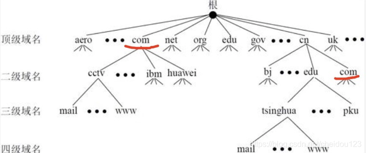
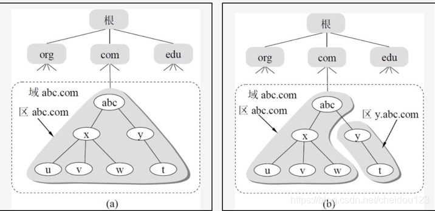
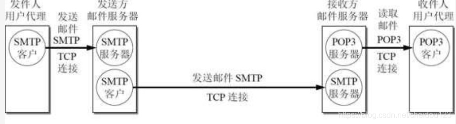
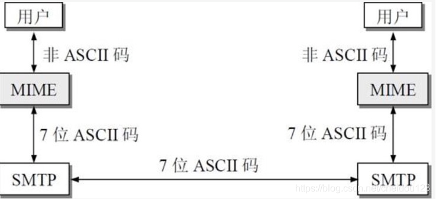
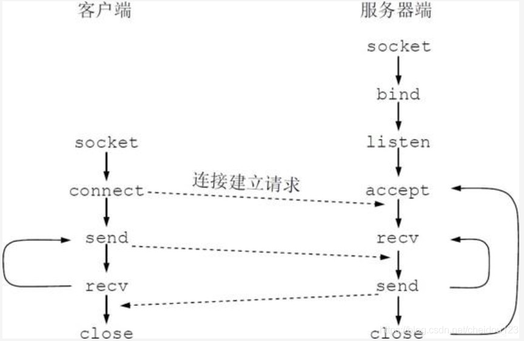

<!-- MDTOC maxdepth:6 firsth1:2 numbering:0 flatten:0 bullets:1 updateOnSave:1 -->

   - [域名系统DNS](#域名系统dns)   
      - [互联网的域名结构](#互联网的域名结构)   
      - [域名服务器](#域名服务器)   
   - [文件传送协议](#文件传送协议)   
      - [FTP](#ftp)   
      - [NFS](#nfs)   
      - [TFTP](#tftp)   
   - [远程终端协议TELNET](#远程终端协议telnet)   
   - [万维网](#万维网)   
      - [概述](#概述)   
      - [统一资源定位符URL](#统一资源定位符url)   
      - [超文本传送协议HTTP](#超文本传送协议http)   
      - [万维网的文档](#万维网的文档)   
         - [HTML超文本标记语言](#html超文本标记语言)   
         - [XML可扩展标记语言](#xml可扩展标记语言)   
         - [XHTML可扩展的超文标记语言](#xhtml可扩展的超文标记语言)   
         - [动态万维网文档](#动态万维网文档)   
         - [活动万维网文档](#活动万维网文档)   
   - [电子邮件](#电子邮件)   
      - [简单邮件传送协议SMTP](#简单邮件传送协议smtp)   
      - [邮件读取协议POP3和IMAP](#邮件读取协议pop3和imap)   
         - [POP3](#pop3)   
         - [IMAP](#imap)   
      - [万维网邮件](#万维网邮件)   
      - [通用互联网邮件扩充MIME](#通用互联网邮件扩充mime)   
         - [SMTP协议的缺点](#smtp协议的缺点)   
         - [MIME](#mime)   
   - [动态主机配置协议DHCP](#动态主机配置协议dhcp)   
   - [应用进程跨网络的通讯](#应用进程跨网络的通讯)   
   - [P2P文件分发](#p2p文件分发)   
      - [概述](#概述)   
      - [第一代 具有集中目录服务器的P2P工作方式](#第一代-具有集中目录服务器的p2p工作方式)   
      - [第二代 具有全分布式结构的P2P文件共享程序Gnutella](#第二代-具有全分布式结构的p2p文件共享程序gnutella)   
      - [第三代 分散定位和分散传输Bit Torrent](#第三代-分散定位和分散传输bit-torrent)   

<!-- /MDTOC -->

### 域名系统DNS
#### 互联网的域名结构

1.除了连字符-以外不能有其它标点符号

2.上图是互联网的域名空间
* 顶级域名，比如国家顶级域名cn,通用顶级域名com(公司企业)
* 二级域名，比如我国下面的com(工商企业)
* 三级域名，比如edu下面的tsinghua大学

#### 域名服务器

1.域名服务器是分级的，主要分为:
* 根域名服务器,知道所有顶级域名服务器的域名和IP地址
* 顶级域名服务器，可能会给出最后结果，也可能给出下一步要找的权威域名服务器
* 权威域名服务器
* 本地域名服务器，它并不在域名服务器层次结构上，它是距离用户最近的，有缓存，可以大大提高效率

2.区和域
区是域的子集，每个区有一个权限域名服务器，如图b，公司abc有两个权限域名服务器

2.DNS查询流程
* 客户端发送查询报文"query zh.wikipedia.org"至DNS服务器，DNS服务器首先检查自身缓存，如果存在记录则直接返回结果。
* 如果记录老化或不存在，则：
  * DNS服务器向根域名服务器发送查询报文"query zh.wikipedia.org"，根域名服务器返回顶级域 .org 的权威域名服务器地址。
  * DNS服务器向 .org 域的权威域名服务器发送查询报文"query zh.wikipedia.org"，得到二级域 .wikipedia.org 的权威域名服务器地址。
  * DNS服务器向 .wikipedia.org 域的权威域名服务器发送查询报文"query zh.wikipedia.org"，得到主机 zh 的A记录，存入自身缓存并返回给客户端。

3.缓存

* 如果本地域名服务器有顶级域名服务器的地址，可以不通过根域名服务器直接向顶级域名服务器请求
* 计算机主机也有缓存

### 文件传送协议

#### FTP

1.FTP若要存取一个文件，就必须先获得一个文件的副本，修改文件只能先修改副本，它对远程往另外一台计算机的某一个文件添加内容并不合适

2.FTP使用的是TCP可靠传输协议，使用客户端服务器的方式

3.FTP服务器有两大部分
* 一个主进程，负责接收请求
* 多个从属进程，负责处理请求

4.FTP服务一般运行在20和21两个端口

5.主进程工作流程
* 打开21端口，使客户进程能够连接上
* 启动从属进程来处理请求
* 回到等待状态

6.从属进程分为控制进程和数据传输进程,从属进程工作流程
* 端口20用于在客户端和服务器控制进程之间传输数据流
* 端口21用于在客户端和服务器控制进程之间传输控制流

#### NFS

1.NFS允许应用进程在远程文件任意位置读写数据，所以对远程往另外一台计算机的某一个文件添加内容比较

#### TFTP

1.基于UDP，效率较高

### 远程终端协议TELNET

1.TELNET将客户操作转换为NVT（网络虚拟终端）的格式，这样接收方把NVT转换成系统所需的格式

### 万维网
#### 概述

1.万维网是一个大规模的，联机式的信息储藏所

2.万维网使用链接的方法将一个页面连接另外一个站点的资源

#### 统一资源定位符URL

1.用来标记万维网的各种文档，一般有下面四部分组成

#### 超文本传送协议HTTP

1.HTTP监听80端口，通常使用TCP协议，无连接，无状态，目前普遍使用HTTP1.1

2.代理服务器可以把一些请求和响应缓存，从而加快网络速度

#### 万维网的文档
##### HTML超文本标记语言

HTML语言并不是应用层协议，它只是万维网浏览器使用的一种语言

##### XML可扩展标记语言

XML的设计宗旨是传输数据

##### XHTML可扩展的超文标记语言

更严格的HTML语言

##### 动态万维网文档

由程序动态创建

##### 活动万维网文档

可以由服务端主动刷新界面

### 电子邮件
1.主要部分
* 用户代理,也就是邮件的客户端
* 邮件服务器
* 邮件发送协议(SMTP)和邮件读取协议(POP3)，它们都是使用TCP协议

2.邮件不会再某个中间邮件服务器落地，另外POP3是客户去邮件服务器拉邮件

#### 简单邮件传送协议SMTP

1.使用端口号25

2.SMTP传输使用的是明文，2008年的扩充的SMTP解决了这个问题

3.发件人的客户端像邮件服务器发送邮件以及邮件服务器互相传输邮件的时候，都是使用SMTP协议，但是当今不需要客户端的电子邮箱用户在浏览器写的邮件通过HTTP发送到邮件服务器

#### 邮件读取协议POP3和IMAP
##### POP3
1.POP3非常的简单，但是又功能有限

2.在接收邮件的用户计算机中的客户端必须运行POP3客户程序

##### IMAP
1.IMAP比较发咋

2.用户计算机运行IMAP客户程序，和邮件服务器建立连接，可以像本地操纵一样查看邮件服务器的邮件，当用户打开邮件时，才会将邮件传到用户计算机上，而且有的时候可以只传一部分

#### 万维网邮件

1.本地不需要有邮件客户端了，比如QQ邮箱

2.浏览器和邮件服务器传输用HTTP协议，邮件服务器传输使用SMTP协议

#### 通用互联网邮件扩充MIME

##### SMTP协议的缺点

* 不能传送可执行文件或其他二进制对象
* 不能传输很多非英文邮件，只可以传送7位ASCII码
* 长度有限

##### MIME
1.MIME并没有改动SMTP，而是对SMTP的一种增强

2.MIME解决了SMTP的主要缺点，支持更多编码方式和文件类型

### 动态主机配置协议DHCP
1.它提供了一种即插即用的机制，允许一台新加入计算机的网络自动获取IP地址

2.DHCP可以指派随机地址或者永久地址

3.计算机加入到一个新的网络，以原地址全为0，目的地址全是1，广播发现报文，只有DHCP发武器才会应答，DHCP会查看自己的数据库看看有没有它的配置信息，没有就从IP池取出来一个给它

4.并非每一个网络都有一个DHCP服务器，但是肯定有一个DHCP中继代理，通常是一台路由器，它收到报文后，就以单播的形式向DHCP发送报文并等待回答

5.DHCP报文使用的是UDP数据报

6.DCHP给客户的IP地址是临时的，这段时间叫做租用期，租用期由DHCP服务器自己决定，当然DHCP客户也可以在报文中提出要求

7.DHCP客户使用的端口是68，DHCP服务器使用的是67

8.DHCP可能会受到多个DHCP服务器发送的报文，它只会选择一个

9.当租用期到达一定时间，客户机就会主动更新租用期

### 应用进程跨网络的通讯

1.大多数操作系统使用系统调用来在应用程序和操作系统之间传输控制权

2.套接字一般是应用进程和TCP/UDP协议之间的接口

3.创建套接字其实就是请求操作系统分配一些存储器空间，CPU时间等资源

4.套接字系统调用过程

UDP是无连接的，没有listen和accept

### P2P文件分发

#### 概述

1.没有固定服务器，而是所有内容都在普通的互联网用户之间进行分发

#### 第一代 具有集中目录服务器的P2P工作方式

1.集中目录指的是把内容的索引集中存放起来，客户通过查找目录服务器就知道去何处下载文件

#### 第二代 具有全分布式结构的P2P文件共享程序Gnutella

1.没有集中式的目录服务器

2.采用有限的洪泛法在一个有限的范围内进行查询

#### 第三代 分散定位和分散传输Bit Torrent

1.把参与某个文件分发的所有对等方集合成为一个洪流

2.每个洪流都有一个追踪器

2.待下载文件的数据单元称为文件块，典型文件块大小是256KB

3.一个新的用户可以加入到某个洪流中，追踪器让它和洪流中一些相邻的用户建立了关系，一边下载，一边把自己已经下载完成的文件块上传给其它的用户

4.当用户获得真个文件后，可以退出，也可以继续留下当雷锋
