<!-- MDTOC maxdepth:6 firsth1:1 numbering:0 flatten:0 bullets:1 updateOnSave:1 -->

   - [计算机网络概述](#计算机网络概述)   
      - [分组交换](#分组交换)   
      - [计算机网络的性能](#计算机网络的性能)   
      - [计算机网络体系结构](#计算机网络体系结构)   
   - [物理层](#物理层)   
      - [物理层的基本概念](#物理层的基本概念)   
      - [信道](#信道)   
      - [物理层下面的传输媒体](#物理层下面的传输媒体)   
         - [1.导引型传输媒体](#1导引型传输媒体)   
         - [2.非导引型传输媒体](#2非导引型传输媒体)   
      - [信道复用技术](#信道复用技术)   
      - [频分复用FDM](#频分复用fdm)   
      - [波分复用WDM](#波分复用wdm)   
      - [时分复用TDN](#时分复用tdn)   
      - [码分复用CDM](#码分复用cdm)   
      - [宽带接入技术](#宽带接入技术)   
         - [非对称数字用户线ADSL](#非对称数字用户线adsl)   
         - [光纤同轴混合网(HFC网)](#光纤同轴混合网hfc网)   
         - [FTTx技术](#fttx技术)   

<!-- /MDTOC -->

## 计算机网络概述
1.internet和Internet
* internet指的是多个计算机互联而组成的网络
* Internet必须使用TCP/IP协议族

2.ISP 互联网提供商，比如中国电信，ISP从互联网管理机构申请到很多IP地址，然后让用户使用，用户必须接入ISP才能接入互联网

3.ISP也是分层的，分为主干ISP，地区ISP，本地ISP

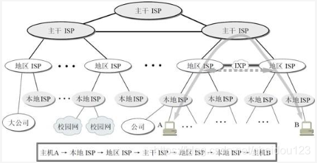

其中,IXP可以让地区ISP直连而不需要通过主干ISP

4.并非所有的RFC文档都能成为互联网标准，一个标准可以和多个RFC文档关联

5.互联网从工作方式来讲，可以分为边缘部分和核心部分

边缘部分:所有连接在互联网上的主机组成
核心部分:由大量网络和路由器组成

### 分组交换

1.分组交换，因为计算机数据是突发式的在网络上传输，线路上真正用来传送数据的时间往往很少很少，为了解决这个问题，提出了分组交换的策略

2.分组交换就是把一个分成一个个小的数据段，然后加上一个首部

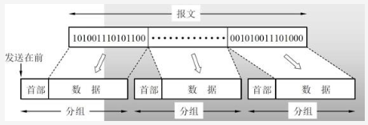

3.首部包含了目的地址和源地址等重要的信息

4.当路由器收到一个分组，检查首部，查找转发表，然后找到合适的端口转发给下一个路由器，这样一步步的经过几十个路由器最终找到目的地址

5.为了提高分组交换的可靠性，互联网核心部分采用网状结构，路由器可以动态选择最佳路径

### 计算机网络的性能
* 速率 比如40Gbit/s
* 带宽 单位时间内网络中的某信道能通过的最高数据率
* 吞吐量 单位时间内某个网络(或信道)的实际数据量，速率是上线值，实际吞吐量肯定要比速率小很多
* 时延 分为各种时延，就是从一头到另一头的时间
* 时延带宽积 时延和带宽相乘
* 往返时间RTT 双向交互时一次交互的时间
* 利用率
  * 信道利用率，某信道百分之几的时间是被利用的，太高了就会有延迟
  * 网络利用率，全网络信道利用率的加权平均值

### 计算机网络体系结构

1.计算机网络体系结构

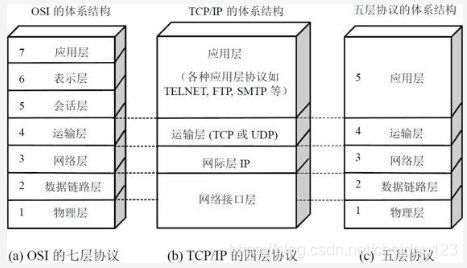

2.传递信息的光缆，信道等不属于物理层，这些物理媒体可以叫第0层

3.TCP/IP一般指的是整个TCP/IP协议族

4.目前OSI分层概念并没有完全遵守，现在的体系结构已经可以使应用层直接使用IP层甚至网络接口层

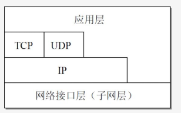

5.IP协议是整个互联网的核心

## 物理层
### 物理层的基本概念
1.物理层考虑的是如何在传输媒体上传输比特流，而不是指具体的传输媒体

2.物理层尽可能的使数据链路层感觉不到传输媒体的差异

3.数据在计算机内部一般采用并行传输，但是在传输媒体上一般都是串行传输，因为并行很贵的

4.一个数据通讯系统可以分为源系统，传输网络，目的系统

### 信道
1.信道一般是用来表示某一个方向上传送信息的媒体，记住是单方向，一条通讯线路一般有发送和接收两个信道

2.从信道的交互方式来看，有以下三种基本方式
* 单向通讯
* 双向交替通讯，不能双方同时发送
* 双向同时通讯

3.来自信源的信号叫做基带信号，许多信道无法直接传送基带信号，需要进行调制:
* 编码 对波形变换，把数字信号转换成另一种波形的数字信号
* 载波 把信号的频率范围转移到较高的频段，并转换成模拟信号

4.信道也是有极限速率的，因为传送过程中会出现失真导致接收端无法识别

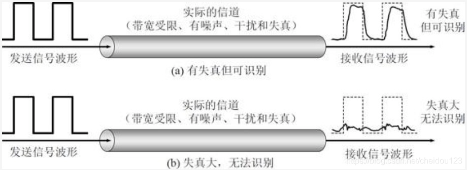

5.限制码元在信道上的传输速率主要原因如下:
* 信道能通过的频率范围有限，高频分量会出现码间串扰，导致接收端无法识别
* 信噪比，也就是信号和噪声的比，信噪比越大，那么极限传输速率越高，信道的极限传输速率可以通过信噪比和带宽(以HZ为单位)来算出来，也就是香农公式
* 信道还会有一些脉冲干扰等

6.对于频道宽度和带宽都已经确定的信号，我们可以让每一个码元携带更多的比特量，我们可以使用多种振幅，比如我们可以3个一组，采用8种振幅来表示

### 物理层下面的传输媒体
#### 1.导引型传输媒体
* 双绞线，局域网用的较多
* 同轴电缆，一般是用在有线电视网
* 光纤
  * 单模光纤，光压根就不用折射，直接向前，适合长距离传输，但是很贵
  * 多模光纤，多条不同入射角度的光线在一条光纤中传输，只适合近距离传输

#### 2.非导引型传输媒体
比如卫星通讯等等

### 信道复用技术
复用，就是不同发送端使用同一个信道和对应接收端通讯，需要复用器和分用器

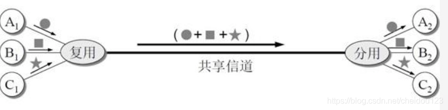

### 频分复用FDM
所有用户在同一时间占用不同的带宽资源，用户增加，带宽就得跟着变宽

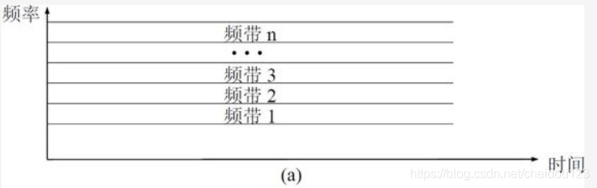

### 波分复用WDM
是将一系列载有信息、但波长不同的光信号合成一束，沿着单根光纤传输；在接收端再用某种方法，将各个不同波长的光信号分开的通信技术

如果每一路的速度是40Gbit/s，那么64路就能获得2.56Tbit/s的数据率

由于光的频率太高，人们一般用光的波长来表示光载波，

### 时分复用TDN
将时间划分为等长的时分复用帧，更适合数字信号的传输

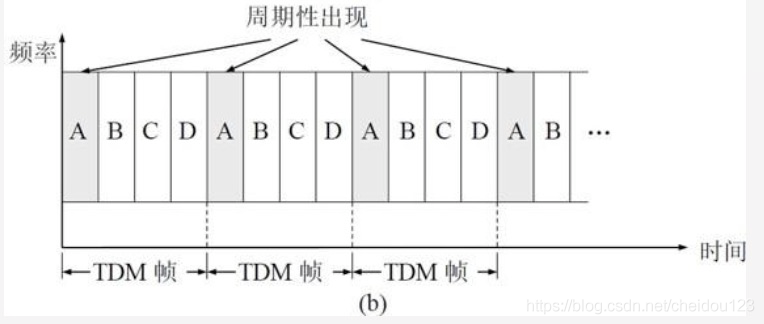

由于计算机的数据都是间歇性的，所以使用上面的方式会浪费很多资源，因为有的时候用户并没有传输，导致信道复用率很低:

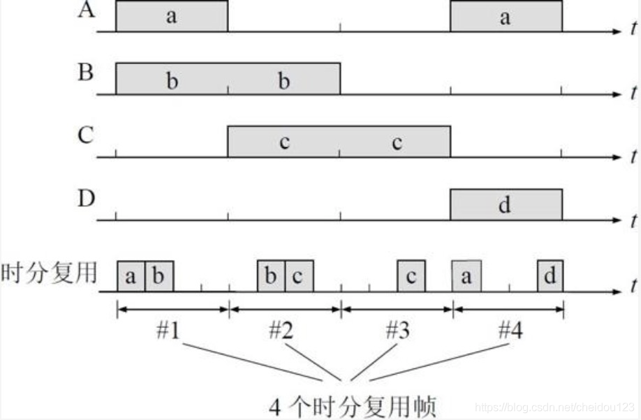

所以就有了统计时分复用，使用一个只能复用器动态分配:

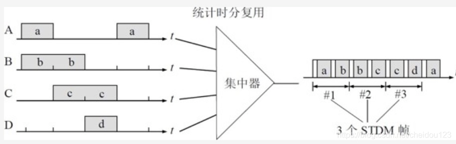

### 码分复用CDM
码分复用可以让用户在同一时间，和同一频带使用不同的码型进行通讯，一般用在军事或者无线局域网中

### 宽带接入技术
#### 非对称数字用户线ADSL
使用数字技术对现有的电话用户线进行改造，可以利用电话线，对老建筑比较友好

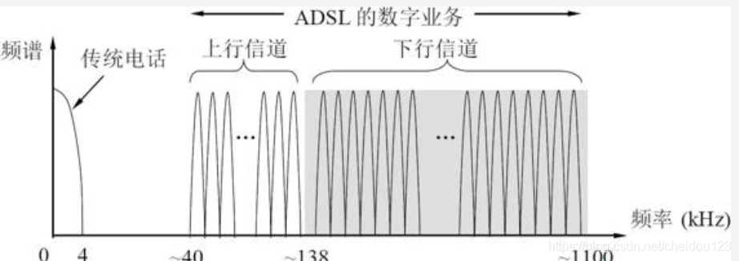

#### 光纤同轴混合网(HFC网)
基有限电视网的，为了提高速率，主线部分使用光纤

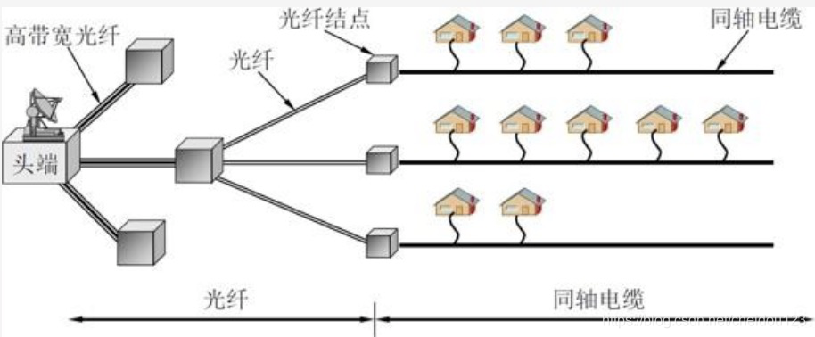

#### FTTx技术
FTTH就是光纤到户，但是一般用户也不需要这么高的速率，而且比较贵，因而有了FTTx，x代表到哪里，比如到小区FTTZ
