<!-- MDTOC maxdepth:6 firsth1:2 numbering:0 flatten:0 bullets:1 updateOnSave:1 -->

   - [网络层提供的两种服务](#网络层提供的两种服务)   
   - [网际协议IPv4](#网际协议ipv4)   
      - [虚拟互连网络](#虚拟互连网络)   
      - [分类的IP地址](#分类的ip地址)   
      - [IP地址与硬件地址](#ip地址与硬件地址)   
      - [地址解析协议ARP](#地址解析协议arp)   
      - [IP数据报的格式](#ip数据报的格式)   
      - [IP层转发分组的流程](#ip层转发分组的流程)   
   - [划分子网](#划分子网)   
   - [CIDR(构造超网)](#cidr构造超网)   
   - [ICMP 网际控制报文协议](#icmp-网际控制报文协议)   
   - [互联网的路由选择协议](#互联网的路由选择协议)   
      - [RIP](#rip)   
      - [OSPF 链路状态协议](#ospf-链路状态协议)   
      - [RIP和OSPF](#rip和ospf)   
      - [外部网关协议BGP](#外部网关协议bgp)   
   - [路由器的构成](#路由器的构成)   
      - [核心控制部分](#核心控制部分)   
      - [分组转发部分](#分组转发部分)   
   - [IPV6](#ipv6)   
   - [IP多播](#ip多播)   
      - [在局域网上进行硬件多播](#在局域网上进行硬件多播)   
      - [在互联网上进行多播](#在互联网上进行多播)   
   - [虚拟专用网VPN](#虚拟专用网vpn)   
   - [NAT/NAPT](#natnapt)   
   - [MPLS](#mpls)   

<!-- /MDTOC -->

### 网络层提供的两种服务
1.网络层向上只提供简单灵活，无连接的，尽最大努力交付的数据报服务

2.网络层不保证分组不出错，不丢失，不重复和不失序，如果需要可靠通讯，需要运输层负责

### 网际协议IPv4
1.配套协议
* ARP 地址解析，RARP现在已经不用了，IP协议使用它
* ICMP，网际控制报文协议，它使用IP协议
* IGMP，网际组管理协议，它使用IP协议

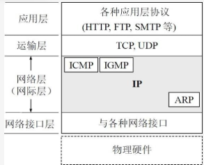

#### 虚拟互连网络
1.将网络互联起来需要使用一些中间设备
* 物理层 转发器
* 数据链路层 网桥/桥接器
* 网络层 路由器，有的时候路由器也叫网关，路由器是一个三层设备
* 网路层以上 网关

2.使用转发器或网桥仅仅是放大了同一个网络，而不是将网络互连

3.我们使用IP协议让不同网络在网络层看起来好像是一个统一的网络，其实就叫做虚拟互连网络

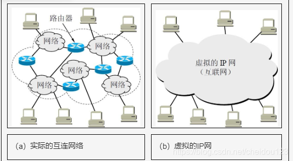

4.直接交付和间接交付
* 不需要路由器转发的叫做直接交付
* 需要路由器转发的叫做间接交付

#### 分类的IP地址
1.IP地址就是给互联网每一个主机或路由器的每一个接口分配一个唯一的32位标识符

2.IP编址方式共经历了三个历史阶段:
* 分类的IP地址
* 子网划分
* 构成超网

3.分类IP地址已经成为历史了，但是还得说说

4.分类IP地址将每一类IP地址分成网络号+主机号的形式，

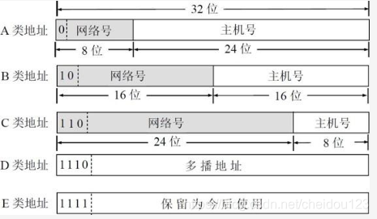

由图可见，地址前面N位会指明类别，A，B，C类地址分别为0，10，110

A类地址占整个IP地址空间的一半，B类占25%，C类占12.5%，因为中间有一些特殊的(比如127.0.0.1这种)，所以会-1或者-2

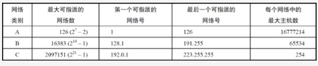

5.IP地址的主要特点
* IP管理机构只分配网络号，谁得到了网络号，谁再去分配主机号
* 路由器转发分组考虑的是网络号，它不关心主机号
* IP地址标志的是一台主机(或路由器)和一条链路的接口，所以一个路由器至少有俩IP地址，但是如果俩路器直接相连，相连的这俩端口可以不分配IP地址
* 转发器或网桥连接起来的若干小网络仍为一个网络，这些小网络都具有同一个网络号，也只能有一个网络号
* 具有不同网络号的局域网必须使用路由器相连

#### IP地址与硬件地址
1.IP数据报一旦交给数据链路层，就封装成MAC帧了，MAC帧的源地址和目的地址都是硬件地址，在数据链路层看不到IP地址

2.接收的设备收到MAC帧时，检查硬件地址决定是否丢弃，只有交给网络层后，网络层才能在IP数据报的首部找到源IP和目的IP地址

3.IP数据报中的源IP和目的IP即使经过路由器转发也不会改变

4.MAC帧的硬件地址在不同的网络上传送时，硬件地址会发生改变

#### 地址解析协议ARP
1.通过IP地址找硬件地址叫做ARP

2.目前DHCP已经包含了RARP的功能

3.网络层使用的是IP地址，但在实际网络链路上传送时，还必须使用该网络的硬件地址

4.主机里面有一个有超时机制的ARP高速缓存，存有IP地址和硬件地址的映射表

5.如果缓存里没有
* 广播发送一个ARP请求分组，里面主要内容时本机的IP地址和硬件地址以及目的地的IP地址
* 本局域网所有主机都收到ARP请求
* 如果某个主机的IP地址就是目的地址，就对其单独响应，同时缓存发送方的信息
* 发送方主机收到响应并缓存

6.ARP的四种典型情况:
* 同一个网络，比如H1到H2，H1发送ARP广播可以直接找到H2硬件地址
* H1到H3，则先找到R1的硬件地址，R1再网2广播
* H1到H4，先到R1，R1找到R2，R2在网3广播

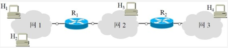

#### IP数据报的格式

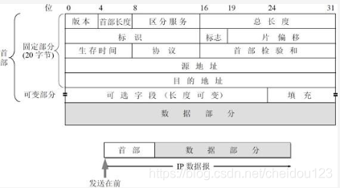

主要有首部和数据部分两块组成，其中首部比较重要的地方是:
*  总长度，最大16位，最大65535字节，指的是首部和数据部分长度之和，但是一旦超过了1500(MTU)字节，IP数据报就得进行分片了，这时候总长度就是每个分片的总长度了
* 标识，相同标识的IP数据报是同一个报文的分片
*  标志
   * MF为1时，还有分片，MF=0，代表这是分片报文中最后一个
   * DF=0时允许分片，否则不能分片

* 片偏移，较长分组分片后，某分片在原分组的相对位置
* 生存时间，表示可以经过路由器的跳数，设置为1，就只能在本局域网传送
* 协议，目的主机通过它来表示到底交给何种上层协议

* 首部检验和，只检验数据报的首部，不检验数据部分

#### IP层转发分组的流程
1.路由表指出的是某个网络如何转发，但是也可以对某个主机指定，方便排查错误
2.在路由表中，最重要的是下面两个信息
* 目的网络地址
* 下一条地址
3.只有到达最后一个路由器时，才试图向主机进行直接交付
4.如果一个主机只有一个路由器和互联网连接，可以使用默认路由策略，如果没有匹配上其他的就走默认路由
5.当路由器收到一个待转发数据报时，从路由表得到下一跳IP地址，然后通过ARP找到硬件地址进行转发

### 划分子网
1.简单的将地址分为A，B，C类会有很多的问题:
* 申请一个A类地址用不完咋整，毕竟A类地址很大
* 有的时候要增加一个新的网络必须申请网络号，这样比较麻烦
* 每个网络都有一个网络号，那么路由表会很大

2.为了解决这些问题，IP地址上又增加了一个子网号段

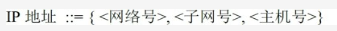

3.子网时一个网络内部的事情，外部看不到这个网络有多少个子网，对外仍然表现为一个网络

4.子网从主机号借用若干位作为子网号，主机号也就响应的减少了同样的位数

5.从其他网络发给本网络的IP数据报，路由器收到后，按目的网络号和子网号找到目的子网，把IP数据报交付给目的主机

6.从IP数据报的首部我们也不知道目的主机是否进行了子网划分，因此有了子网掩码这个概念，子网掩码都是连续的1和连续的0组成，当路由器收到一个IP地址时，和子网掩码与一下就知道所要找的子网地址了

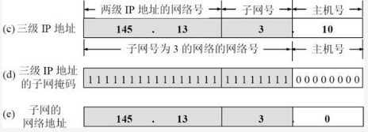

7.现在互联网标准要求，不划分子网的时候，也需要有子网掩码，这时候就是默认的，1的位置和网络号位置对应

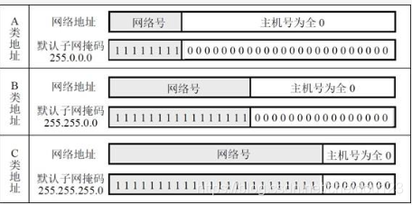

8.路由器和相邻路由器交换路由信息时，也需要告诉相邻路由器自己的子网掩码，路由表中的每一项也要有子网掩码

9.在划分子网的情况下，路由表需要包含目的网络地址，子网掩码，下一条地址

10.路由器转发分组算法

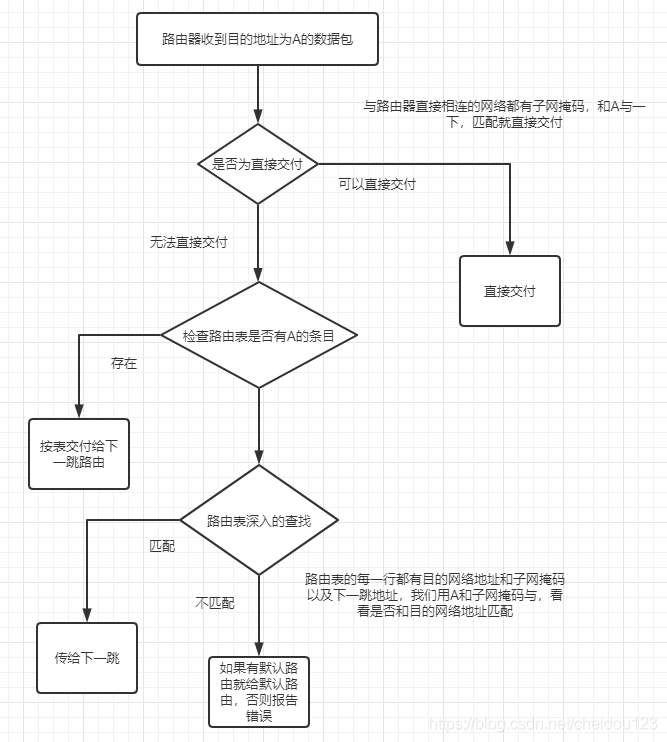

### CIDR(构造超网)
1.A/B/C类地址存在的问题
* 单纯分配A/B/C类地址，B类地址在1992年已经用了一半了
* 路由表的项目也会很多

2.CIDR的主要特点
* 消除了A,B,C的地址的概念，使用斜线计法，前面表示网络号，后面是主机号
* 网络号相同的是一个CIDR地址块

3.我们只要知道了CIDR的任何一个地址，就可以知道它所在块的最小地址和最大地址

4.分配了CIDR地址块，可以对这个地址块再进行划分子网，这个时候网络前缀就会根据从主机号借来几位，比如本来单位是/20，后面科室可以从主机号借来3位划分子网

5.使用CIDR可以减少路由表的条目数，可以根据客户需要分配适当大小的地址块

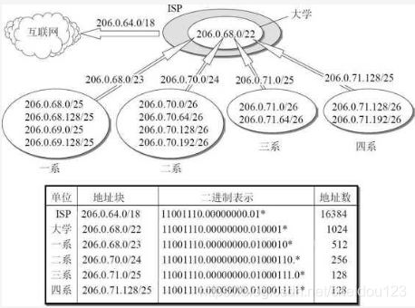

* 这个ISP要按分类地址来看，需要64个C类网络，但是这里只需要一条搞定
* 大学从ISP又要来个/22这个项目，ISP不会考虑各个系，而是直接给/22

6.有的时候，查找路由表可以找到不只一个匹配的，这时候就要有最长匹配原则
* 比如大学的四系希望ISP直接发给他
* 在ISP的项目中有/22(大学)和/25(四系)两个项目
* 来了个IP地址这俩都匹配，这时候就要选/25

7.使用二叉线索树查找路由表
如果使用最长前缀匹配，我们不能只在路由表匹配一个就完事了，要都过一边看看对应的那个最长，这个时候我们就可以使用二叉线索树了，二叉线索树的路径代表了地址值

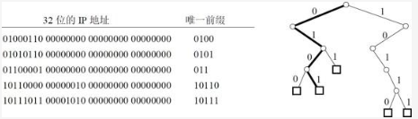

二叉线索树的每一个叶子节点(注意是叶子节点)还包含了对应的网络前缀和子网掩码，因为路径都是唯一前缀，我们还需要找到具体的网络前缀才行，而且还需要查找的IP地址还要和子网掩码运算看是不是为具体的网络前缀，不是就丢弃

### ICMP 网际控制报文协议
1.ICMP是IP层的协议

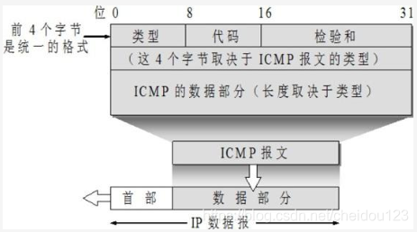

2.ICMP报文类型

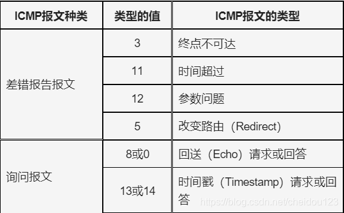

3.ICMP差错报文
* 3 当路由器或主机不能交付数据报时向源点发送
* 11 路由器收到生存时间为0的数据报时，就向源点发送
* 12 当收到数据报首部有问题时向源点发送
* 5 路由器让源点知道，下一次给XX更好，因为互联网源点主机的路由表中不一定是最佳路由

4.ICMP询问报文
* 8/0 源点向特定目的地发送请求，目的地回答
* 13/14 用于源点和目的主机时钟同步

3.PING 使用了8/0会送请求或回答报文，它并没有使用TCP/UDP，

4.TRACEROUTE
* 发送一系列的数据报，第一个TTL是1，路由器收到后，会回复时间超过
* 第二个TTL是2，第二个路由器回复时间超过
* 一直到目的主机，但是数据报时无法交付的UDP数据报，目的主机向源主机发送ICMP终点不可达的报文
* 这样就知道中间经过的全部路由器信息了

### 互联网的路由选择协议
1.路由选择协议采用的是分层次的策略，把整个互联网划分成小的自治系统AS，每个AS是在单一策略下管理的路由器，在目前的互联网中，一个ISP(运行商)就是一个自治系统，路由选择协议分为两大类
* 内部网关协议，如RIP，OSPF
* 外部网关协议，如BGP

2.每个自治系统都有一个或多个路由器负责和其它AS交互。它会同时运行两种协议

3.对于很大的自治系统，可以建立一个主干网，连接很多区域网，但是自治系统内部仍然全部采用同样的内部网关协议

#### RIP
1.一种简单的，基于距离向量的路由选择协议

2.网络中每一个路由器都要维护从它自己到其他每一个目的网络的距离，直接相连的就是1，RIP认为好的路由线路就是通过的路由器数量少，RIP最多可以支持通过15个路由器，RIP寻找最短距离使用的是距离向量算法

3.RIP协议的特点
* 仅和相邻的路由器交换信息
* 交换的信息时路由器知道的全部信息，也就是整个路由表
* 按固定时间间隔交换路由信息

4.路由器刚开始工作时，通过不断的和直接相连的路由器交换信息，最终生成自己的路由信息

#### OSPF 链路状态协议
1.开放最短路径优先 开放表示是公开的意思，不受厂商的影响，最短路径使用了SPF算法

2.OSPF的要点
* 最核心的是OSPF把每条路由路径都收集在自己的数据库里了，然后选择最合适的
* 向本自治系统所有路由器发送信息，使用洪泛法，先给相邻的发，然后相邻的再给相邻的发，最终这个自治系统所有路由器都收到了
* 发送的信息就是源路由器和它相邻路由器的链路状态，包含距离，时延，带宽等等
* 当链路状态发生变化的时候会洪泛

3.通过洪泛，所有路由器都能建立一个本自治系统的网络拓扑图，然后根据网络拓扑图，构造自己的路由表

4.如果一个规模很大的网络，可以将自治系统划分成区域，每个区域路由器一般不超过200个

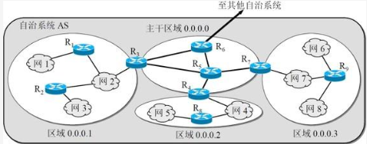

划分区域之后，洪泛法作用于每个区域，每个区域内部路由器只知道本区域的网络拓扑，同时又一个区域是主干区域，负责连接下层的区域，每个下层区域都至少有一个边界路由器，如R3,R4,R7，同时主干区域还必须有个和其它AS相连的AS边界路由器

5.OSPF直接用IP数据报进行传送

6.OSPF的分组类型
* 问候，相邻路由器每10S要互相问候一下，毕竟可达是最基本的，如果40S没有收到隔壁的问候，就要修改路由表了
* 链路状态数据库的同步相关的
  * 数据库描述
  * 链路状态请求
  * 链路状态更新
  * 链路状态确认

7.一个新加入网络的路由器直接在全网进行广播本地链路状态，这个代价实在是太大了

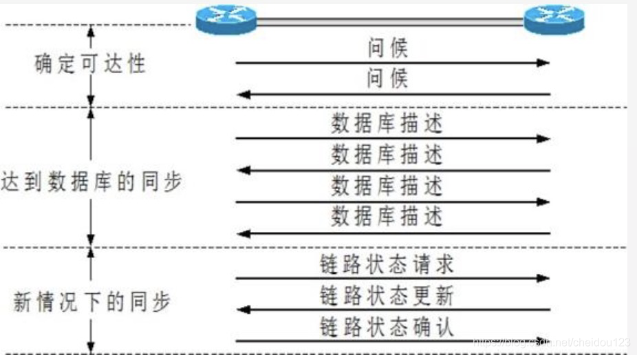

* 一个新的路由器刚开始工作，它只能通过问候来得知它的邻居路由器
* 新的路由器用数据库描述分组来告诉邻居我表里有这些路由器的链路状态了，你把我没有的给我，通过分组交换，然后就得到了一个完整的链路数据库了

8.在网路运行过程中，如果一个路由器的链路状态发生变化了，会使用洪泛法来更新链路状态，另外，每个一段时间，也会刷新一下链路状态

9.一个路由器的链路状态只涉及到相邻路由器，所以互联网规模很大时，OSPF也适用
#### RIP和OSPF
你要去西湖，你问旁边的几个人，A告诉你“走我这条路要20㎞”，B告诉你“走我这条路要30㎞”，于是你选择走A——这是RIP，是一种距离矢量协议；你要去西湖，你问旁边几个人，A,B都把一个他们手中的地图（链路状态数据库）给你，你把几张地图拼起来，然后脑里一合计（最短路径算法），决定走A，这是OSPF，是一种链路状态协议

#### 外部网关协议BGP
1.每个自治系统可能有自己独立的一些策略，比如A到C，可能要经过B，但是B不想让A过，所以有的时候找到最短路径并不合适

2.BGP采用了路径向量的路由选择协议，只是力求寻找能够到达目的网络并且还差不多的路由，而并非一定要找到最好的

3.每个自治系统都至少有一个路由器来当本自治系统的联络人，一般是边界路由器

4.链路人和其它自治系统的联络人通过TCP建立BGP会话，交换路由信息

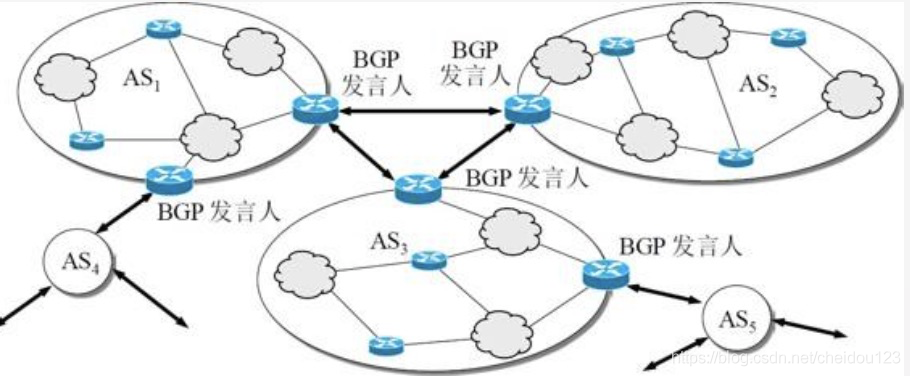

5.BGP互相交换的信息就是要到达某个网络所要经过的自治系统，当交换完成之后，联络人就会从中选择较好的路由

6.自治系统的个数较少，所以路由选择也不会过分复杂

7.BGP运行并交换信息之后，以后交换只更新有变化的部分

8.BGP报文类型
* OPEN 与相邻自治系统的联络人初始化关系
* UPDATE 用来更新一条路由或撤销某些路由
* KEEPALIVE 验证和邻站的连通性
* NOTIFICATION 如果检测到差错，发送

9.两个不同AS的联络人先通过OPEN来建立连接，然后用KEEPALIVE来保持连接，UPDATE是核心，可以撤销或更新路由

10.BGP报文的格式

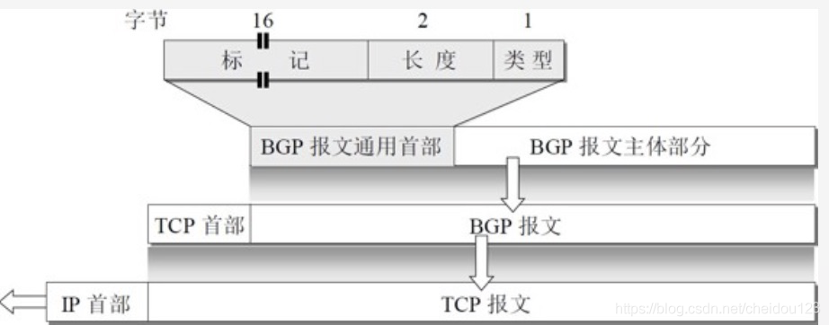

### 路由器的构成
1.路由器是一个具有多个输入和输出端口的专用计算机，核心任务是转发分组，主要分为两大部分
* 核心控制部分
* 分组转发部分

#### 核心控制部分
主要是构造，更新和维护路由表
#### 分组转发部分
1.分组转发的意思根据转发表是从某个输入端口进入的分组从一个合适的输出端口转发出去
* 转发表 从路由表得出，一般不用区分转发表和路由表，都当路由表就行
* 路由表 很多路由器协同作用的结果

2.分组转发由三部分组成
* 输入端口
* 输出端口
* 交换结构，一种包含在路由器中的网络

3.路由器结构

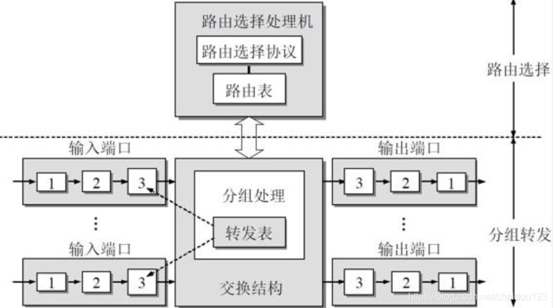

图中，3，2，1分别代表了网络层，数据链路层，物理层，在网络层有个缓冲区，缓冲区满了就会丢弃新来的数据，所以提高转发速度还是很重要的

4.常用的交换结构

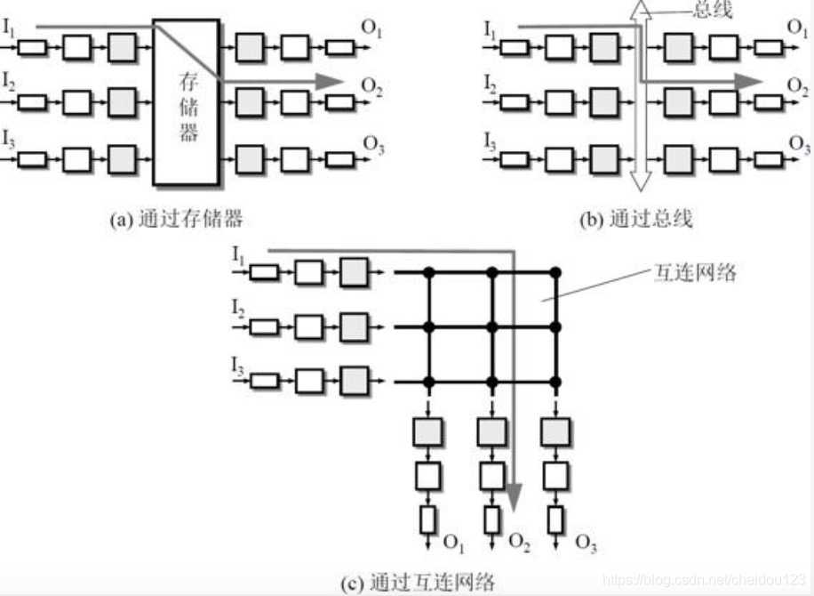

* 通过存储器的结构
* 通过总线的结构，同一时间只能有一个分组在总线上传输
* 纵横交换互连网络

### IPV6
1.和IPV4的主要区别
* IPV6将IP地址从32位增大到128位
* IPV6首部可以定义许多扩展首部，扩展首部在数据部分，不属于IPV6的基本首部，这样也提高了转发效率，因为扩展首部是属于数据部分
* 不需要DHCP，即插即用
* 去掉了网络层的校验和

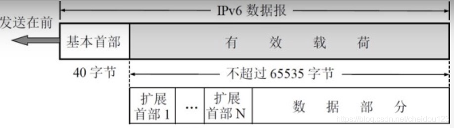

2.IPV6目的地址的类型
* 单播
* 多播， 一对多个，广播是多播的特例
* 任播，想多个接收方组成的一个组其中的随便一个发送

3.IPV6地址表示方式使用的是冒号十六位进制方法，每16位的值用一个十六位进制表示

另外，IPV6地址允许将0使用::省略，也支持16位和10位共同表示，还支持CIDR和子网划分

4.从IPV4到IPV6
* 使用双协议栈，也就是主机或路由器同时装有两种地址，通过DNS查询接收主机地址类型，然后根据目的地址类型选择合适的协议，这样存在的问题是会丢失一些首部信息，因为两种地址格式首部毕竟不一样
* 使用隧道技术，当目的地址不支持IPV6的时候，将IPV6数据包当成IPV4的数据部分直接发送过去，当IPV4的首部协议字段的值是41时是这种类型

5.ICMPV6

ICMPV6比ICMPV4要复杂的多，ARP和IGMP都直接合并进去了

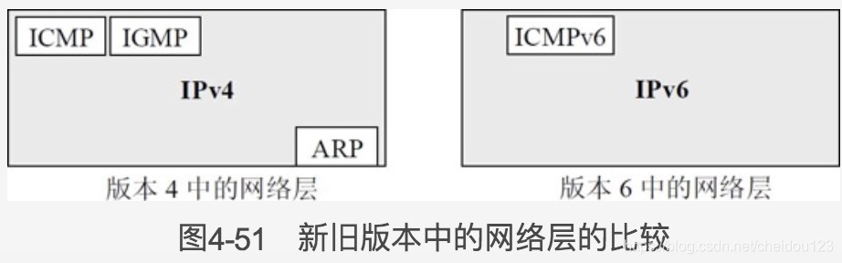

### IP多播
1.多播数据报源主机只要发送一次，中间路由器会复制副本，到最后的局域网通过硬件多播的方式，不再需要复制副本了

2.能够运行多播协议的路由器叫做多播路由器

3.多播组的目的地址就是IP地址中的D类地址，然后让许多目的主机和这个D类地址关联起来，使用的是IGMP协议

4.多播数据报可以由没有加入多播组的主机发出

#### 在局域网上进行硬件多播
当有硬件多播时，网卡经过驱动配置，除了关注自己的MAC地址外，还关注特定的MAC地址。当网卡收到一个多播MAC地址的报文时，它会向上交给IP层作进一步处理

#### 在互联网上进行多播
* 网际组管理协议IGMP
IP组播通信的特点是报文从一个源发出，被转发到一组特定的接收者。但在组播通信模型中，发送者不关注接收者的位置信息，只是将数据发送到约定的目的组播地址。要使组播报文最终能够到达接收者，需要某种机制使连接接收者网段的组播路由器能够了解到该网段存在哪些组播接收者，同时保证接收者可以加入相应的组播组中。IGMP就是用来在接收者主机和与其所在网段直接相邻的组播路由器之间建立、维护组播组成员关系的协议

* 多播路由选择协议
当一个网络组里面没有机器参与了多播组，就不让多播数据报传到这个网络组里面，而且因为经常有机器参与或退出多播，所以要适应动态变化

### 虚拟专用网VPN
1.在互联网中，路由器对所有目的地址是专用地址的数据报一律不进行转发

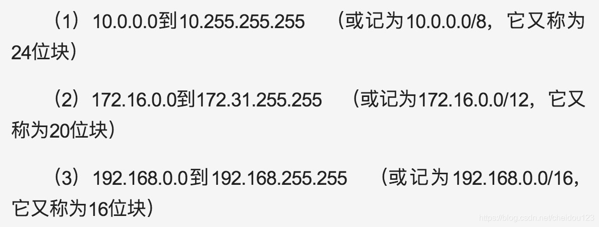

2.有的时候一个单位要分布在世界各地，这时候就需要VPN来帮忙了

3.一个机构要使用VPN要为它的每一个场所购买专用的硬件(如果单单是普通员工在家办公，不需要购买硬件，直接通过软件即可)和软件，并且每一个场所要有一个合法的全球IP地址，VPN将数据加密后封装到正常的互联网数据报中发送给目的场所，这种技术也叫做隧道技术

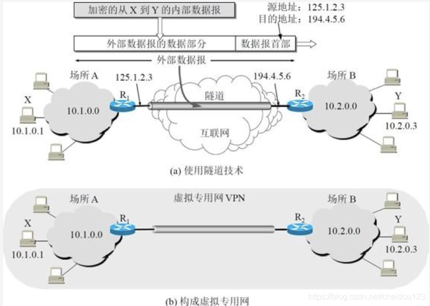

### NAT/NAPT
1.装有NAT软件的路由器叫做NAT路由器，可以将本地地址转换为全球地址，当然NAT路由器可以有多个全球地址

2.传统的NAT路由器有N个IP地址，专用网中可以有N个主机接入互联网，为了提高能接入互联网主机的数量，有了NAPT，也就是加上了端口号，这样NAPT也工作在了运输层

3.目前主流使用的是NAPT，也就是端口+IP

### MPLS
1.MPLS是一种加快数据传输的技术

2.FEC 同样的转发路径的网络数据包的集合

3.传统的路由决策，路由器需要对网络数据包进行解包，而MPLS提出，当网络数据包进入MPLS网络时，对网络数据包进行解包，计算归属的FEC，生成标签（Label）。当网络数据包在MPLS网络中传输时，路由决策都是基于Label，路由器不再需要对网络数据包进行解包

在MPLS网络里面，数据被封装在了盒子里，上面贴了标签，每个经手的人只需要读标签就知道盒子该送到哪

4.MPLS网络指的是网络中有很多彼此相邻且都支持MPLS技术的标记交换路由器LSR，从进入MPLS网络开始的打标记，推出后就去掉标记

5.MPLS首部的格式
在以太网的帧首部和IP数据报首部之间插入一个4字节的MPLS首部

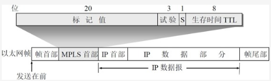
