<!-- MDTOC maxdepth:6 firsth1:2 numbering:0 flatten:0 bullets:1 updateOnSave:1 -->

   - [运输层协议概述](#运输层协议概述)   
   - [用户数据报协议UDP](#用户数据报协议udp)   
   - [传输控制协议TCP](#传输控制协议tcp)   
      - [概述](#概述)   
      - [TCP报文段的首部格式](#tcp报文段的首部格式)   
      - [可靠传输的一些尝试](#可靠传输的一些尝试)   
         - [停止等待协议(不用)](#停止等待协议不用)   
         - [ARQ(不用)](#arq不用)   
      - [TCP可靠传输的实现](#tcp可靠传输的实现)   
         - [以字节为单位的滑动窗口](#以字节为单位的滑动窗口)   
         - [超时重传时间的选择](#超时重传时间的选择)   
         - [选择确认SACK(不使用)](#选择确认sack不使用)   
      - [TCP流量控制](#tcp流量控制)   
      - [Nagle算法](#nagle算法)   
      - [TCP的拥塞控制](#tcp的拥塞控制)   
         - [拥塞控制的一般原理](#拥塞控制的一般原理)   
         - [拥塞控制算法](#拥塞控制算法)   
            - [慢开始](#慢开始)   
            - [拥塞避免](#拥塞避免)   
            - [快重传](#快重传)   
            - [快恢复](#快恢复)   
            - [总结](#总结)   
         - [主动管理队列AQM](#主动管理队列aqm)   
      - [TCP的连接管理](#tcp的连接管理)   
         - [三次握手](#三次握手)   
         - [四次挥手](#四次挥手)   
         - [TCP的有限状态机](#tcp的有限状态机)   

<!-- /MDTOC -->

### 运输层协议概述
1.从IP层来说，IP数据报对象是两台主机，但是真正通讯的实体是两台主机中的进程

2.运输层主要有两种协议
* 面向连接的TCP
* 无连接的UDP

3.UDP和TCP都有源端口/目的端口两个字段，比如TCP可以有65535个不同的端口号，其中有一些重要的
* Telnet 23
* HTTP 80
* HTTPS 443

### 用户数据报协议UDP
1.UDP的主要特点
* 无连接，发送数据不需要先建立连接，不需要使用套接字，TCP通讯就必须在套接字之间建立连接
* 尽最大努力交付，但不保证可靠交付
* 面向报文，应用程序交下来的报文，加个首部就给IP层，既不合并，也不拆分
* 支持一对一，一对多，多对一，多对多各种姿势
* 首部开销比较小

2.当运输层从IP层收到数据报的时候，根据首部中的目的端口，把UDP数据报上交到对应的进程

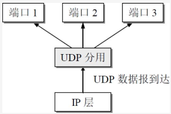

3.如果没有存在对应端口号的进程，就丢弃该报文，返回ICMP端口不可达报文

4.UDP的首部格式

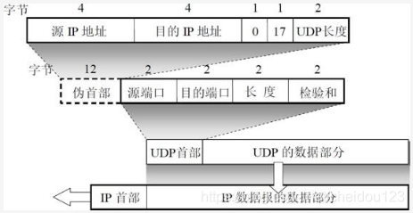

其中首部字段有四个部分:
* 源端口
* 目的端口
* 长度
* 检验和

5.检验和是UDP中比较特殊的部分，在上图我们可以看到一个伪首部，伪首部既不往上也不往下传送，主要是为了计算检验和，里面的内容就像上图最上面所示，它是一个虚拟的数据结构，其中的信息是从数据报所在IP分组头的分组头中提取的

这样的校验和，既校验了用户数据的源端口号和目的端口号以及用户数据报的数据部分，又检验了IP数据报的源IP地址和目的地址

### 传输控制协议TCP
#### 概述
1.TCP是点对点的面向连接的协议，提供可靠的全双工通讯，是面向字节流的，在连接的两端都有发送和接收缓存

2.对面向字节流的理解

指的是从流入到进程或从进程流出的字节序列，应用程序和TCP交互时一次一个数据块，但是TCP把数据看成是字节流

TCP不会关心进程给它发送了多长的报文，而是根据对方给出的窗口值和网络拥塞成都来决定一个报文段含有多少个字节

相反，UDP的报文长度是应用程序给出的

3.TCP的端点叫做套接字，其实也就是IP+PORT

#### TCP报文段的首部格式

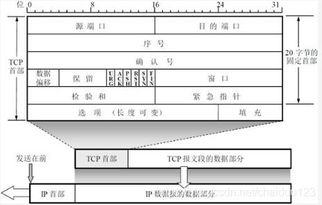

不过说实话，硬记肯定记不住，这里只说几个关键的地方
* 如果确认号时N，则到序号N-1的所有数据已经正确收到
* 数据偏移，指出了数据起始处到TCP报文段首部的距离，起始也就是首部的长度
* 窗口，从本报文段首部确认号开始，接收方目前允许对方发送的字节数，窗口是动态变化的，比如确认号是701，窗口字段1000，那么允许发送的字节序号是701-1700

#### 可靠传输的一些尝试
##### 停止等待协议(不用)
1.每发送完一个分组就停止发送，等待收到确认后再发送下一个分组

2.另外发送方有一个超时计时器，如果超过了时间没有收到对应应答，就重新发送

3.还有一些比如确认丢失和确认迟到的情况

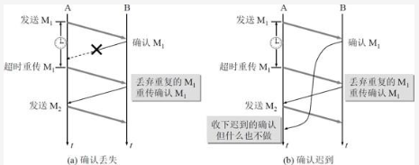

4.停止等待协议存在的问题就是信道利用率太低，所以并不合适
##### ARQ(不用)
1.发送方维持发送窗口，将窗口内连续的5个分组连续的发送出去，不需要等待对方的确认，这样信道利用率就提高了

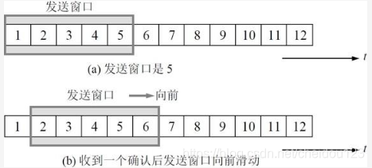

接收方采用累计确认的方式，收到几个分组后，对最后一个分组发送确认

2.ARQ同样也存在着问题，发送方发送了5个分组，第三个丢了，接收方只能确认前两个，所以发送方只能把后面三个分组都重传一次，叫做Go-back-N
#### TCP可靠传输的实现
首先，我们假设传输是单向的，这样好分析，其实TCP是全双工的，两端都有发送窗口的
##### 以字节为单位的滑动窗口
1.发送方当收到接收方的确认报文段，可以从中提取出窗口大小，和确认号，如下，确认号是31，窗口大小是20字节

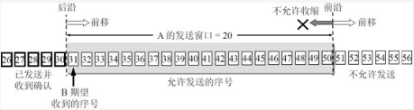

另外，发送端的发送窗口还会受到网络拥塞程度的制约，是网络拥塞程度和接受方接受能力的最小值，但是这里先不做考虑了

2.发送窗口的前后沿会根据消息确认情况和窗口大小不断变化
* 发送窗口的前沿
  * 不动
  * 前移
  * 向后收缩，一般不会
* 发送窗口的后沿
  * 不动
  * 前移

3.另外，要描述一个发送窗口的状态需要三个位置:

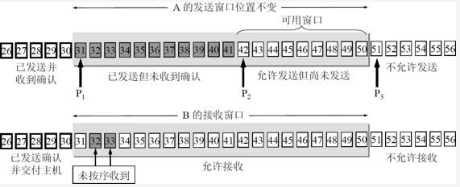

4.窗口和缓存的关系，其实是环形的，但这里把它画成长条状

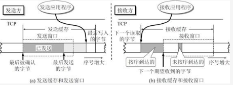

从中我们可以看到，发送窗口和接收窗口都是发送缓存的一部分

5.TCP接收方通常对不按序到达的数据存放临时存放在接收窗口中，先不确认，等缺失的来到后，再确认并交付给应用层

6.TCP接收方通过累计和捎带确认，可以减少传输开销
##### 超时重传时间的选择
1.TCP在规定时间内没有收到确认就要重传报文，但是重传时间是个很重要的问题，因为时间太短，就会造成很多不必要的重传，时间太长，就会降低效率

2.TCP采用了一个自适应算法，来计算重传的时间，主要是采用了Karn算法，具体是根据多次采集的发送和收到确认的时间差来确定时间

##### 选择确认SACK(不使用)
1.有些报文接收方已经收到了，但是前面有中断，这时候就不能发送确认，发送方就会全部重传，其实接受方也可以告诉发送方那些序号段已经收到了，但是这样会增加TCP首部字段来指明这些信息，所以一般不使用这个

#### TCP流量控制
1.这里所说的流量控制，是指要让接收方来得及接收，注意和拥塞控制的区别

2.利用可变窗口进行流量控制

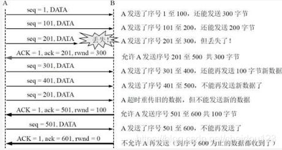

* B告诉A，我的rwnd(接收窗口)是400字节，假设一个报文段长度是100字节
* 图中，rwnd一共是修改了3次，从400到300到100到0

有一种特殊情况，B向A发送rwnd是0，然后过了一段时间，B又改变主意了，给A发送rwnd是500，但是这个报文丢了！为了解决这个问题，A一旦接收到零窗口通知，就会启动一个计时器，到时间主动问问B

#### Nagle算法
Nagle算法主要用来预防小分组的产生。在广域网上，大量TCP小分组极有可能造成网络的拥塞

Nagle时针对每一个TCP连接的。它要求一个TCP连接上最多只能有一个未被确认的小分组。在改分组的确认到达之前不能发送其他小分组。TCP会搜集这些小的分组，然后在之前小分组的确认到达后将刚才搜集的小分组合并发送出去。

有时候我们必须要关闭Nagle算法，特别是在一些对时延要求较高的交互式操作环境中，所有的小分组必须尽快发送出去。

我们可以通过编程取消Nagle算法，利用TCP_NODELAY选项来关闭Nagle算法。

#### TCP的拥塞控制
##### 拥塞控制的一般原理
1.在某段时间内，如果对网络某一资源的需求超过可用，就会造成拥塞，比如某个路由器节点缓存太小了

2.拥塞控制是一个全局性的过程，涉及到所有主机，路由器等等，而流量控制只是发送和接受方主机之间的关系

##### 拥塞控制算法
首先我们讨论的是基于窗口的拥塞控制，发送方维持一个拥塞窗口cwnd，拥塞窗口大小取决于网络的拥塞程度

发送方一旦发现超时，就判断出现了网络拥塞

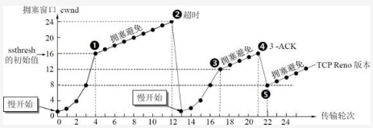

###### 慢开始
当发送方每收到一个 ACK(★注意是ACK)，拥塞窗口的大小就会加 1，这样就会呈现出指数级增长

###### 拥塞避免
POINT1时，达到慢开始门限，采用拥塞避免算法，拥塞避免算法是线性增长，每完成一轮传播，加1个报文段(TCP是以字节数作为窗口大小的基本单位，但是报文段更直观)

到达POINT2时，出现了超时，将sthresh设置为超时时窗口的一半，继续从慢开始开始

###### 快重传

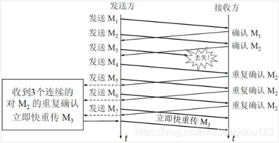

在POINT4，出现了一种特殊的情况，收到了对一个报文段的三个重复ACK，意思是个别报文段丢了，而不是出现了超时，快重传主要是为了防止慢开始的出现，因为如果发送方迟迟收不到ACK，就会重新慢开始

快重传要求接收方收到报文段，立即发送确认，如果是失序的就确认他前面已经收到的那个报文段，如图所示，无论发送M4，M5，M6都重复确认M2，这样发送方就知道M3接收方没有收到，然后就立刻重传M3
###### 快恢复
在点4重传M3的同时，调整门限值位cwnd/2=8，同时将窗口置为8，开始拥塞避免算法

###### 总结
在讨论这四种算法的时候，我们假设接收方给出的接收窗口无限大，其实发送窗口只能取接收窗口和拥塞窗口其中较小的值

##### 主动管理队列AQM
网络中的路由器存在着尾部丢弃策略，当队列满的时候，会丢弃尾部很多不同TCP连接，这样很多TCP就进入了慢开始状态，使网络中通讯量同时下降了很多

后来出现了主动队列管理，比如当队列长度到达一个警戒值，就随机丢弃分组，让个别TCP进入慢开始状态，而不是全部的

#### TCP的连接管理
##### 三次握手

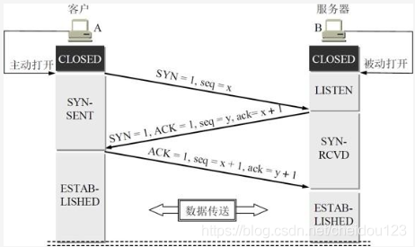

* 服务器B的进程要处于LISTEN状态
* 为什么两次握手不可以呢?因为假设有个建立连接的报文，半路上堵住了，这时A又重新发送和B建立连接，然后结束，突然这个堵住的建立连接的报文到达B了，这个时候，如果B不再确认一下，就傻乎乎等待A发来数据，资源就浪费了
##### 四次挥手

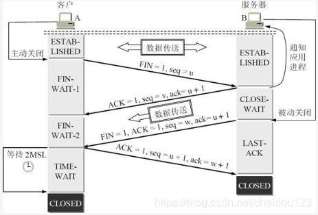

* 通信双方都可以释放连接
* 当B第一次回复的之后，A不会再发送具体数据到B，但是B还可能给A发数据
* B没有数据需要发送之后，再给A发一个，A收到之后回复
* B收到之后关闭，A等等2MSL的时间之后关闭，MSL是最长报文段寿命

为什么A要等待2MSL呢？
* 保证A的最后一个ACK到达B，如果没到达，B会重传FIN+ACK的报文，A再重新确认
* 保证本连接的报文段都在网络中消失

服务端同时会有一个保活计时器，如果客户端主机坏了，过了保活时间服务端就会发送探测报文，若多次后客户端无效应，则服务端自己关闭连接

##### TCP的有限状态机

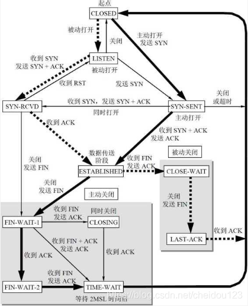
* 粗实线箭头表示对客户进程的正常变迁
* 粗虚线箭头表示对服务器进程的正常变迁
* 细线箭头表示异常变迁
