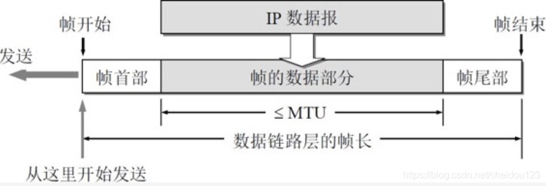
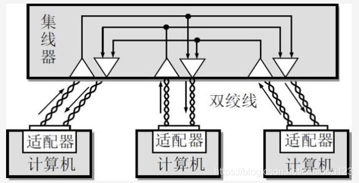

<!-- MDTOC maxdepth:6 firsth1:2 numbering:0 flatten:0 bullets:1 updateOnSave:1 -->

   - [概述](#概述)   
   - [数据链路层的三个基本问题](#数据链路层的三个基本问题)   
      - [封装成帧](#封装成帧)   
      - [透明传输](#透明传输)   
      - [差错检测](#差错检测)   
   - [使用点对点信道的数据链路层](#使用点对点信道的数据链路层)   
      - [PPP协议的特点](#ppp协议的特点)   
      - [PPP协议的帧格式](#ppp协议的帧格式)   
      - [PPP协议的工作流程](#ppp协议的工作流程)   
   - [使用广播信道的数据链路层](#使用广播信道的数据链路层)   
      - [局域网的数据链路层](#局域网的数据链路层)   
      - [总线网CSMA/CD协议](#总线网csmacd协议)   
      - [使用集线器的星型拓扑](#使用集线器的星型拓扑)   
      - [以太网的信道利用率](#以太网的信道利用率)   
      - [以太网的MAC层](#以太网的mac层)   
   - [扩展的以太网](#扩展的以太网)   
      - [在物理层扩展以太网](#在物理层扩展以太网)   
      - [在数据链路层扩展以太网](#在数据链路层扩展以太网)   
         - [以太网交换机](#以太网交换机)   
         - [以太网交换机的自学习功能](#以太网交换机的自学习功能)   
      - [虚拟局域网](#虚拟局域网)   
   - [高速以太网](#高速以太网)   
      - [100BASE-T以太网](#100base-t以太网)   
      - [吉比特以太网](#吉比特以太网)   
      - [10吉比特以太网和更快的以太网](#10吉比特以太网和更快的以太网)   
      - [使用以太网进行宽带接入](#使用以太网进行宽带接入)   

<!-- /MDTOC -->

### 概述
1.数据链路层使用的信道主要有两种类型:
* 点对点信道 使用PPP协议
* 广播信道 使用CSMA/CD协议

2.数据链路层的三个基本问题:
* 封装成帧
* 透明传输
* 差错检测

3.数据链路层的协议数据单元是帧
* 把网络层交下来的数据构成帧发到链路上，网络层协议的数据单元是IP数据报
* 把接受到的帧数据取出并上交给网络层

### 数据链路层的三个基本问题
#### 封装成帧
1.接收端在收到物理层上交的比特流后，就根据首部和尾部的标记，识别帧的开始和结束

2.网络层的IP数据报传送到数据链路层就成为帧的数据部分，在数据部分添上首部和尾部，构成了一个完成的帧

#### 透明传输
帧的首部和尾部都是二进制8比特，帧的数据部分如果和帧界定符一样，就需要使用转义字符

#### 差错检测
1.数据链路层对差错的检测，局限在比特差错，也就是1可能会变成0，0可能会变成1，目前数据链路层使用的是循环冗余检测技术CRC

2.CRC的原理就在帧的组成中加入N位的校验码，然后构成一个帧，这个冗余码叫做FCS

3.数据链路层并不能提供可靠传输，比如帧丢失，帧重复，帧失序，这种靠CRC无法解决

### 使用点对点信道的数据链路层
#### PPP协议的特点
1.点对点的链路，使用的协议是PPP协议

2.互联网用户需要接入ISP才能接入互联网，PPP协议就是用户结算及和ISP进行通讯时使用的数据链路层协议

3.PPP协议应当满足的需求
* 简单，把最复杂的部分交给TCP协议
* 使用界定符封装成帧，以便接收端能从收到的比特流找出帧开始和结束位置
* 透明性，数据内容如果有界定符一样的8位比特需要转义
* 支持多种网络层协议，比如IP/IPX
* 支持串行/并行，电的，光的等不同的点对点链路
* 差错检测
* 能够及时检测出链路的不正常
* 数据部分的最大长度也就是MTU
* 可以协商网络层地址
* 可以协商数据压缩算法

4.PPP协议的组成
* 一个封装IP数据报的方法
* LCP 一个链路控制协议，用于建立，配置，和测试数据链路连接
* NCP 一套网络控制协议，其中每一个协议支持不同的网络层协议，比如IP等等

#### PPP协议的帧格式

1.第一个字段F和最后一个字段F是定界符，当信息部分出现一样的比特组合时，需要进行转义

2.另外我们要知道，连续两个帧之间只要一个定界符，如果连续两个定界符，说明是一个空帧

3.A和C目前没啥用

4.协议字段，可以区分是IP数据报，LCP的数据，还是网络层的控制数据

5.FCS是校验位

#### PPP协议的工作流程

1.用户拨号接入ISP，建立个人电脑到ISP的物理连接

2.个人电脑向ISP发送一些列的链路控制LCP分组，双方协商一些配置选项，建立LCP连接，之后进行身份鉴别，若鉴别成功，进入网络控制协议状态，否则链路终止

3.网络控制协议NCP给用户个人电脑分配一个IP地址，另外需要根据双份的网络层(同一个PPP协议两端可以运行不同的网络层协议)协议来交换网络控制分组

4.通讯完毕，NCP释放网络层连接，收回IP地址

5.LCP释放数据链路层连接

6.释放物理层的连接，PPP链路的起始和终止状态永远是链路静止状态，这时用户个人电脑和ISP路由器之间并不存在物理层的连接

### 使用广播信道的数据链路层
#### 局域网的数据链路层
1.广播信道可以进行一对多的通讯，局域网使用的就是广播信道

2.局域网的主要特点:
* 具有广播功能，从一个站点可以很方便的访问全网
* 局域网上的主机可以共享连接在局域网上的硬件和软件资源

3.现在以太网几乎成了局域网的同义词

4.局域网的工作层次跨越了数据链路层和物理层，由于局域网技术有关数据链路层的内容比较丰富，所以把局域网放在数据链路层讨论

5.局域网共享信道并没有使用诸如频分复用，时分复用等技术，因为他们代价较高，它使用的是动态媒体接入控制(多点接入)的方式，实现方式主要是随机接入，如果有碰撞，就解决碰撞

6.计算机与外界局域网的连接通过网卡进行，上面装有处理器和存储器，适配器在接受和发送网络帧时不使用计算机的CPU，适配器的核心功能是
* 计算机并行到网络串行的转换
* 由于网络数据率和计算机数据率不同，需要有对数据进行缓存的存储芯片
* 网卡驱动需要告诉网卡在存储器什么位置把多长数据块发到局域网，或者在存储器什么位置把局域网的数据块存储下来
* 当适配器收到有差错的帧时直接丢弃不告诉计算机，收到正确的帧时，使用中断通知计算机，并交付协议栈中的网络层
* 计算机的MAC地址就在适配器的存储器中

#### 总线网CSMA/CD协议
1.当数据帧中的目的地址与网卡MAC地址一致时，网卡才会接收数据帧

2.为了通讯简便，局域网使用下面两种方式:
* 在网卡这一层，除了CRC不会对帧做过多的可靠性验证，为了防止帧在总线上碰撞，在同一时间只允许一台计算机发送数据，使用的方式是CSMA/CD协议，CSMA/CD协议中文叫做载波监听多点接入/碰撞检测协议
* 以太网数据使用曼彻斯特编码

3.CSMA/CD协议的要点:
* 总线型网络
* 不停进行碰撞检测

4.虽然我们在发送数据之前检测信道为空闲，但这并不能说明不会发生碰撞，电磁波在1km电缆的传播时延是5微秒，当A向B发送数据时，B不能及时检测出碰撞，在A发送数据时，最多需要两倍的端到端时延才能检出碰撞，这个两倍端到端时延叫做争用期，

5.由于碰撞我们可以看出，使用CSMA/CD协议时，肯定无法进行全双工通讯，只能半双工通讯

6.以太网使用的是截断二进制指数退避算法来确定碰撞后何时再进行重传，它会使主机在再次检测到信道空闲时，随机推后一个时间，防止多个机器同时检测到空闲而再次碰撞，另外协议规定了基本的争用期时间是51.2微秒，如果10Mbit/s的以太网，争用期可以发送512bit

因为1km电缆时延是5微秒，所以以太网最大端到端长度是5KM

7.我们考虑一种特殊情况:
* 一个帧很短，主机很快就发射出去了
* 这个帧发生了碰撞，目的地收到了差错帧，因而丢弃了它
* 这时，发送端并不知道发生了碰撞，怎么办？

为了解决这个问题，以太网规定了每个帧的最低长度512bit，发送端传完这个帧，就正好过了争用期，如果小于512bit，那么可以进行字节填充

8.当发送主机检测到碰撞，不但需要立即停止，还需要发送32bit或者48bit的人为干扰信号，从而让所有用户知道发生了碰撞

9.以太网规定了帧建最小间隔9.6微秒，这样做是为了让接收端来得及处理

10.发送端发送帧时，还需要把发送数据暂时保留，防止发送碰撞，好重新发送

#### 使用集线器的星型拓扑
1.在星形拓扑的中心，增加了集线器

2.集线器的主要特点:
* 由于集线器内部也是模拟电缆线的工作，所以集线器逻辑上仍然是个总线以太网，使用的还是CSMA/CD协议，在同一时刻仍然只允许一个站发送数据★★★
* 集线器有许多接口，很像一个多接口转发器
* 集线器工作在物理层

3.当连接集线器的适配器故障时，集线器一般可以检出并断开连接

#### 以太网的信道利用率

1.占用信道时间为什么还需要一个端到端的延迟呢？因为最后发送的比特还需要传播

2.从图上我们可以看出，为了提高以太网利用率，我们要尽可能的提高T而减少端到端的延迟，这样信道被争用期浪费的时间就会很少:
* T比较高说明了帧长比较长
* 端到端的延迟比较小，说明了以太网连线长度较小

3.在没有碰撞的情况下，以太网极限信道利用率为:

4.实际上，以太网利用率超过3成就很高了，就会产生很高的碰撞

#### 以太网的MAC层
1.MAC地址和适配器一一关联，48位，6个字节

2.IEEE注册管理机构RA负责前三个字节，前三个字节叫做组织唯一标识符OUI，通常也叫公司标识符，但是一个公司标识符可能有多个公司一起买，一个公司也可能买多个标识符

3.前三个字节是24位，但是IEEE规定第一个字节的最低位是I/G位，因而IEEE只分配前24位中的23位，不同的标准最低位的位置是不一样的
* 为0时，地址字段表示一个单个站地址
* 为1时，表示组地址

4.第一个字节最低第二位是G/L位，如果是0表示它属于全球统一管理的，所以，当第一位和第二位都是0时，有70万亿个可分配地址

5.适配器收到网络上地址，如果不是发给自己的，就丢掉，除非启用混杂模式

6.以太网V2标准的MAC帧格式如下:

* 目的地址和源地址6个字节
* 类型字段2字节表示上层使用的是IP协议还是其他
* MAC帧无需指明帧长度，因为曼彻斯特编码可以识别出帧结束的位置
* 数据字段在46-1500字节之间，46的意思是最小长度减去18
* 数据字段小于46字节时，使用填充，MAC子层将数据字段和填充一起交给上层，上层协议比如IP会识别出总长度字段
* 在物理层又多了8个字节，这是为了使接受适配器时钟和比特流同步以接受MAC帧
* 如果帧的长度不是整数字节，那么是一个无效的MAC帧

### 扩展的以太网
#### 在物理层扩展以太网
1.如果主机和集线器的距离很远，我们可以使用光纤和一对光纤调制解调器

光纤调制解调器可以进行电信号和光信号的转换，这样主机就可以很容易的和几公里外的集线器连接

2.我们可以将集线器层级化，形成一个更大的以太网

集线器之间的距离如果使用光纤的话也会很远，但是使用多级集线器也会有一些缺点:
* 从多个碰撞域合成一个，加大碰撞概率
* 如果不同的系使用不同的以太网技术，比如不同速率的适配器，A系使用10Mbit/s，B系使用100Mbit/s，那么大家都只能工作在10Mbit/s的速率了

#### 在数据链路层扩展以太网
##### 以太网交换机
1.扩展以太网更常用的方法是在数据链路层进行，这时使用的就是以太网交换机(工作在数据链路层)

2.以太网交换机的主要特点★★★
* 和集线器很不同
* 每个接口直接与另一台主机或者另一个以太网交换机相连
* 一般工作在全双工模式
* 可以同时连通多对接口，使多对主机能同时通讯
* 接口具有存储器(集线器没有)，在输出端口繁忙时把帧进行缓存，也有的交换机不缓存
* 以太网内部的地址包通过自学习算法自动建立起来
* 以太网交换价的性能远远超过普通集线器
* 对于10Mbit/s的共享式以太网，10个用户平均带宽只有1Mbit/s，但拥有10个接口的以
* 太网交换机的总容量就成了100Mbit/s，这也是交换机的最大的优点
* 还有更重要的一点，以太网交换机不使用共享总线，没有碰撞问题，不使用CSMA/CD协议，没有争用期

##### 以太网交换机的自学习功能
1.假设交换机有四个接口，分别连接MAC地址为A,B,C,D四台主机

2.一开始，以太网交换机里面的交换表示空的

3.当A发一条信息给B，A从接口1进来，因为交换表没有B的信息，所以先广播发送，C和D丢弃帧，但是交换机知道了目的地是A的要从接口1发出去

4.然后某时B又给其它主机发了一条，然后交换机知道了目的地是B的从端口2发出去

5.依次类推，而且这个交换表每个条目有一定的有效时间

6.为了防止交换机出现死循环，制定了一个生成树协议来STP来消除兜圈子的现象

#### 虚拟局域网
1.利用以太网交换机可以很方便的实现虚拟局域网VLAN

2.虚拟局域网VALN是由一些局域网网段的构成和物理位置无关的逻辑组

3.假设有个网络长下面这样

VLAN1 VLAN2 VLAN3就是三个虚拟局域网，在虚拟局域网的每个主机都能收到同一个虚拟局域网的广播信息，而不是同一个虚拟局域网的虽然连在同一个交换机上但是收不到

4.1988年出现支持虚拟局域网的以太网帧格式扩展标准，只有使用这类格式，才能区分虚拟局域网，否则还是普通的以太网帧

一旦数据链路层检测到了VLAN标记中的802.1Q标记类型，就接着检查标记控制信息内容，其中VID标记了这个以太网帧属于哪个VLAN

同时这时候以太网的最大帧长又增加了4个字节变成了1522字节

### 高速以太网
1.目前以太网速度从10Mbit/s已经发展到了上Gbit//s

2.现在以太网的工作范围已经从局域网提高的城域网或广域网，实现端到端的以太网传输
* 很成熟
* 在广域网使用以太网，成本是同步光纤网的N分之一
* 端到端的帧格式全都是以太网格式，简化了管理，但是以太网和ATM网络等交互还是需要相应的接口才行

#### 100BASE-T以太网
* 100Mbit/s
* 在双绞线上传输
* 星形拓扑
* 使用CSMA/CD协议，但是如果使用以太网交换机，CSMA/CD协议就不起作用了，但是半双工模式下使用的是CSMA/CD协议
* 从细缆以太网升级到快速以太网的用户必须重新布线
* 争用期降低到5.12微妙，帧最小间隔0.96微秒

#### 吉比特以太网
* 1Gbit/s
* 可以在半双工(半双工使用使用CMSA/CD协议)和全双工模式下工作
* 使用光缆或双绞线等
* 因为数据率提高了，根据下面的公式，T就会减小，因此需要采用一种方式提高S的值，但是减少电缆长度是肯定不行的，增大最短帧长也不太好，它采用了载波延伸和分组突发技术来进行优化，但是以太网工作在全双工模式下并不使用载波延伸和分组突发

* 载波延伸
   * 最短帧长仍旧是64字节
   * 争用期增大为512字节，而不是前面的512比特
   * 最短帧长不到512字节，使用特殊字符填充至512字节
   * 接收端接收后需要删除填充字节
* 分组突发
   * 64字节填充到512字节会有很大的开销
   * 分组突发就是突然发出很多短帧时，第一个帧按载波延伸发，后面的一系列短帧可一个接一个的发送，它们之间只需要必要的帧间最小间隔

#### 10吉比特以太网和更快的以太网
* 它并不是简单将速率提高10倍或更多倍，因为还有很多技术问题
* 和前面的帧格式完全相同
* 只工作在全双工模式，不用CSMA/CD协议，不进行碰撞检测

#### 使用以太网进行宽带接入
1.如果以太网需要接入互联网，其中重要一点是身份验证，但是以太网的帧格式中，并不包含用户名和密码

2.所以现将PPP协议中的PPP帧封装到以太网中传输，形成PPPoE，现在的光纤接入都采用这种方式，具体过程如下:
* 比如一个光纤到大楼
* 大楼楼口有个ONU，实际上就是一个以太网交换机
* 然后根据用户申请带宽，用铜线接入用户家中(也可以每一层楼再来个交换机)
* 用户家中只有一个RJ-45插口，用户将网线接到插口，然后在PPPoE弹出的窗口输入用户名和密码就可以上网了

3.用户家中个人电脑到第一个交换机的带宽是独占的，但是在往上就是共享的了

4.另外，使用电话线上网不叫以太网，而是用电话线接入互联网，这时用户个人电脑发送的以太网帧到家里ADSL调制解调器后，转换为PPP帧
