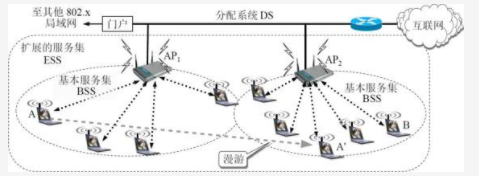
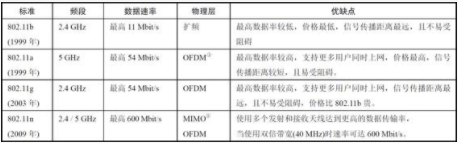
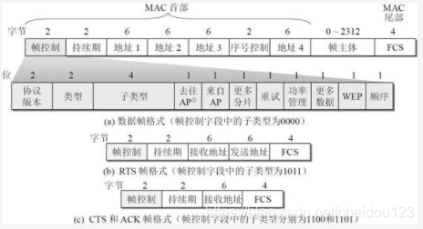
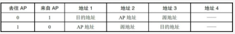
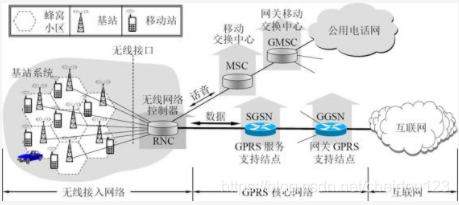
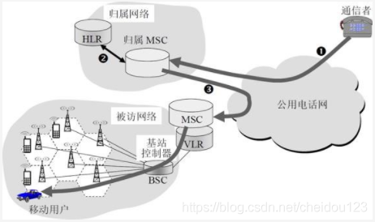

### 无线局域网WLAN
#### 无线局域网的组成
##### 有固定基础设施的
1.无线以太网的标准是802.11协议，也就是WI-FI，其实WIFI和无线局域网WLAN是一个意思

2.无线局域网的最小构件是基本服务集BSS，每个基本服务区都至少有一个基站AP，本基站内的所有参与者都可以直接通讯，但是和本基站以外的目标通讯一定要经过基站

3.每个基站都有一个SSID，也叫做标识符，基站覆盖的区域叫服务区，一般直径在100米内

4.基站可以连接到分配系统DS上，这样再和其他服务区相连，同时也可以连接到以太网上

上述A和B通讯有两种情况:
* A在自己的服务区，通过DS和B通讯
* B不在自己的服务区，在其他服务区通过漫游和B通讯

5.参与者如果需要加入到服务区，需要先和服务区某个信号好些的基站相连，并和它建立虚拟线路

6.关联后，参与者通过关联的基站，向子网发送DHCP发现报文获取IDP地址，它就成了这个子网的一台主机

7.参与者可以发送探测帧来探测基站，另外，基站也会周期性发出信号来告诉参与者这有个基站

8.现在无线局域网一般使用WPA或者WPA2来进行安全校验

##### 移动自组网络
1.没有基站，而是一些平等的参与者一起临时组成一个小网络，一般不会和外界相连，就算是能连接互联网，也不许外部通讯量通过这个小网络

2.移动网络在民用通讯比如手机和军事上都有很多应用，比如很多坦克在没有信号的地方可以组成一个网络

##### 无线局域网的物理层
1.无线局域网的物理层非常的复杂

2.下面是几种常用的标准

* OFDM 正交频分复用
* MIMO 多入多出，对不同的数据进行不同调制

3.很多无线网卡都能适用于多个标准

##### 无线局域网的MAC层
1.我们知道，有线局域网使用的是CSMA/CD协议，协议的要点在于
* 发送前先检测信道，信道空闲就发送，叫做CSMA
* 变发送变检测，一发现碰撞就停止发送。叫做碰撞检测，叫做CD

2.无线局域网没有碰撞检测的功能，它使用的是CSMA/CA协议以及停止等待协议
* CA指的是碰撞避免，也就是尽量减少碰撞的概率
* 停止等待，也就是发送完一帧后需要等待确认后再发下一帧，说明无线局域网在MAC层就保证了可靠性，而有线局域网在这一层不会管这事

3.发送方参与者会告诉其他人，自己需要占用信道的时间，也就是对信道进行预约，其他人在这段时间不发信息

4.具体流程
* ⑴发送者检测到信道空闲，等待一个时间间隔后，发送
* ⑵参与者检测到信道忙时，它就会执行退避算法，各自退避一个随机的时间，然后每隔固定时间再次检测信道:
  * 信道空闲，继续倒计时，倒计时到0可以发送了
  * 信道忙，冻结计时器，然后检测到信道空闲时并再经过一个时间间隙后再进行倒计时
* ⑶当发送方可以发送后，就发送，当收到确认后，如果想要发送第二帧，需要像步骤二信道忙的样子执行一个退避算法，如果没收到确认，就重传

5.只有在信道空闲，并且是发送方第一个帧的时候，才不执行退避算法

##### 无线局域网的MAC帧

1.MAC首部有四个地址，第四个用于自组网络，前三个地址的内容和帧控制里面的去往AP和来自AP相关，下面是最常见的两种情况:

2.持续期字段表示对信道进行预约

3.序号控制字段使接收方能够知道是新传送的帧，还是出现差错而重传的帧

4.帧控制字段很复杂，其中类型字段和子类型字段表示这是一个控制帧，数据帧还是管理帧

5.更多分片字段表示这个帧是否属于一个帧的多个分片之一

6.有限等效保密字段WEP，表示采用了WEP加密算法

#### 无线个人区域网WPAN
1.它不需要接入AP，网络范围比较小，一般10M左右，实际上就是一个低功率，小范围的电缆替代技术

2.常见的WPAN比如蓝牙，ZigBee，还有计算机和打印机扫描仪相连的技术等等

### 蜂窝移动通讯网
#### 概述
1.目前很多地方并没有开通WIFI热点，但是一般都会与无线信号，这样就可以利用蜂窝技术来接入通讯网

2.蜂窝通讯把整个网络划分成很多CELL，也就是蜂窝，每个小区一个基站，移动站发送和接收都必须通过基站

3.目前蜂窝技术有3G，4G，5G

4.3G蜂窝通讯系统

* 每个基站都和RNC相连
* 如果是打电话，RNC就通过MSC到公共电话网
* 如果是互联网服务，就通过GPRS核心网络接入到互联网

#### 移动IP
1.移动IP要解决的主要问题是，让互联网其他主机能找到不断移动的用户，因为用户在不断的变化着网络

2.移动IP有几个概念
* 归属地址，也就是移动站最原始的地址(就像人们的家庭地址一样，人出去，但家庭地址永远不变，我们可以通过家庭地址找到此人目前的地址)
* 归属网络，也就是移动站原始连接到的网络

* 移动站目前所在的网络叫做被访问网络
* 被访问网络中的路由器叫做外地代理，外地代理就是为移动站创建一个转交地址，转交地址网络号就是被访问网络的网络号

3.另外，外地代理在给移动站转发消息时，不适用ARP，而是直接使用移动站MAC地址

4.当一个发送者B想和移动站A进行通讯时
* B发送给A的数据报被A的归属代理截获(只有当A不在归属地时才会截获)
* 归属代理将数据报转到A的外地代理(当外地代理代理A时，需要向归属地登记)
* 外地代理将数据报发送给A，这时A也知道B的IP地址，回信息就很简单了，因为用B的IP地址作为数据报的目的地址就行了，不需要通归属代理了

5.为了提高效率，B可以也有一个通讯代理，通讯代理向归属代理直接询问被通讯者的外地代理地址，然后直接将数据报发送到被通讯者的外地代理，这样数据报就不用去被通讯者归属代理那跑一圈了

#### 蜂窝移动通讯网中对移动用户的路由选择
1.一个固定电话用户对移动通讯用户呼叫的流程:

 

* 找到用户的归属网络，比如运营商的4-7位就是归属网络号码
* 归属网络从本地数据库HLR知道移动用户的位置，将呼叫从发送到被访问网络的MSC即可

#### 无线网络对高层协议的影响
1.无线网络可能在很短的时间就会中断，在TCP连接中，只要报文频繁丢失，TCP的拥塞控制就会减少窗口，这样是不合理的，因为目前有了一些方案
* 让TCP发送方知道是发生拥塞的部分到底是无线还是有线部分，只有有线部分才会减少窗口
* 把端到端的TCP连接拆成两个部分，一个有线，一个无线
