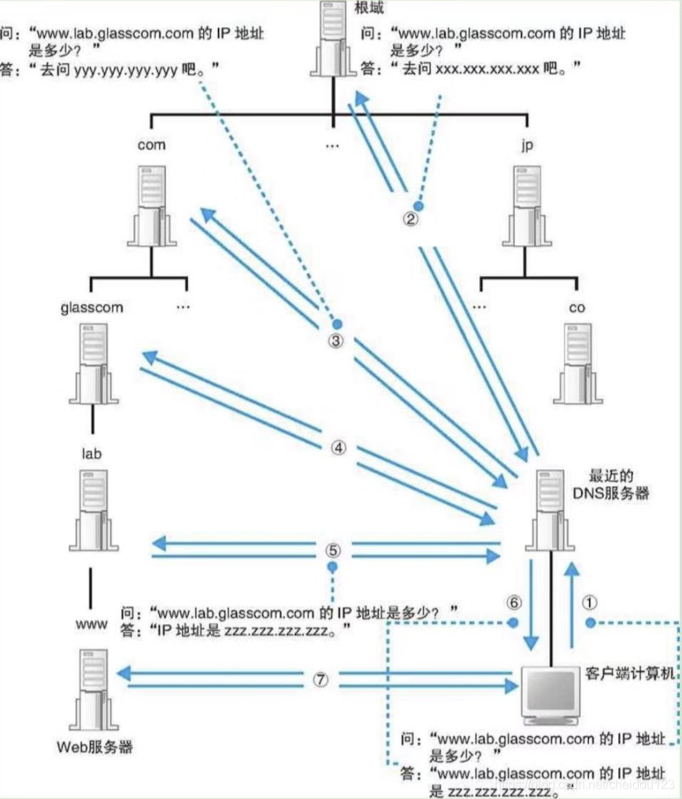
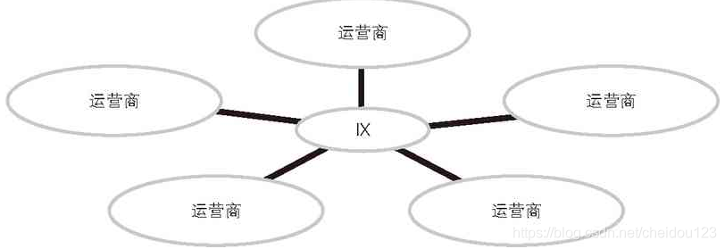

@[toc]

## 1.浏览器生成消息
### 生成HTTP请求消息
* 但实际上除了"http:"，网址还可以以其他一些文字开头，例如"ftp:"等

* 浏览器是一个具备多种客户端功能的综合性客户端软件

* 尽管浏览器能够解析网址并生成 HTTP 消息，但它本身并不具备将消息发送到网络中的功能，因此这一功能需要委托操作系统来实现

* HTTP默认端口是80，我们输入URL的时候一般省略了端口号

* 如果一个URL后面没有跟具体的服务器文件名，那么一般会跳到默认的文件，比如index上

* PUT/DELETE一般用在Restful设计中，在APP和服务器交互中经常用到

* 在浏览器输入地址使用GET方法

* 一条请求消息只能写一个URI，如果需要多个文件，每个文件都需要一个请求

### 向DNS服务器查询WEB服务器的IP地址
* 通过几个集线器连接在一起的是同一个子网，将子网通过路由器连接起来，形成一个网络

* 现在很多路由器包含了集线器的功能

* 发送者发出的消息先经过子网中的集线器，然后转发到距离最近的路由器，路由器根据目的地来判断下一个路由器

* 通过DNS查询IP地址的操作叫做域名解析

* 如果一个IP地址的主机号全是0，那么这代表的是整个子网

 * 对于 DNS 服务器，我们的计算机上一定有相应的 DNS 客户端，而相当于 DNS 客户端的部分称为 DNS 解析器，或者简称解析器，解析器实际上是一段程序，它包含在操作系统的 Socket 库中，当然请求的时候还需要调用操作系统网络协议栈

* 解析器会向DNS服务器发送查询请求，然后将响应的IP地址写到一个内存地址上，浏览器将IP地址取出，交给操作系统即可

* DNS是基于UDP的

* HTTP消息是用文本编写的，而DNS消息是使用二进制数据编写的

* DNS服务器的地址一般都是配置，不需要查找

### 全世界DNS服务器的大接力

* 像DNS服务器进行查找需要发送三个东西
   * 域名
   * Class 这个目前都是IN
   * 记录类型，比如A是IP地址，MX是邮件服务器

* 在公司内部网络中，所有内部网络DNS信息都可以保存在一台DNS服务器上面，但是在互联网中，一台服务器肯定远远不够

* DNS查找，我们要搞清楚域名层次，比如www.lab.glass.com 越靠右边表示层次越高，就像com集团glass事业部lab科的www(代表服务器名称)

* 根据域名层次，DNS服务器也可以分为多级，一个DNS服务器可以同时服务于多级，我们以glass.com为例，它的DNS服务器的IP地址需要在com DNS服务器中有注册，这样我们可以通过com DNS服务器查到glass.com保存的DNS服务器地址

* 在com上面还有根域，根域IP地址全世界就13个，所以它们保存在所有DNS服务器中一点也不难



* 我们可以通过缓存来提高速度，比如我们的最近DNS服务器有glass.com DNS服务器的缓存地址，那么就不用再去根域查了，这个缓存是有有效期的，而且DNS会告诉客户端这个响应是来自缓存的

### 委托协议栈发送消息
* 一个设备有多个网络硬件，就会有多个IP地址

* 客户端在创建套接字时，协议栈会随便给它分配个端口号，在执行连接操作时，会把端口号发送给服务器


* 套接字创建完成后，协议栈会返回一个描述符，应用程序会将收到的描述符存放在内存中。描述符是用来识别不同的套接字的

* 需要委托协议栈将客户端创建的套接字与服务器那边的套接字连接起来。应用程序通过调用 Socket 库中的名为 connect 的程序组件来完成这一操作。这里的要点是当调用 connect 时，需要指定描述符、服务器 IP 地址和端口号这 3 个参数

* 服务器上所使用的端口号是根据应用的种类事先规定好的，仅此而已。比如 Web 是 80 号端口，电子邮件是 25 号端口

* 调用read 时需要指定用于存放接收到的响应消息的内存地址，这一内存地址称为接收缓冲区

## 2.用电信号传输 TCP/IP 数据
### 创建套接字
* 创建套接字的时候，首先分配一个套接字所需的内存空间，然后向其中写入初始状态，把这个套接字的描述符告知应用程序

### 连接服务器
* 连接实际上是通讯双方交换控制信息

* 我们还需要一块用来临时存放收发数据的内存空间，叫做缓冲区

* 只要数据传输过程在持续，也就是在调用close之前，连接是一直存在的

### 收发数据
* 为了防止大量的小包，协议栈并不是一收到数据就马上发送出去，而是会将数据存放在内部的发送缓冲区中，但是为了防止时间太长，协议栈内部有一个计时器，达到一定毫秒数就会把网络报发送出去，应用程序也可以选择不使用缓冲区，比如浏览器就不用

* MTU是一个网络包的最大长度，一般是1500字节

* MSS除去头部之后网络包的最大长度


* FCS是帧校验序列

* 在发送的时候，会按包大小限制来对数据进行拆分，会将每一块数据是从头开始的第几个字节放到这个包的头部，也就是序号，起始序号是一个随机的数

* 在得到对方确认之前，发送过的包都会存在缓冲区里面，如果接收方在规定时间没有正确ACK，那么会重传几次，这个规定的时间是TCP动态确定的

* TCP不是发一个等到ACK之后再发一个，而是利用滑动窗口机制，这个窗口需要由接收方确定，因为接收方知道自己缓冲区能最多接受多少数据，接收方会将自己的窗口大小和ACK合在一起进行返回

* 接收方在发送ACK的时候，只需要发送最后一个ACK就行了，前面的不用发了

* 在发送HTTP请求之后
   * 调用read程序获取响应消息
   * 控制流程从read转移到协议栈
   * 协议栈尝试从缓冲区取出数据并交给应用程序，但这时候缓冲区估计还没收到数据，这时候协议栈会把应用程序的委托暂时挂起直到服务器返回响应消息
   * 当发现服务器返回了消息，协议栈会检查数据块和TCP头部的内容，没问题就给服务器ACK
   * 协议栈将数据块还原成原始数据交给应用程序

### 从服务器断开并删除套接字
* 发送端和接收端都可以发起断开过程

* 整体流程就是四次挥手，这里就不赘述了

### IP与以太网的包收发操作
#### 包的基本知识
* 发送方包会被发往最近的网络转发设备，转发设备根据包头信息判断接下来向哪个转发设备转发，通过一直转发到达目的地

* 网络中有路由器和集线器两种不同的转发设备
  * 路由器，按照IP地址规则，使用IP头部
  * 集线器，按照以太网规则，使用MAC头部
  * 再次强调目前很多路由器包含集线器的功能

* 路由器中有路由表，根据目的IP查到下一跳的MAC地址，所以在经过路由器的时候，MAC地址会发生变化

* 集线器也有个用于以太网协议的表，根据MAC地址来找具体往哪里传输

* 具体我们看下面这个图:


#### 包收发操作概览
* 包收发操作的起点是TCP模块委托IP模块发送包的操作，TCP要指定通讯对象的IP地址

* IP模块会添加IP头部和MAC头部两种头部，然后交给网络硬件，比如网卡，网卡收到的是0和1，需要将它转换成电信号或者光信号发出去

* IP对包的乱序和丢失不关心，这些是TCP的事

#### 生成包含接收方IP地址的IP头部
* IP地址并不是分配给计算机的，而是分配给网卡的

* 我们如何判断把包交给哪一个网卡呢，这个原理和路由表其实是一样的，

* 我们可以查看我们机器的路由表


#### 生成以太网用的MAC头部
* IP 头部中的接收方 IP 地址表示网络包的目的地，通过这个地址我们就可以判断要将包发到哪里，但在以太网的世界中，TCP/IP 的这个思路是行不通的。以太网在判断网络包目的地时和 TCP/IP 的方式不同，因此必须采用相匹配的方式才能在以太网中将包发往目的地，而MAC 头部就是干这个用的

* 生成IP头部之后，接下来IP模块还需要在IP头部之前加上MAC头部，MAC头部包含发送方和接收方的MAC地址

* 本机网卡的MAC地址一般是固定不变的，虽然通过一些操作可以改变，而对方机器的MAC地址需要根据ARP去查询

#### 通过ARP查询目标路由器的MAC地址
* ARP 中文名叫做地址解析协议

* ARP是利用广播的方式对同一个以太网的所有设备大喊这个目的IP是谁的，对的上的IP地址就会回答，其余的会忽略

* 在我们正确配置路由表的情况下，这个目的路由器的IP地址对应的设备应该就在这个子网中

* 我们也有ARP缓存机器来减少这种吼的次数

#### 以太网的基本知识
* 以太网是一种为多台计算机能够彼此廉价相互通讯而设计的通讯技术

* 当一台计算机发送信号时，信号就会通过网线，流经整个网络，最终到达所有的设备，设备根据MAC地址判断是否需要接收

* 以太网的主要特征是以MAC地址为核心

* 如果是集线器，集线器所有端口都会发这个收到的包发出去

* 如果是交换机(交换式及下气)，交换机根据MAC地址找到合适的端口发出去，这样就不用吼了

#### 将IP包转发成电或光信号发送出去
* 负责这个工作的是网卡，网卡需要网卡驱动程序才能正常工作，打开计算机时，驱动程序需要对硬件进行初始化工作，然后硬件才可以使用

* 网卡ROM里面由唯一的MAC地址，这个的确是唯一的，但是真正联网的时候驱动程序设置的MAC地址才是真正的网络中的MAC地址，这个真正的MAC地址其实是可以变动的，但是正常情况是不会改变的

#### 给网络包再加三个控制数据
* 网卡驱动程序从IP模块获取包之后，会将其复制到网卡的缓冲区中，然后向MAC模块发送发送包的命令，接下来就轮到MAC模块进行工作了

* MAC模块把包从缓冲区取出，然后
  * 在开头加上报头和起始帧分界符
  * 在末尾加上检测错误的帧校验序列FCS，它使用的也是CRC错误校验码

#### 向集线器发送网络包
* 发送和接收可以同时进行的叫做全双工，否则叫半双工

* 在半双工模式，如果网络中有其它设备发送的包，就无法发送自己的包

* 在发送的时候，MAC模块从报头开始将数字信息将每个BIT转换成电信号发送出去，这个转换装置叫做PHY(或MAU)模块

* 以太网不会检测对方是否收到，但是它也有检测，在半双工模式下MAU模块会在发送之前会检测没有到来的信号才能发送，在发送完成之前一直没有信号过来，就完事了

* 在半双工模式的集线器模式下，一旦碰撞大家就随机等待一下重新发送

* 在全双工的交换机模式中不需要考虑碰撞问题

#### 接收包
* 如果是集线器的半双工模式的以太网，发出的信息会到达本网络所有设备

* 接收方首先检查FCS，如果校验没问题检查MAC地址看是不是自己的

* MAC 头部中接收方MAC 地址与网卡在初始化时分配给自己的 MAC 地址是否一致如果不是自己的包就直接丢弃

* 如果是自己的将包放入缓冲区中，然后通过中断机制告诉计算机处理

#### TCP/IP栈的处理
* 首先，网卡驱动把包交给IP模块

* IP模块会检查IP头部是否正常，然后还得检查IP地址是不是自己的，如果不是就通过ICMP消息返回(如果机器具有包转发功能，也可能转发了，比如很多服务器)

* 因为到达的包是分片后的，IP模块会将它还原，然后交给TCP模块

* TCP根据发送方和接收方的IP地址和它们的端口号找到对应的套接字进行相应的操作

* 记住需要通过IP地址而不仅仅是端口号来查找对应的套接字

### UDP协议的收发操作
* TCP复杂的核心原因是保证可靠性，需要重发已经出错或已经送达的包

* 如果数据很短，一个包就能cover，可以用UDP来实现可靠性，比如DNS交换控制信息可以放到一个包里面搞定

* 一个IP包的最大长度是65535字节，但是通讯线路的最大长度肯定没这么大，所以IP模块还需要对此进行再分片

* 在音视频传输中，UDP有优势，但是现在很多防火墙会禁止UDP，所以还是由很多使用TCP的

## 3.从网线到网络设备
### 基础
* 路由器比交换器要早

* 对于路由器和交换机这种设备，包发生错误会直接丢弃了，但是发送方操作系统会控制重传

* 交换机是基于以太网工作的，而路由器是基于IP工作的，路由器一般还有地址转换，WAF等附加功能

### 信号在网线和集线器中传输
* 转发设备在转发时也不看数据的内容

* 信号在网线的传输过程中会出现衰减

* 局域网中使用特定缠绕方式的双绞线，加入隔板，金属屏蔽网的方式来减少衰减

* 信号到达集线器后，会广播到整个网络，以太网的基本架构A就是将包发到所有的设备，然后由设备根据接收方MAC地址来判断应该接收哪些包，而集线器就是这一架构的忠实体现

* 即便信号受到噪声的干扰发生了失真，也会原样发送到目的地，这时，接收信号的设备，也就是交换机、路由器、服务器等，会在将信号转换成数字信息后通过FCSA 校验发现错误，并将出错的包丢弃，TCP模块会检测到丢包，并对该包进行重传

### 交换机
* 现今我们已经不用集线器了，而是使用交换机比较多

* 交换机的一个接口就相当于计算机上的一块网卡，但是交换机的网卡没有MAC地址，也不会核对是不是发到它这个物理设备的

* 如果我们的计算机使用混杂模式，然后再加个网络包转发软件，其实就成了一个交换机

* 包到达交换机之后，就要查询这个包的接收方MAC地址是否存在于MAC地址表中，然后根据对应的端口转发出去


* 因为有的移动设备可能会移动位置，如果单从MAC表中转发过去，设备可能已经回家了，所有地址表每条记录是有有效期的，过了有效期就删除

* 如果地址表没有，就会广播到所有端口，等收到回复后，就写到地址表中

* 交换机如果发现一个包要回原端口，就会直接丢弃

* MAC地址的全F和IP地址的全1都是广播地址，也是直接向所有端口发送

* 全双工模式是指可以同时进行发送和接收，交换机可以，集线器不行

* 一般只要不使用集线器就不会碰撞，在集线器如果多个计算机同时发送信号，就会碰撞

* 双绞线不会碰撞，因为他们的发送和接收信号是相互独立的，碰撞的设备是集线器

* 全双工一般情况比半双工快，除非包很少，那两者差不多

* 有的时候，交换器和它对接的设备要判断双方是否都支持全双工，以及信号发送给速率，这个时候就需要进行协商

* 在以太网中，如果没有数据传输时，就会有一个脉冲信号，就像我们网口上绿色的LED灯，如果绿色亮就没问题了

* 脉冲信号还有更高端的功能，他可以是自动协商的载体，目前所有的设备都支持自动协商，脉冲信号可以载有自动协商的信息

* 如下图所示，双方自动协商后，最优就是100 全双工


* 交换机里面的电路可以只同时支持多个转发电路，可以同时转发多个包，所以不会像集线器那样发生碰撞

### 路由器
* 交换机是基于以太网规格工作的设备，而路由器是基于 IP 工作的

* 以太网和互联网有什么区别呢?这两个本身而言不具有比较性，互联网很大，里面包含有以太网，ATM网等等等等

* 互联网是和局域网LAN，广域网WAN这样按区域范围来划分的

* 以太网和ATM网，FDDI网一样是按传输技术来划分的

* 计算机的网卡一般只支持以太网和无线局域网，而路由器的端口模块还致贺词ADSL,FTTH等等不同传输技术

* 路由器的每个端口都具有MAC地址和IP地址，路由器的端口只接收与自己匹配的包，遇到不匹配的就直接丢弃

* 路由器中的表叫做路由表，路由表很重要
   * 路由器会忽略主机号，只匹配网络号
   * 路由表可以手动维护，也可以通过路由协议自动交换信息来维护
  * 子网掩码位0.0.0.0的记录为默认路由，后面的网关列的地址就是需要转发的地址
  * 如果网关列不是空，下一个目标就是网关列，否则就是目标地址
  * 网络号比特数越长，意味着该子网的主机数量越少，在命中的情况下越应该优先考虑


* 一般情况下，包的有效期是64或128，现在正常互联最多也就是几十个路由器就OK了

* 有的时候因为线路原因，或者传输技术原因，需要对包进行再分片，如果设置了不能分片的包，就会ICMP回去

* 我们在得到下一跳的IP地址之后，就得通过ARP查询到对应的MAC地址，路由器中也是由ARP缓存机制的

*  完成包接收操作之后，路由器就会丢弃包开头的 MAC 头部，当包到达路由器之后，MAC 头部的任务就完成了，于是 MAC 头部就会被丢弃

* 当输出端口是以太网时，发送出去的包就需要再通过交换机找到下一个路由器地址，但是目前所有的路由器都包含了交换机的功能

* 为什么还需要交换机介入呢？因为到头来还需要加上MAC头通过以太网来传输数据，路由器是基于IP设计的，它需要将包传输的工作交给基于以太网设计的交换机来工作

* 从包的转发目标也可以看出路由器和交换机之间的委托关系。IP 并不是委托以太网将包传输到最终目的地，而是传输到下一个路由器。在创建 MAC 头部时，也是从 IP 的路由表中查找出下一个路由器的 IP 地址，并通过 ARP 查询出 MAC 地址，然后将 MAC 地址写入 MAC 头部中的，这表示 IP 对以太网的委托只是将包传输到下一个路由器就行了。当包到达下一个路由器后，下一个路由器又会重新委托以太网将包传输到再下一个路由器。随着这一过程反复执行，包就会最终到达 IP 的目的地，也就是通信的对象。

* 路由聚合


如果上面三个子网都需要A来转发，那么在路由器B的路由表中可以聚合成一条记录

### 路由器的附加功能
#### 地址转换
* 我们可以让一个大的内网只占用一个公有IP地址，也就是通过地址转换的机制

* 目前的私有IP地址范围
  *  10.0.0.0~10.255.255.255 即10.0.0.0/8
  *  172.16.0.0~172.31.255.255即172.16.0.0/12
  *  192.168.0.0~192.168.255.255 即192.168.0.0/16

* 私有IP地址在公司内部也是不能重复的

* 地址转发的原理是把IP头部IP地址和端口号进行改写，从而将IP从私有地址改成公有地址

* 可以用端口号来区分内网不同的终端

* 基本流程


* 从公司内网访问外网，转换的时候，只需要临时分配一个空闲端口即可

* 从互联网访问公司内网的包，如果对应表中没有相关记录，就无法正常转发，所以要主动配置

#### 网络包过滤
* 其实就是简单的防火墙功能

## 4.探索接入网和网络运行商ISP
### 接入网


从上面的图中，画圈的也就是接入网所处的位置

#### ADSL接入网
* 一般在家庭公司网络设备也就几十米

* 双绞线的极限距离100米，光纤极限距离几公里

* 家庭/公司网络和互联网的主要不同
   * 距离的不同
   * 路由的维护方式

* 所谓的接入网，就是指互联网和家庭/公司之间的接入线路
  * ADSLs 不对称数字用户线，是一种电话线，上行和下行速率不对称，因为下行频段要多一些
  * FTTH 光纤到户


* 上图的重点
  * 客户端在通过互联网接入路由器之后，就进入了互联网★*
  * ADSL Modem为什么要拆分成信元呢，是为了适配一种叫ATM的传输方式，略微了解一下就行
  * 在DSLAM之前还需要一个分离器，主要分离出电话信号
  * 到达DSLAM之后，再次转换成馨园给BAS宽带接入服务器
  * BAS负责将ATM信元还原成网络包转发到互联网内部

#### FTTH光纤接入网


* 首先将数字信息转换成电信号，然后再将电信号转换成光信号

* 单模光纤和多模光纤
   * 单模光纤，只能传到一条光纤，信号失真较小
   * 多模光纤，可以传到多条光纤，信号失真较大

* FTTH一般使用的是单模光纤

* 在一条光纤中使用不同的波长传输多个光信号叫做波分复用

### 接入网中使用PPP和隧道
#### 用户认证和配置下发
* 用户发送的网络包会通过ADSL或者FTTH到达运营商的BAS
* BAS是接入网需要连接的路由器
* 用户认证需要通过PPPoE的方式，PPPoE的前身是PPP协议，PPP就是电话拨号上网

#### 以太网上传输PPP消息
* 通过ADSL或者FTTH一般无需拨号
* PPP消息需要放入一个具有报头，FCS，信号格式等元素的容器进行传送，比如HDLC协议容器
* ADSL和FTTH并没有使用HDLC容器，而是放入以太网包中进行传输，这就是PPPoE

#### 接入网的整体工作过程
* 接入路由器先根据PPPoE的发现机制发现BAS的MAC地址(其实和ARP差不多)
* 通过密码认证后BAS向用户下发TCP/IP配置信息，这个配置配置到接入路由器的BAS端口上
* 发送包的时候先到达接入路由器，在接入路由器路由表没有查到的话，就去默认路由(也就是去BAS)
* BAS收到后，去掉MAC头部和PPPoE头部，然后将报发送给网络运营商的路由器

#### 接入路由器将私有地址转换为公有地址
* 一般计算机都是私有地址，通过接入路由器转换成公有地址
* 这样做的好处是避免互联网的包直接到达计算机

#### 除了PPPoE的方式
* DHCP也是一种方式，也就是DHCP服务器直接下发TCP/IP配置信息

### 网络运营商内部
* 接入网和运营商的POP设备相连,POP设备是互联网的真正入口，POP中文名字是接入点
* POP传给NOC(网络运行中心)，NOC是大号的POP，由它转给其他POP或者运营商

### 跨越运营商的包


* 这张图很简单，路由信息交换使用的机制是BGP，也就是边界网关协议
* 单纯的使用路由信息交换也不行，因为运营商A不想让运营商B从自己这通过也是由可能的
* 因为运营商一一连接非常困难，所以又有了IX互联网交换中心，IX就是一个大号的交换机，如下所示:



## 5.服务器端的局域网中有什么玄机
### Web服务器的部署地点
* 目前一般是将服务部署到网关后面，这样一来可以节约IP地址，二来也比较安全，也可以将服务直接部署到运营商

### 防火墙的结构和原理
#### 防火墙的过滤方式
* 包过滤
* 应用层网关
* 电路层网关等

#### 包过滤规则
* 网络包的头部包含了一些控制信息，可以通过它们来设置包过滤规则
   * MAC头部
   * IP头部
   * 发送方和接收方端口号
   * TCP控制位
   * ICMP消息类型

* 假设我们允许互联网包流向web服务器，但是不允许web服务器去访问互联网，怎么办呢？


* 条目1表示发送方是任意，接收方是WEB服务器80端口就可以通过
* 条目2表示发送方式服务器，而且是主动发起握手，阻止掉
* 条目3是用来做确认应答，因为服务器要返回给客户端信息啊
* 其余的都不允许通过

#### 从外部访问公司内网
防火墙不仅可以阻止网络包传输，也具有地址转换的功能

#### 防火墙无法抵御的攻击
因为服务器的一些BUG之类的问题防火墙是无法抵御的

### 使用缓存服务器分担负载

* 缓存服务器是通过代理机制对数据进行缓存的服务器，介于Web服务器和客户端之间

* 缓存服务器会检查请求消息的内容，看看请求的数据是否保存在缓存中，并且它会请求服务器，看看是否发生了修改(如何服务器可以主动推就不需要检查)

 

* 检查缓存在服务端是否发生更改的字段是If-Modified-Since

### 正向代理/反向代理
* 正向代理其实本质上就是浏览器上配置的代理

* 反向代理就是放在服务端的代理

### 内容分发服务
* 如何缓存放在服务端，无法减少互联网中的流量，所以我们尽量把缓存服务器部署到离客户端更近的位置，但是放到客户端肯定也不合适，因为谁知道客户端有没有缓存服务器呢，所以web服务器将缓存服务器放到运营商，这种机制也叫作CDN

* 当然和运营商打交道的有专门的机构，叫做CDSP，内容分发服务运营商

* 我们可以让缓存服务器收到请求后去服务端查看内容是不是变化，也可以让服务端主动将变化推到缓存服务器

## 6.请求到达 Web 服务器，响应返回浏览器
### 服务器概览
* 服务器需要同时和多个客户端进行通讯

* 确定一个套接字的属性
   * 发送方IP和端口号
   * 接收方IP和端口号

* 服务端的主要过程
  * 创建套接字，这个时候套接字的信息还不全，因为发送方IP和端口还没有
  * 将套接字设置为等待连接状态
  * 接收连接
  * 收发数据
  * 断开管道并删除套接字

* 等待连接的套接字收到请求后，复制出一个新的套接字，原来那个处于等待连接状态的套接字会怎么样呢？其实它还会以等待连接的状态继续存在，当再次调用 accept，客户端连接包到达时，它又可以再次执行接受连接操作，新创建的套接字副本必须和原来的等待连接的套接字具有相同的端口号

### 服务器的接收操作
  * 网卡将接收到的信号转换成数字信息
  * 根据包末尾的帧校验序列FCS来校验错误
  * 校验MAC地址，看是不是发给自己的
  * 将数字信息保存在网卡的内部缓冲区中
  * 网卡通过中断通知CPU
  * CPU响应中断，网卡驱动运行，从网卡内部缓冲区将包读取出来
  * 根据MAC头部的以太类型判断协议的种类，比如交给TCP/IP协议栈
  * IP模块检查IP头部，查看IP地址，如果不是自己的自己又启用了包转发，就需要进行转发
  * 确定是自己的，将分片充足
  * 根据IP头部的协议号字段，交给TCP或者UDP
  * 根据具体的动作TCP模块进行处理，假设是一个发起连接的包
     * 确认TCP头部控制位SYN
     * 检查接收方端口号
     * 为相应的等待连接套接字复制一个新的副本
     * 记录发送方IP地址和端口号等信息
  *  当连接完成，进入收发操作之后
    * TCP会检查收到的包对应哪一个套接字
    * 检查序号，防止丢失
    * 没有丢失就提取数据，放到接收缓冲区
    * 根据接收包的序号和数据长度计算ACK号发送给客户端
* 数据收发完成后，执行断开操作

### Web服务器程序解释请求信息并作出响应
* 如果完全按照URI路径访问肯定不行，意味着磁盘上所有文件都可以访问
* Web服务器公开的目录其实是一个虚拟目录，URL是虚拟路径下的结构路径
* 因此，当服务器读取文件时，需要先查询到实际目录的文件，才能读取数据
* 如果URI文件内容是一个程序，需要先运行程序，然后将程序输出的数据返回给客户端，比如.cgi和.php当成程序，然后委托操作系统运行这个程序，输出返回给客户端

### 浏览器接收消息并显示内容
* Web 可以处理的数据包括文字、 图像、 声音、 视频等多种类型，可以通过Content-Type 头部字段的值来判断，但是为了方式不准确，我们还需要通过文件的扩展名等方式来确认
```
Content-Type: text/html
```
* Content-Type中，左边是主类型text，右边是子类型html
* 当数据类型为文本时， 还需要判断编码方式，utf-8表示unicode编码
```
Content-Type: text/html; charset=utf-8
```
* 除了通过 Content-Type 判断数据类型， 还需要检查 Content-Encoding头部字段，看看是不是通过压缩的
* 根据数据类型调用用于显示内容的程序， 将数据显示出来就可以了，我们以HTML为例
   * 浏览器需要按照指定的样式显示文档内容
   * 实际显示操作还是由操作系统指定
