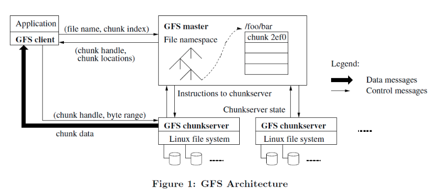

### 摘要

我们设计和实现了GFS这个可以为数据密集型应用大规模扩展的文件系统，它可以在廉价的磁盘上提供很好的
容错性，另外他为大量客户端提供那个极高的聚合性能处理

### 介绍

GFS和分布式文件系统的区别:

* 节点失效被看成正常情况
* 文件巨大
* 主要是追加数据，而不是修改数据
* 一套好的API

### 设计概榄

除了上面四点之外，还有一些设计要点:

* 就是多个客户端并发修改同一个文件是可以保证原子性的
* 高性能的网络带宽比低延迟更加重要

#### 架构

GFS集群由一个单个的master和好多个chunkserver（块服务器）组成

每个文件都被拆成固定大小的块，然后在不同的chunkserver上一共有三个副本

#### 单个master

master负责管理所有的文件系统的元数据，客户端只在master获取元数据，实际数据交换还是直接和
chunkserver交换

客户端只会缓存元数据，不会缓存数据

#### chunk块大小

chunk块大小是64M，远大于文件系统block大小，

#### 元数据

#### 一致性模型
