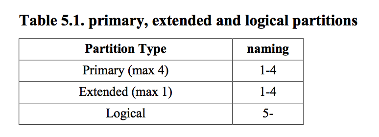
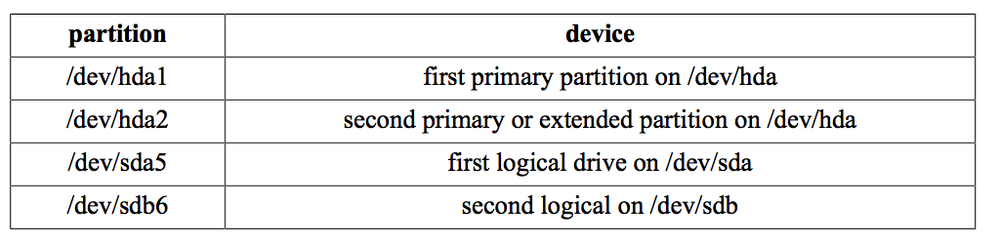
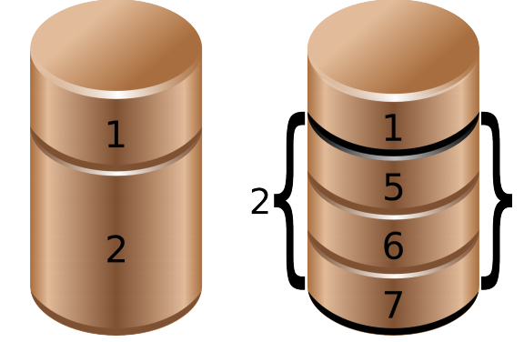

## 5.磁盘分区

这一章衔接前一章继续探讨硬盘管理,这里我们会对设备进行分区

这一章同时又是下一章的铺垫,我们在分区上搭建文件系统

### 5.0.0待完成
* 5.4.1
* 5.4.2
* 5.6

### 5.1 关于分区

#### 5.1.1 主分区 扩展分区 逻辑分区

linux 需要你创建一个或多个分区,下一段将会解释如何创建和使用分区

分区的结构和大小一般被柱面和扇区决定,分区分为主分区(最多四个),扩展分区(最多1个)和逻辑分区(在扩展分区中),每个分区有个包含code的type属性.



#### 5.1.2 分区命名

在前面章节我们看到硬盘设备根据配置被命名为/dev/hdx或/dev/sdx with,后面跟的就是一个分区号,从1开始.因此主分区(可能是4个)会被标记为1到4,逻辑分区总是从5开始,因此 /dev/hda2是ATA第一个硬盘设备的第二个分区,然后and /dev/hdb5是第二个ATA硬盘的第1个逻辑分区.对于SCSI, /dev/sdb3是第二个SCSI硬盘的第三个分区.



下面图片显示了两个具有分区的硬盘,注意扩展分区是逻辑分区的容器




### 5.2 发现分区

#### 5.2.1 fdisk -l

下面的例子你可以看到/dev/sdb的两个分区,第一个分区扫描31个柱面,包含一个交换空间，第二个分区更大一些.

```
root@laika:~# fdisk -l /dev/sdb
Disk /dev/sdb: 100.0 GB, 100030242816 bytes
255 heads, 63 sectors/track, 12161 cylinders
Units = cylinders of 16065 * 512 = 8225280 bytes
 Device Boot Start End Blocks Id System
/dev/sdb1 1 31 248976 82 Linux swap / Solaris
/dev/sdb2 32 12161 97434225 83 Linux
root@laika:~# 
```

#### 5.2.2 /proc/partitions

这个文件包含一个主要和次要号，以及他们是第几个块和设备名,验证/proc/devices连接到了按正确到major标号.


```
paul@RHELv4u4:~$ cat /proc/partitions
major minor #blocks name
 3 0 524288 hda
 3 64 734003 hdb
 8 0 8388608 sda
 8 1 104391 sda1
 8 2 8281507 sda2
 8 16 1048576 sdb
 8 32 1048576 sdc
 8 48 1048576 sdd
 253 0 7176192 dm-0
 253 1 1048576 dm-1
```

major标号与设备类型(或者驱动)类型相关,可以在/proc/
devices中找到,3就是ide,8就是sd，major标号决定了设备使用的设备驱动

minor标号是主要用去区分.内核树中的devices.txt包含了major和minor标号的列表

#### 5.2.3 parted

你可以对fdisk的替代品parted,cfdisk,sfdisk以及gparted感兴趣,这个课程主要使用fdisk来分区硬盘

一些Linux分布式系统建议使用parted来处理存储,使用gpt而非mbr.

下面是一个CentOS的parted

```
[root@centos65 ~]# rpm -q parted
parted-2.1-21.el6.x86_64
[root@centos65 ~]# parted /dev/sda
GNU Parted 2.1
Using /dev/sda
Welcome to GNU Parted! Type 'help' to view a list of commands.
(parted) print
Model: ATA VBOX HARDDISK (scsi)
Disk /dev/sda: 42.9GB
Sector size (logical/physical): 512B/512B
Partition Table: msdos
Number Start End Size Type File system Flags
 1 1049kB 525MB 524MB primary ext4 boot
 2 525MB 42.9GB 42.4GB primary lvm
(parted)
```

### 5.3 新磁盘分区

在下面的例子中, 你买了一块新磁盘,当硬盘已经连接后,你可以使用fdisk和parted来创建必要的分区,这个例子使用fdisk,使用parted其实也没有什么问题

#### 5.3.1 认识磁盘

首先,我们使用fdisk -l来检测Linux是否能看到它,下图我们可以看到已经检测到/dev/sdb了,但是它仍然没有任何分区.

```
root@RHELv4u2:~# fdisk -l

Disk /dev/sda: 12.8 GB, 12884901888 bytes
255 heads, 63 sectors/track, 1566 cylinders
Units = cylinders of 16065 * 512 = 8225280 bytes

Device Boot Start End Blocks Id System
/dev/sda1 * 1 13 104391 83 Linux
/dev/sda2 14 1566 12474472+ 8e Linux LVM

Disk /dev/sdb: 1073 MB, 1073741824 bytes
255 heads, 63 sectors/track, 130 cylinders
Units = cylinders of 16065 * 512 = 8225280 bytes

Disk /dev/sdb doesn't contain a valid partition table
```

#### 5.3.2 使用fdisk打开磁盘

我们在/dev/sdb上使用fdisk创建分区,我们将/dev/sdb作为fdisk的参数,小心别弄错了磁盘

```
root@RHELv4u2:~# fdisk /dev/sdb
Device contains neither a valid DOS partition table, nor Sun, SGI...
Building a new DOS disklabel. Changes will remain in memory only,
until you decide to write them. After that, of course, the previous
content won't be recoverable.

Warning: invalid flag 0x0000 of partition table 4 will be corrected...
```

#### 5.3.3 空的分区表

在fdisk中,我们可以使用p命令查看当前磁盘的分区表

```
Command (m for help): p

Disk /dev/sdb: 1073 MB, 1073741824 bytes
255 heads, 63 sectors/track, 130 cylinders
Units = cylinders of 16065 * 512 = 8225280 bytes

Device Boot Start End Blocks Id System
```

#### 5.3.4 创建一个新分区

在fdisk中,我们使用n命令来创建分区,我们选择p来当主分区,1来当分区号，1和14分别为开始和结束的柱面

```
Command (m for help): n
Command action
e extended
p primary partition (1-4)
p
Partition number (1-4): 1
First cylinder (1-130, default 1):
Using default value 1
Last cylinder or +size or +sizeM or +sizeK (1-130, default 130): 14
```

我们使用p命令来验证变化,然后这是硬盘还没有真正的改变,我们仍然可以取消这次操作,如果没问题的话使用w命令来改变磁盘,然后退出fdisk

```
Command (m for help): p
Disk /dev/sdb: 1073 MB, 1073741824 bytes
255 heads, 63 sectors/track, 130 cylinders
Units = cylinders of 16065 * 512 = 8225280 bytes

Device Boot Start End Blocks Id System
/dev/sdb1 1 14 112423+ 83 Linux

Command (m for help): w
The partition table has been altered!

Calling ioctl() to re-read partition table.
Syncing disks.
root@RHELv4u2:~#
```

#### 5.3.5 显示新分区

我们使用fdisk -l来决定我们的分区正确,下面的命令可以看到/dev/sdb上的分区

```
root@RHELv4u2:~# fdisk -l

Disk /dev/sda: 12.8 GB, 12884901888 bytes
255 heads, 63 sectors/track, 1566 cylinders
Units = cylinders of 16065 * 512 = 8225280 bytes

Device Boot Start End Blocks Id System
/dev/sda1 * 1 13 104391 83 Linux
/dev/sda2 14 1566 12474472+ 8e Linux LVM

Disk /dev/sdb: 1073 MB, 1073741824 bytes
255 heads, 63 sectors/track, 130 cylinders
Units = cylinders of 16065 * 512 = 8225280 bytes

Device Boot Start End Blocks Id System
/dev/sdb1 1 14 112423+ 83 Linux
root@RHELv4u2:~#
```

### 5.4 关于分区表
#### 5.4.1 主引导记录

分区表信息(主分区或者扩展分区)写入主引导记录或者mbr,你可以使用dd命令将mbr拷贝到一个文件

这里将mbr从第一个SCSI硬盘拷贝出来

```
dd if=/dev/sda of=/SCSIdisk.mbr bs=512 count=1
```

dd命令也可以用来擦除磁盘上的分区信息,下面是一个


#### 5.4.2 partprobe

当我们

#### 5.4.3 逻辑驱动

分区表不包含逻辑启动,对mbr使用dd备份是能作用域主要和扩展分区,如果想备份逻辑驱动,你可以使用sfdisk

下面是备份所有分区和逻辑驱动信息到一个文件

```
sfdisk -d /dev/sda > parttable.sda.sfdisk
```

下面将拷贝mbr和逻辑驱动信息

```
sfdisk -d /dev/sda | sfdisk /dev/sdb
```


### 5.5 GUID分区表

由于mbr比较古老,只支持2TB和4个分区,gpt被开发出来了

从2010年开始gpt是uefi的一部分,但它仍然可以运行在BIOS系统上

最新版本的fdisk和gpt兼容性良好,但是目前仍有老版本的fdisk,你可以使用parted工具来替代

### 5.6 parted

parted是一个像fdisk的交互工具,在parted中输入help来列出命令

下面开始使用parted来管理/dev/sdb

```
[root@rhel71 ~]# parted /dev/sdb
GNU Parted 3.1
Using /dev/sdb
Welcome to GNU Parted! Type 'help' to view a list of commands.
(parted)
```


### 5.7 问题/ 5.8答案

* 1.使用fdisk -l 查看已经存在的分区和大小

```
as root: # fdisk -l
```

* 2.使用df -h查看存在的分区和大小
```
df -h
```

* 3.比较fdisk和df

还是有些区别的

* 4.在一个小磁盘上创建一个200MB的主分区
```
Choose one of the disks you added (this example uses /dev/sdc).
root@rhel53 ~# fdisk /dev/sdc
...
Command (m for help): n
Command action
 e extended
 p primary partition (1-4)
p
Partition number (1-4): 1
First cylinder (1-261, default 1): 1
Last cylinder or +size or +sizeM or +sizeK (1-261, default 261): +200m
Command (m for help): w
The partition table has been altered!
Calling ioctl() to re-read partition table.
Syncing disks.
```

* 5.在一个大磁盘创建一个400MB的主分区和两个300MB的逻辑分区

```
Choose one of the disks you added (this example uses /dev/sdb)
fdisk /dev/sdb
inside fdisk : n p 1 +400m enter --- n e 2 enter enter --- n l +300m (twice)
```

* 使用 df -h 和 fdisk -l来验证

```
fdisk -l ; df -h
```

* 使用fdisk和df来查看是否显示除了新分区

fdisk有,df没有

* 使用dd或者mbr创建一个上面200MB的备份

```
dd if=/dev/sdc of=bootsector.sdc.dd count=1 bs=512
```

* 备份一个包含400MB主分区和300MB逻辑分区的驱动,确认逻辑驱动在悲愤中

```
sfdisk -d /dev/sdb > parttable.sdb.sfdisk
```
